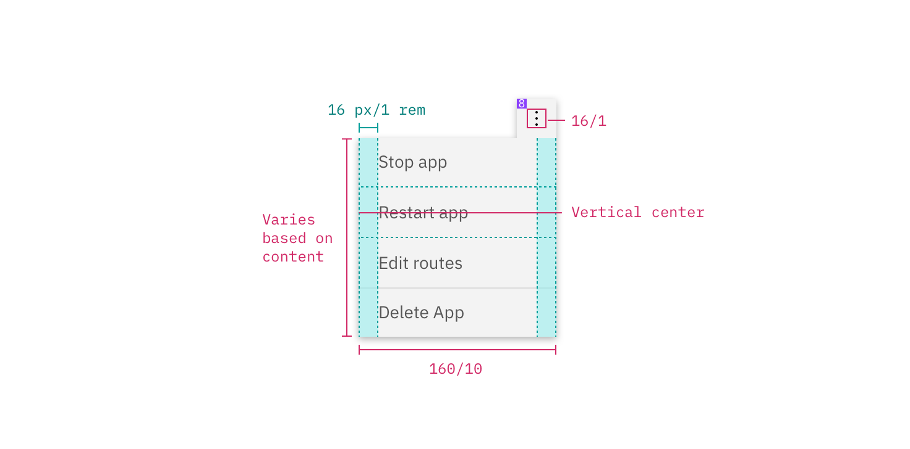

## Color

| Element            | Property         | Color token                      |
| ------------------ | ---------------- | -------------------------------- |
| Overflow menu icon | fill             | `$icon-primary`                  |
| Menu option        | background-color | `$layer`                         |
|                    | text color       | `$text-secondary`                |
| Danger option      | background-color | `$layer`                         |
| Container          | box-shadow       | `0 2px 6px 0 rgba(0, 0, 0, 0.3)` |

### Interactive states

| Class                      | Property         | Color token            |
| -------------------------- | ---------------- | ---------------------- |
| `.bx--overflow-menu:focus` | border           | `$focus`               |
| `option:focus`             | border           | `$focus`               |
| `.bx--overflow-menu:hover` | background-color | `$background-hover`    |
| `option:hover`             | background-color | `$layer-hover`         |
| `option:hover`             | text color       | `$text-primary`        |
| `option--danger:hover`     | background-color | `$button-danger-hover` |
| `option:disabled`          | text color       | `$text-disabled`       |

<Caption>Text and warning hover examples for overflow menu</Caption>

## Typography

Overflow menu option text should be set in sentence case with the first letter
of the first word capitalized.

| Element          | Font-size (px/rem) | Font-weight   | Type token         |
| ---------------- | ------------------ | ------------- | ------------------ |
| Menu option text | 14 / 0.875         | Regular / 400 | `$body-compact-01` |

## Structure

The height of an overflow menu is determined by the amount of content in the
menu. The overflow menu icon can be found in the
[icons](/guidelines/icons/library) library.

| Class                                        | Property                    | px / rem  | Spacing token |
| -------------------------------------------- | --------------------------- | --------- | ------------- |
| `.bx--overflow-menu__icon`                   | icon size                   | 16 x 16px | –             |
| `.bx--overflow-menu-options__btn`            | padding-right, padding-left | 16 / 1    | `$spacing-05` |
| `.bx--overflow-menu-options`                 | height                      | 32 / 2    | –             |
| `.bx--overflow-menu-options__option--danger` | border-top                  | 1px       | –             |

## Sizes

| Element      | Size        | Height (px/rem) |
| ------------ | ----------- | --------------- |
| Menu options | Small (sm)  | 32 / 2          |
|              | Medium (md) | 40 / 2.5        |
|              | Large (lg)  | 48 / 3          |
| Icon button  | Small (sm)  | 32 / 2          |
|              | Medium (md) | 40 / 2.5        |
|              | Large (lg)  | 48 / 3          |

<Caption>Sizes for menu options and icon button | px / rem</Caption>
