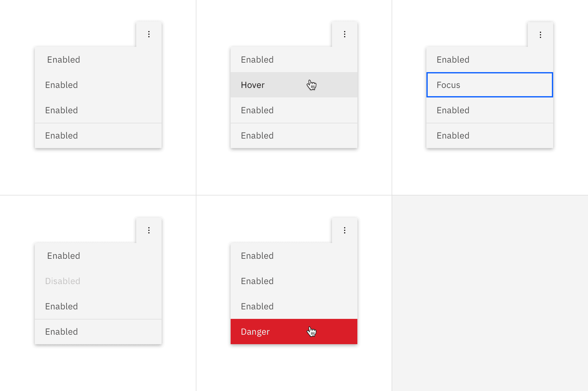
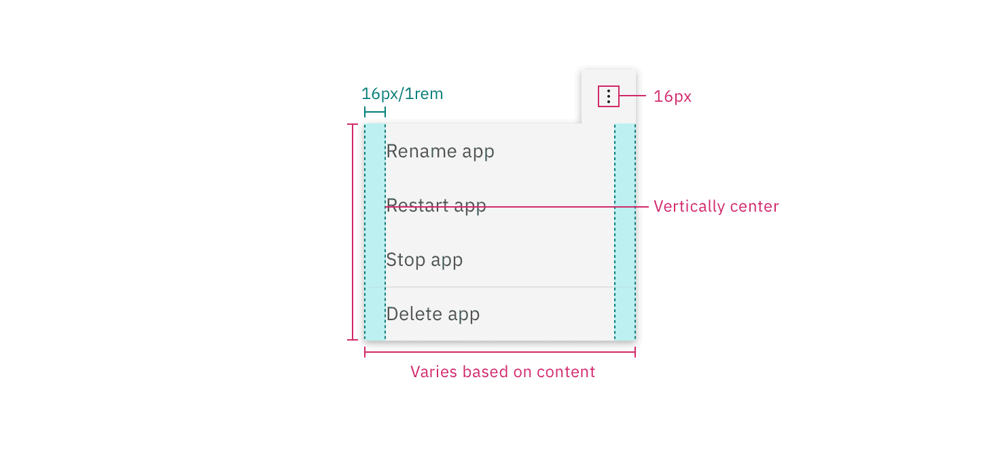

## Color

| Element            | Property         | Color token                      |
| ------------------ | ---------------- | -------------------------------- |
| Overflow menu icon | fill             | `$icon-primary`                  |
| Menu option        | background-color | `$layer` \*                      |
|                    | text color       | `$text-secondary`                |
| Danger option      | background-color | `$layer`\*                       |
| Container          | box-shadow       | `0 2px 6px 0 rgba(0, 0, 0, 0.3)` |

<Caption fullWidth>
  \* Denotes a contextual color token that will change values based on the layer
  it is placed on.
</Caption>

<Row>
<Column colLg={8}>

</Column>
</Row>

### Interactive states

| Element              | Property         | Color token              |
| -------------------- | ---------------- | ------------------------ |
| Icon button:focus    | border           | `$focus`                 |
| Menu option:focus    | border           | `$focus`                 |
| Icon button:hover    | background-color | `$background-hover`      |
| Menu option:hover    | background-color | `$layer-hover` \*        |
|                      | text color       | `$text-primary`          |
| Danger option:hover  | background-color | `$button-danger-primary` |
| Menu option:disabled | text color       | `$text-disabled`         |

<Row>
<Column colLg={12}>

</Column>
</Row>

## Typography

Overflow menu option text should be set in sentence case with the first letter
of the first word capitalized.

| Element          | Font-size (px/rem) | Font-weight   | Type token         |
| ---------------- | ------------------ | ------------- | ------------------ |
| Menu option text | 14 / 0.875         | Regular / 400 | `$body-compact-01` |

## Structure

The height of an overflow menu is determined by the amount of content in the
menu. The overflow menu icon can be found in the
[icons](/elements/icons/library) library.

| Element     | Property                    | px / rem  | Spacing token |
| ----------- | --------------------------- | --------- | ------------- |
| Icon        | icon size                   | 16 x 16px | –             |
| Menu option | padding-right, padding-left | 16 / 1    | `$spacing-05` |
| Divider     | border-top                  | 1px       | –             |

## Sizes

| Element      | Size        | Height (px/rem) |
| ------------ | ----------- | --------------- |
| Menu options | Small (sm)  | 32 / 2          |
|              | Medium (md) | 40 / 2.5        |
|              | Large (lg)  | 48 / 3          |
| Icon button  | Small (sm)  | 32 / 2          |
|              | Medium (md) | 40 / 2.5        |
|              | Large (lg)  | 48 / 3          |

<Caption>Sizes for menu options and icon button | px / rem</Caption>
