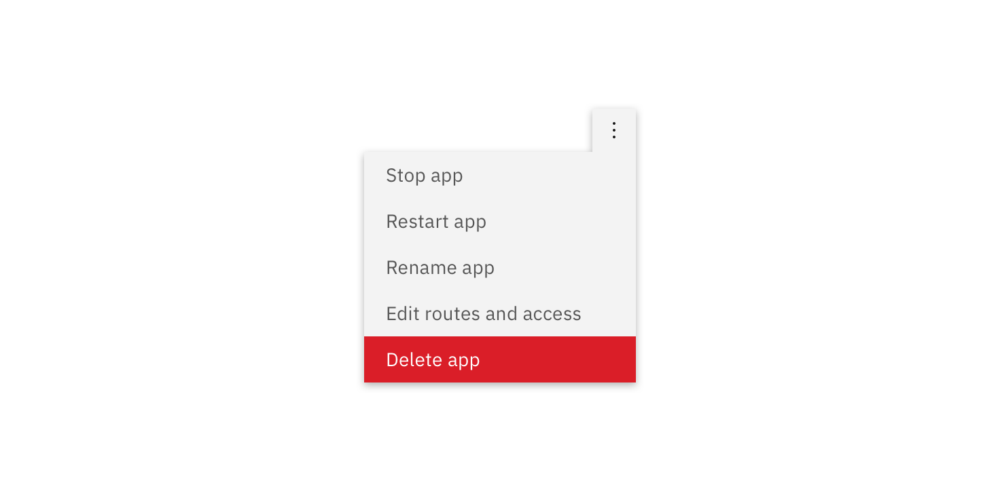
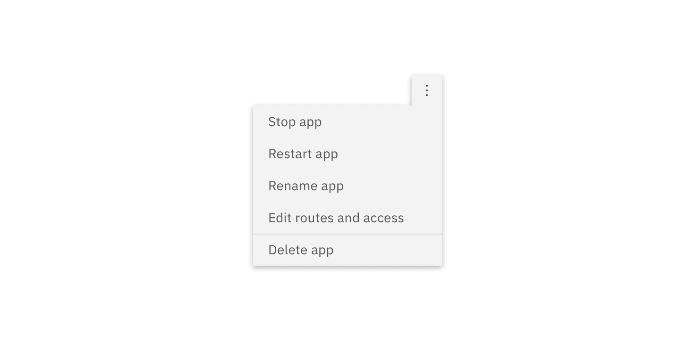

import A11yStatus from 'components/A11yStatus';

<PageDescription>

Use the overflow menu component when additional options are available to the
user but there is a space constraint.

</PageDescription>

<AnchorLinks>

<AnchorLink>Live demo</AnchorLink>
<AnchorLink>Overview</AnchorLink>
<AnchorLink>Formatting</AnchorLink>
<AnchorLink>Feedback</AnchorLink>

</AnchorLinks>

## Overview

Overflow menu is used when additional options are available to the user and
there is a space constraint.

## Live demo

<StorybookDemo
  themeSelector
  url="https://react.carbondesignsystem.com"
  variants={[
    {
      label: 'Default',
      variant: 'components-overflowmenu--default',
    },
    {
      label: 'Render custom Icon',
      variant: 'components-overflowmenu--render-custom-icon',
    },
  ]}
/>

## Formatting

#### Text

The text within an overflow menu should be direct so users can quickly decide on
an action. Actions that could cause a significant change to the user's data
(delete app, delete service, etc.) are separated by a divider and live below the
primary set of actions.

<Row>
<Column colLg={8}>

</Column>
</Row>

### Placement

Depending on where the Overflow menu appears within the UI, the tab tip may
appear on the left or right so it always remains visible.

<Row>
<Column colLg={8}>

</Column>
</Row>

## Feedback

Help us improve this component by providing feedback, asking questions, and
leaving any other comments on
[GitHub](https://github.com/carbon-design-system/carbon-website/issues/new?assignees=&labels=feedback&template=feedback.md).
