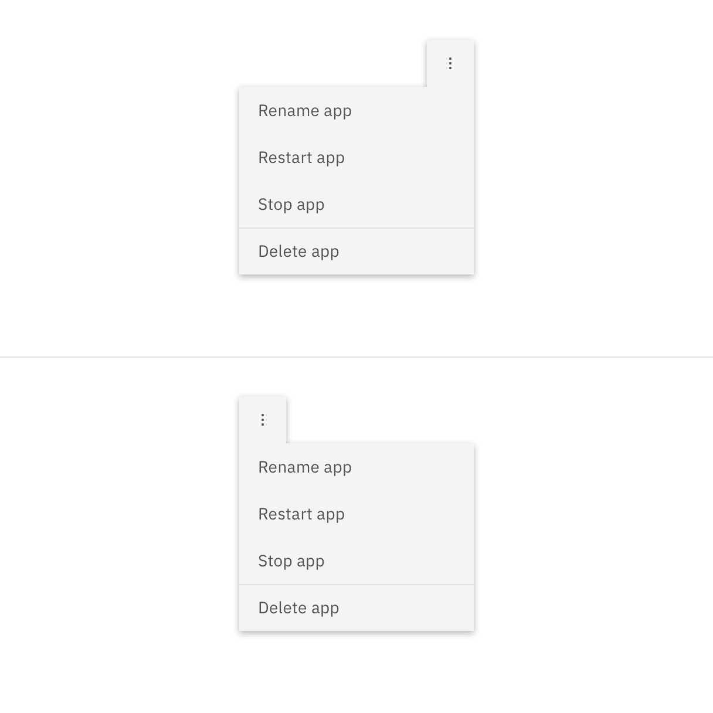
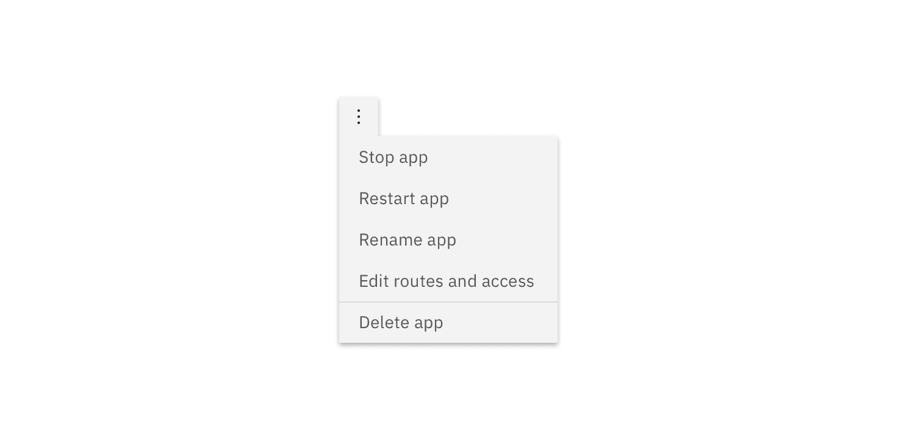
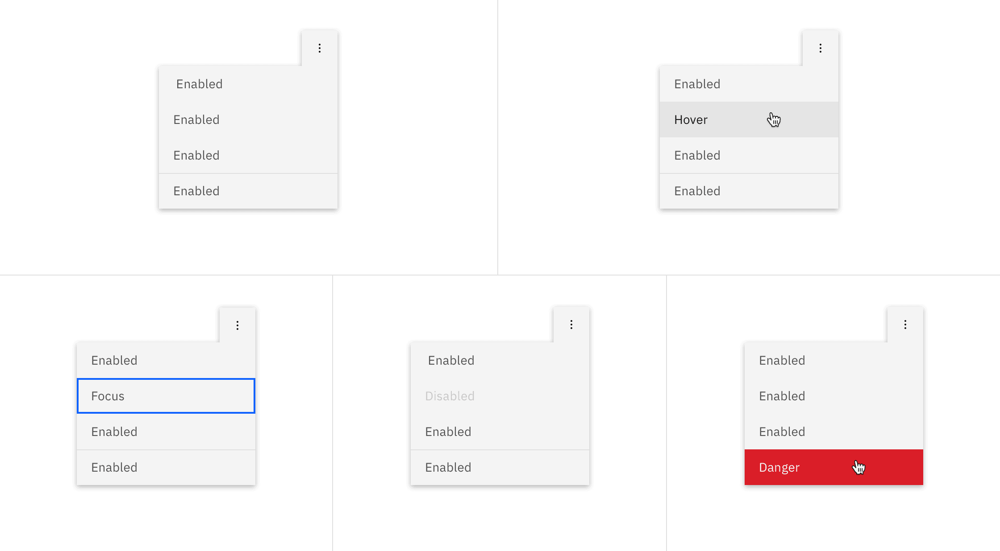

<AnchorLinks>

<AnchorLink>General guidance</AnchorLink>
<AnchorLink>Formatting</AnchorLink>
<AnchorLink>Content</AnchorLink>
<AnchorLink>Behavior</AnchorLink>
<AnchorLink>Accessibility</AnchorLink>
<AnchorLink>Variations</AnchorLink>
<AnchorLink>Style</AnchorLink>
<AnchorLink>Code</AnchorLink>
<AnchorLink>Feedback</AnchorLink>

</AnchorLinks>

## General guidance

Overflow menu is used when additional options are available to the user and there is a space constraint.

<ComponentCode
  name="Overflow menu"
  component="overflow-menu"
  variation="overflow-menu"
  hasReactVersion="overflowmenu--basic"
  hasVueVersion="overflowmenu--default"
  hasAngularVersion="?path=/story/overflow-menu--basic"
  codepen="PgNGop"></ComponentCode>

## Formatting

**Depending on where the Overflow Menu appears within the UI, the caret or arrow may be left or right aligned so the Overflow Menu is clearly visible.**

<Row>
<Column colLg={8}>

</Column>
</Row>

<Row>
<Column colLg={8}>

</Column>
</Row>

## Content 

**The text within an overflow menu should be direct so users can quickly decide on an action.** Actions that could cause a significant change to the user’s data (delete app, delete service, etc.) are separated by a horizontal rule and live below the primary set of actions.

<Row>
<Column colLg={8}>

</Column>
</Row>

## Behavior

## Accessibility

## Variations 

## Style

### Color

| Class                                        | Property         | Color token                      |
| -------------------------------------------- | ---------------- | -------------------------------- |
| `.bx--overflow-menu__icon`                   | fill             | `$icon-01`                       |
| `.bx--overflow-menu-options`                 | background-color | `$ui-01`                         |
| `.bx--overflow-menu-options__btn`            | color            | `$text-02`                       |
| `.bx--overflow-menu-options__option--danger` | background-color | `$support-01`                    |
| `.bx--overflow-menu-options`                 | box-shadow       | `0 2px 6px 0 rgba(0, 0, 0, 0.3)` |

### Interactive states

| Class                      | Property         | Color token     |
| -------------------------- | ---------------- | --------------- |
| `.bx--overflow-menu:focus` | border           | `$focus`        |
| `option:focus`             | border           | `$focus`        |
| `.bx--overflow-menu:hover` | background-color | `$hover-ui`     |
| `option:hover`             | background-color | `$hover-row`    |
| `option:hover`             | text color       | `$text-01`      |
| `option--danger:hover`     | background-color | `$hover-danger` |
| `option:disabled`          | text color       | `$disabled-02`  |

<Caption>Text and warning hover examples for overflow menu</Caption>

### Typography

Overflow menu text should be set in set in sentence case with the first letter of the first word capitalized.

| Property                          | Font-size (px/rem) | Font-weight   | Type token       |
| --------------------------------- | ------------------ | ------------- | ---------------- |
| `.bx--overflow-menu-options__btn` | 14 / 0.875         | Regular / 400 | `$body-short-01` |

### Structure

The height of an overflow menu is determined by the amount of content in the menu. The overflow menu icon can be found in the [iconography](/style/iconography/library) library.

| Class                                        | Property                    | px / rem  | Spacing token |
| -------------------------------------------- | --------------------------- | --------- | ------------- |
| `.bx--overflow-menu__icon`                   | icon size                   | 16 x 16px | –             |
| `.bx--overflow-menu-options__btn`            | padding-right, padding-left | 16 / 1    | `$spacing-05` |
| `.bx--overflow-menu-options`                 | height                      | 32 / 2    | –             |
| `.bx--overflow-menu-options__option--danger` | border-top                  | 1px       | –             |

## Code

<ComponentDocs component="overflow-menu"></ComponentDocs>

## Feedback
