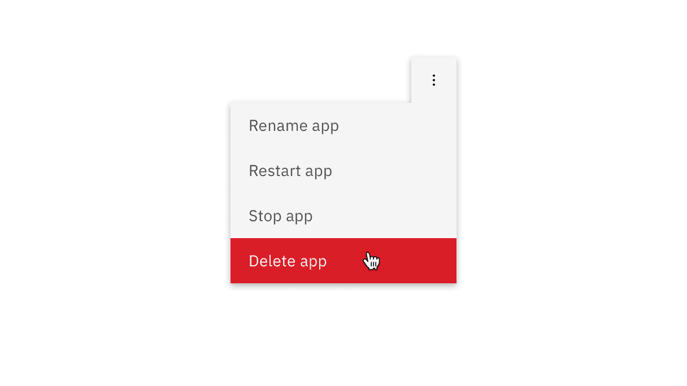

<PageDescription>

Use the overflow menu component when additional options are available to the
user but there is a space constraint.

</PageDescription>

<AnchorLinks>

<AnchorLink>Overview</AnchorLink>
<AnchorLink>Live demo</AnchorLink>
<AnchorLink>Formatting</AnchorLink>
<AnchorLink>Feedback</AnchorLink>

</AnchorLinks>

## Overview

Overflow menu is used when additional options are available to the user and
there is a space constraint.

## Live demo

<ComponentDemo
  components={[
    {
      id: 'overflow-menu',
      label: 'Overflow menu',
    },
  ]}>
  <ComponentVariant
    id="overflow-menu"
    knobs={{
      OverflowMenuItem: ['disabled', 'isDelete'],
    }}
    links={{
      React:
        'https://react.carbondesignsystem.com/?path=/story/overflowmenu--basic',
      Angular:
        'https://angular.carbondesignsystem.com/?path=/story/components-overflow-menu--basic',
      Vue:
        'http://vue.carbondesignsystem.com/?path=/story/components-cvoverflowmenu--default',
      Vanilla: 'https://the-carbon-components.netlify.com/?nav=overflow-menu',
    }}>{`
    <OverflowMenu
      selectorPrimaryFocus={'.optionTwo'}
    >
      <OverflowMenuItem
        itemText="Option 1"
      />
      <OverflowMenuItem
        className="optionTwo"
        itemText="Option 2 is an example of a really long string and how we recommend handling this"
        requireTitle
      />
      <OverflowMenuItem itemText="Option 3" />
      <OverflowMenuItem itemText="Option 4" hasDivider/>
    </OverflowMenu>
  `}</ComponentVariant>
</ComponentDemo>

## Formatting

#### Text

The text within an overflow menu should be direct so users can quickly decide on
an action. Actions that could cause a significant change to the user's data
(delete app, delete service, etc.) are separated by a horizontal rule and live
below the primary set of actions.

<Row>
<Column colLg={8}>

</Column>
</Row>

#### Positioning

Depending on where the Overflow Menu appears within the UI, the caret or arrow
may be left or right aligned so the Overflow Menu is clearly visible.

<Row>
<Column colLg={8}>

</Column>
</Row>

<Row>
<Column colLg={8}>

</Column>
</Row>

## Feedback

Help us improve this component by providing feedback, asking questions, and
leaving any other comments on
[GitHub](https://github.com/carbon-design-system/carbon-website/issues/new?assignees=&labels=feedback&template=feedback.md).
