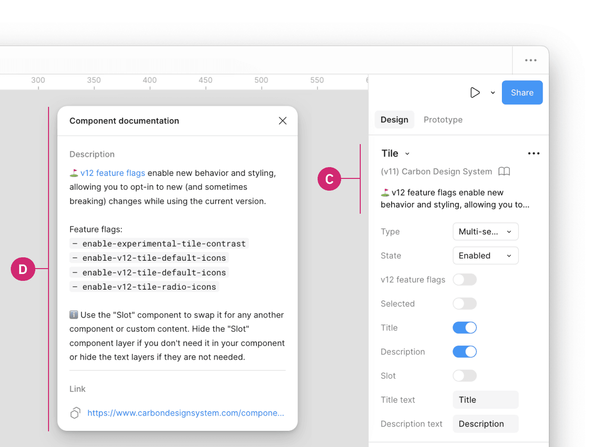

import { Launch } from '@carbon/icons-react';
import { Link } from '@carbon/react';

<PageDescription>

Feature flags enable new behaviors and styling, allowing users to opt-in to new
breaking changes while staying on the current major version.

</PageDescription>

<AnchorLinks>

<AnchorLink>Overview</AnchorLink>
<AnchorLink>Components with feature flags</AnchorLink>
<AnchorLink>How to implement</AnchorLink>

</AnchorLinks>

## Overview

When a new feature flag is introduced, it is set to false or "off" by default to
ensure backward compatibility. We are not deprecating the current components but
encourage all teams to use the new feature flag-enabled components in their
products moving forward. Once the next major release (v12) is released in the
future, these feature flags will become the default version of the component.

## Components with feature flags

The following components have v12 feature flags, with changes related to either
design or development.

| Component                    | Design change                                                                    | Code change                                                                                                                                                                                   |
| ---------------------------- | -------------------------------------------------------------------------------- | --------------------------------------------------------------------------------------------------------------------------------------------------------------------------------------------- |
| Menu buttons (Overflow menu) | No design change                                                                 | <Link href={"https://react.carbondesignsystem.com/?path=/docs/components-overflowmenu-feature-flag--flag-details"} renderIcon={() => <Launch aria-label="Launch" />}>React</Link>             |
| Modal                        | No design change                                                                 | <Link href={"https://react.carbondesignsystem.com/?path=/docs/components-modal-feature-flag--flag-details"} renderIcon={() => <Launch aria-label="Launch" />}>React</Link>                    |
| Notification                 | No design change                                                                 | <Link href={"https://react.carbondesignsystem.com/?path=/docs/components-notifications-actionable-feature-flag--flag-details"} renderIcon={() => <Launch aria-label="Launch" />}>React</Link> |
| Structured list              | <Link href={"/components/structured-list/usage/#feature-flags"}>Usage tab</Link> | <Link href={"https://react.carbondesignsystem.com/?path=/docs/components-structuredlist-feature-flag--flag-details"} renderIcon={() => <Launch aria-label="Launch" />}>React</Link>           |
| Tile                         | <Link href={"/components/tile/usage/#feature-flags"}>Usage tab</Link>            | <Link href={"https://react.carbondesignsystem.com/?path=/docs/components-tile-feature-flag--flag-details"} renderIcon={() => <Launch aria-label="Launch" />}>React</Link>                     |
| Tree view                    | No design change                                                                 | <Link href={"https://react.carbondesignsystem.com/?path=/docs/components-treeview-feature-flag--flag-details"} renderIcon={() => <Launch aria-label="Launch" />}>React</Link>                 |

## How to implement

### Code

Each framework handles feature flags differently. At the moment, only React has
available feature flags. This may change in the future, check back later for
updates related to all available feature flags.

<Title>React</Title>

The development specifics for feature flags in React can be found in the
[@carbon/react](https://react.carbondesignsystem.com/?path=/docs/getting-started-feature-flags--overview)
framework.

### Design

Inside a design file, click on the component with a feature flag (A). In the
properties panel, locate the **v12 feature flag** boolean property (B). By
default, this feature is turned off, but can be toggled on to enable the v12
feature flag.

<Row>
<Column colLg={8}>

</Column>
</Row>

Additionally, when clicking on the **components details** (C) in the properties
panel, a description of the v12 feature flag, and a link to the component's
usage guidance is provided for more information in the **Component
documentation** window (D).

<Row>
<Column colLg={8}>

</Column>
</Row>
