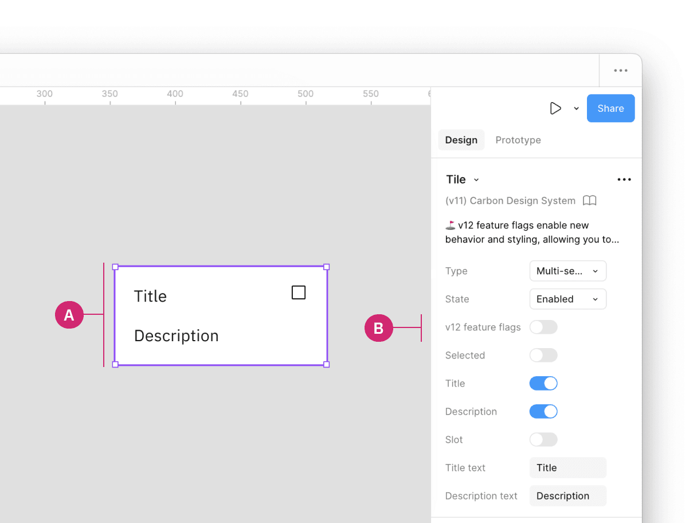

import { Launch } from '@carbon/icons-react';
import { Link } from '@carbon/react';

<PageDescription>

Feature flags enable new behaviors and styling, allowing users to opt-in to new
breaking changes while staying on the current major version.

</PageDescription>

<AnchorLinks>

<AnchorLink>Overview</AnchorLink>
<AnchorLink>Components with feature flags</AnchorLink>
<AnchorLink>How to implement</AnchorLink>

</AnchorLinks>

## Overview

When a new feature flag is introduced, it is set to false or "off" by default to
ensure backward compatibility. We are not deprecating the current components but
encourage all teams to use the new feature flag-enabled components in their
products moving forward.

## Components with feature flags

The following components have feature flags, with changes related to either
design or development:

| Component                    | Design change                                                                                                  | Code change                                                                                                                                                                                  |
| ---------------------------- | -------------------------------------------------------------------------------------------------------------- | -------------------------------------------------------------------------------------------------------------------------------------------------------------------------------------------- |
| Menu buttons (Overflow menu) | No design change                                                                                               | <Link href={"https://react.carbondesignsystem.com/?path=/docs/experimental-feature-flags-overflowmenu--overview"} renderIcon={() => <Launch aria-label="Launch" />}>React</Link>             |
| Modal                        | No design change                                                                                               | <Link href={"https://react.carbondesignsystem.com/?path=/docs/experimental-feature-flags-modal--overview"} renderIcon={() => <Launch aria-label="Launch" />}>React</Link>                    |
| Notification                 | No design change                                                                                               | <Link href={"https://react.carbondesignsystem.com/?path=/docs/experimental-feature-flags-notifications-actionable--overview"} renderIcon={() => <Launch aria-label="Launch" />}>React</Link> |
| Structured list              | <Link href={"https://carbondesignsystem.com/components/structured-list/usage/#feature-flags"}>Usage tab</Link> | <Link href={"https://react.carbondesignsystem.com/?path=/docs/experimental-feature-flags-structuredlist--overview"} renderIcon={() => <Launch aria-label="Launch" />}>React</Link>           |
| Tile                         | <Link href={"https://carbondesignsystem.com/components/tile/usage/#feature-flags"}>Usage tab</Link>            | <Link href={"https://react.carbondesignsystem.com/?path=/docs/experimental-feature-flags-tile--overview"} renderIcon={() => <Launch aria-label="Launch" />}>React</Link>                     |
| Tree view                    | No design change                                                                                               | <Link href={"https://react.carbondesignsystem.com/?path=/docs/experimental-feature-flags-treeview--overview"} renderIcon={() => <Launch aria-label="Launch" />}>React</Link>                 |

## How to implement

### Code

In React, for more feature flag information specific to developers, refer to the
[@carbon/react](https://react.carbondesignsystem.com/?path=/docs/experimental-feature-flags--overview)
framework.

### Design

Inside a design file, click on the component with a feature flag (A). In the
properties panel, locate the "**Feature flag**" boolean property (B). By
default, this feature is turned off, but you can toggle it on to enable the
feature flag.

<Row>
<Column colLg={8}>

</Column>
</Row>

Additionally, when viewing more details in the "**Component documentation**" (C)
section of the properties panel, a description of a feature flag and a link to
the components usage guidance is provided for more information (D).

<Row>
<Column colLg={8}>

</Column>
</Row>
