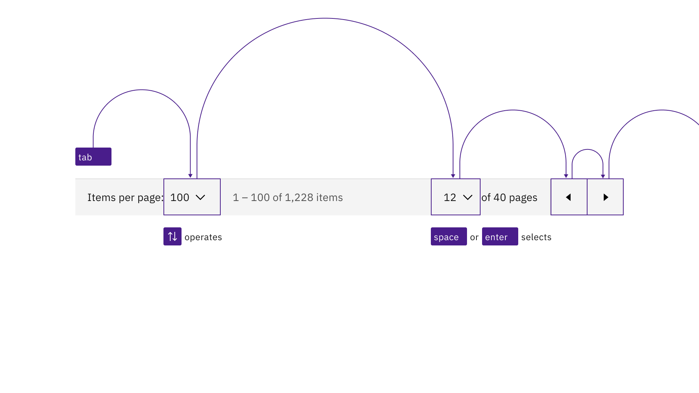
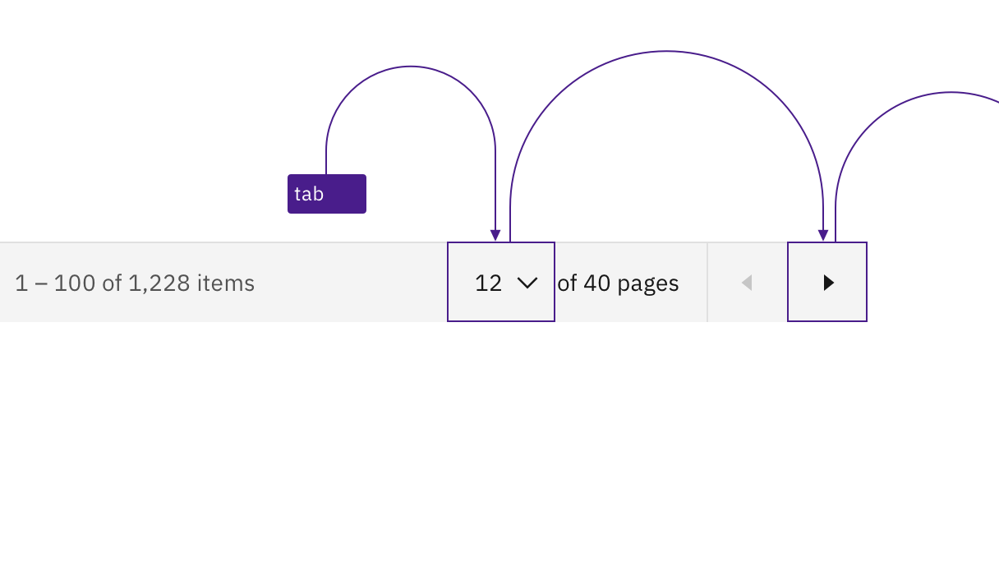
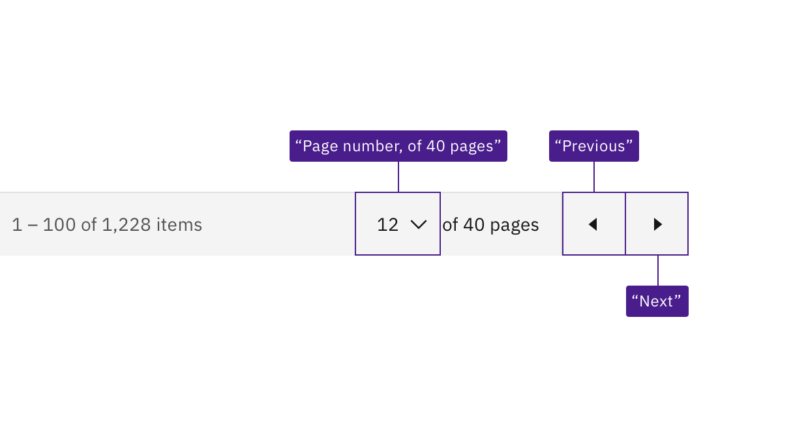

import {
  StructuredListWrapper,
  StructuredListHead,
  StructuredListBody,
  StructuredListRow,
  StructuredListInput,
  StructuredListCell,
  OrderedList,
  ListItem,
} from '@carbon/react';

<PageDescription>

No accessibility annotations are needed for pagination, but keep these
considerations in mind if you are modifying Carbon or creating a custom
component.

</PageDescription>

<AnchorLinks>

<AnchorLink>What Carbon provides</AnchorLink>
<AnchorLink>Development considerations</AnchorLink>

</AnchorLinks>

## What Carbon provides

Carbon bakes keyboard operation into its components, improving the experience of
blind users and others who operate via the keyboard. Carbon incorporates many
other accessibility considerations, some of which are described below.

### Keyboard interaction

The tab order goes from left to right through the controls in the pagination
component. On focus, the dropdowns are opened with `Space` or with up or down
arrows, which also cycle through the values. Both `Space` and `Enter` select a
value and close the dropdown. The dropdown can also be closed by pressing `Esc`.
The previous and next page arrow buttons are activated by `Space` or `Enter`
keys.

<Row>
<Column colLg={8}>

<Caption>
  Interactive elements in pagination maintain their usual Carbon keyboard
  behaviors and tab order.
</Caption>

</Column>
</Row>

When the pagination is at either end of its range, one of the page navigation
buttons becomes invalid. When that happens, the button is no longer navigable or
operable, like any other disabled control.

<Row>
<Column colLg={8}>

<Caption>
  The prior page button is disabled and unreachable when the pagination is at
  the start of its range.
</Caption>

</Column>
</Row>

### Labeling

Not all the elements in pagination have static or visually isolated labels.
Carbon constructs a programmatic name for the second dropdown by concatenating
some dynamically generated text on the screen. Carbon also provides accessible
names for the icon-only buttons.

<Row>
<Column colLg={8}>

<Caption>
  Carbon provides the accessible names "page number, of 40 pages", "previous
  page", and "next page" for assistive technology.
</Caption>

</Column>
</Row>

## Development considerations

Keep these considerations in mind if you are modifying Carbon or creating a
custom component.

- Carbon uses `<select>` elements for the dropdowns.
- Consult the
  [ARIA authoring practices](https://www.w3.org/WAI/ARIA/apg/example-index/combobox/combobox-select-only.html)
  for more considerations.
