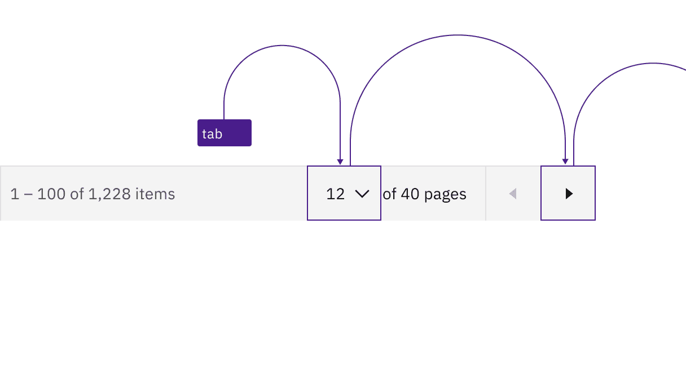
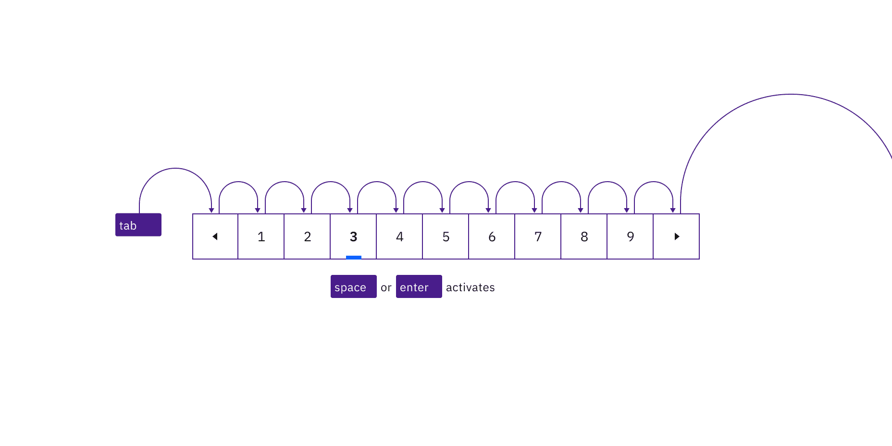
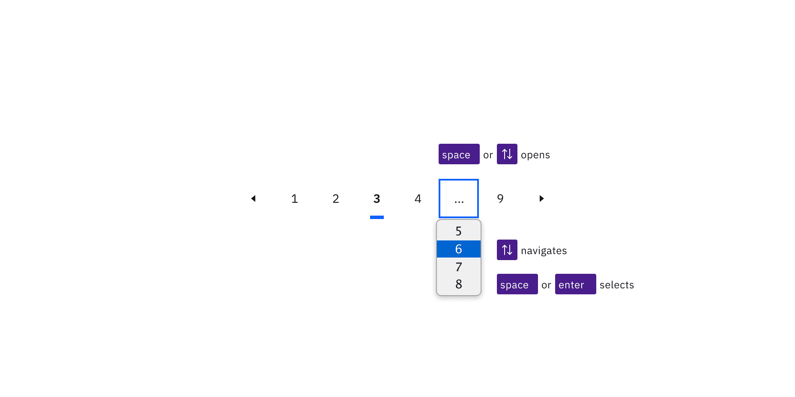
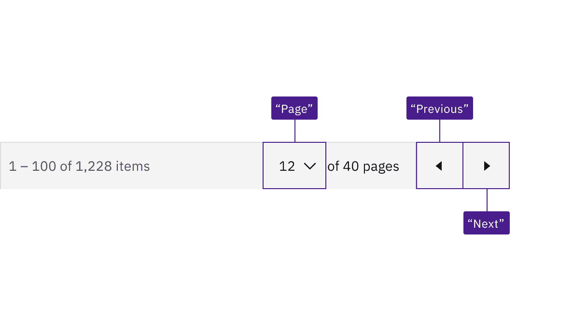

import A11yStatus from 'components/A11yStatus';

import {
  StructuredListWrapper,
  StructuredListHead,
  StructuredListBody,
  StructuredListRow,
  StructuredListInput,
  StructuredListCell,
  OrderedList,
  ListItem,
} from '@carbon/react';

<PageDescription>

No accessibility annotations are needed for pagination, but keep these
considerations in mind if you are modifying Carbon or creating a custom
component.

</PageDescription>

<AnchorLinks>

<AnchorLink>What Carbon provides</AnchorLink>
<AnchorLink>Development considerations</AnchorLink>

</AnchorLinks>

## What Carbon provides

Carbon bakes keyboard operation into its components, improving the experience of
blind users and others who operate via the keyboard. Carbon incorporates many
other accessibility considerations, some of which are described below.

### Keyboard interaction

#### Pagination

The tab order goes from left to right through the controls in the pagination
variant. On focus, the selects are opened with `Space` or with `Up` or `Down`
arrows, which also cycle through the values. Both `Space` and `Enter` select a
value and close the select. The select can also be closed by pressing `Esc`. The
previous and next page arrow buttons are activated by pressing `Space` or
`Enter`.

<Row>
<Column colLg={12}>

<Caption>
  Interactive elements in pagination maintain their usual Carbon keyboard
  behaviors and tab order.
</Caption>

</Column>
</Row>

When the pagination is at either end of its range, one of the page navigation
buttons becomes invalid. When that happens, the button is no longer navigable or
operable, like any other disabled control.

<Row>
<Column colLg={8}>

<Caption>
  The prior page button is disabled and unreachable when the pagination is at
  the start of its range.
</Caption>

</Column>
</Row>

#### Pagination nav

The tab order goes left to right through the button controls in the pagination
nav variant. When page buttons have focus, `Space` or `Enter` activates the page
button and changes the current page to the button that currently has selection.
When the previous and next page arrow buttons have focus, `Space` or `Enter`
activates them.

<Row>
<Column colLg={12}>

<Caption>
  Interactive elements in pagination nav maintain their usual Carbon keyboard
  behaviors and tab order.
</Caption>

</Column>
</Row>

If an overflow ellipsis is present in the pagination nav, once focused, pressing
`Space`, `Up` arrow, or `Down` arrow activates the select menu to choose an
available page to navigate to. `Up` or `Down` arrows navigate between page
options in the menu. `Space` or `Enter` selects a page from the menu and closes
it. The menu can also be closed by pressing `Esc`.

<Row>
<Column colLg={12}>

<Caption>
  The menu opens by pressing Space, Up arrow, or Down arrow, and closes by
  pressing Space or Enter to select an item.
</Caption>

</Column>
</Row>

### Labeling

#### Pagination

Not all the elements in pagination have static or visually isolated labels.
Carbon constructs a programmatic name for the second select by concatenating
dynamically generated text on the screen. Carbon also provides accessible names
for the icon-only buttons.

<Row>
<Column colLg={8}>

<Caption>
  Carbon provides the accessible names "Page", "Previous", and "Next" for
  assistive technology.
</Caption>

</Column>
</Row>

#### Pagination nav

Carbon constructs a programmatic name for the page ghost buttons by
concatenating dynamically generated text on the screen. Carbon also provides
accessible names for the icon-only buttons.

<Row>
<Column colLg={8}>

<Caption>
  Carbon provides the accessible names "Page", "Previous", and "Next" for
  assistive technology.
</Caption>

</Column>
</Row>

## Development considerations

Keep these considerations in mind if you are modifying Carbon or creating a
custom component.

- Carbon uses `<select>` elements for the dropdowns.
- Consult the
  [ARIA authoring practices](https://www.w3.org/WAI/ARIA/apg/example-index/combobox/combobox-select-only.html)
  for more considerations.

<A11yStatus layout="table" components={['Pagination', 'Pagination nav']} />
