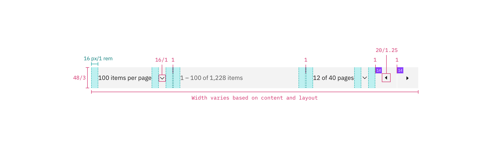

## Color

| Element   | Property         | Color token         |
| --------- | ---------------- | ------------------- |
| Container | background-color | `$layer` \*         |
|           | border-top       | `$border-subtle` \* |
| Text      | text color       | `$text-secondary`   |
| Icon      | fill             | `$icon-primary`     |

## Typography

Pagination text should be set in sentence case with the first letter of each
word capitalized.

| Element | Font-size (px/rem) | Font-weight   | Type token         |
| ------- | ------------------ | ------------- | ------------------ |
| Text    | 14 / 0.875         | Regular / 400 | `$body-compact-01` |

## Structure

The Pagination bar is most commonly used in data tables. The width can vary
depending on content and layout, but should span the entire width of the table
it's being paired with.

| Element        | Property                    | px / rem  | Spacing token |
| -------------- | --------------------------- | --------- | ------------- |
| Container      | border                      | 1px       | –             |
|                | padding-left, padding-right | 16 / 1    | `$spacing-05` |
| Select control | padding-left, padding-right | 16 / 1    | `$spacing-05` |
| Arrow icon     | size                        | 20 x 20px | –             |

<Caption>Structure and spacing measurements for Pagination | px / rem</Caption>

## Sizes

| Element          | Size        | Height (px/rem) |
| ---------------- | ----------- | --------------- |
| Container height | Small (sm)  | 32 / 2          |
|                  | Medium (md) | 40 / 2.5        |
|                  | Large (lg)  | 48 / 3          |
| Icon button      | Small (sm)  | 32 / 2          |
|                  | Medium (md) | 40 / 2.5        |
|                  | Large (lg)  | 48 / 3          |
