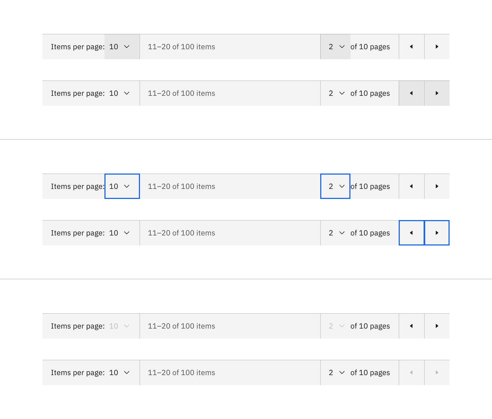
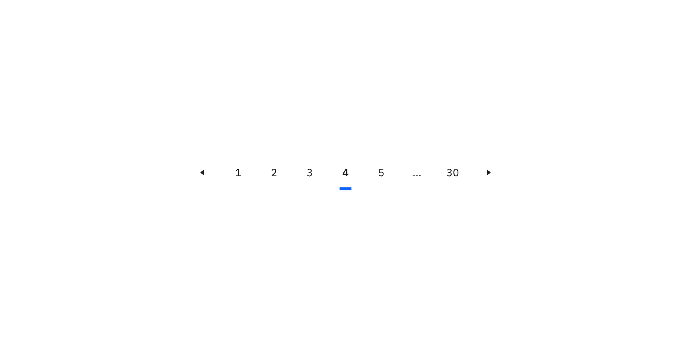
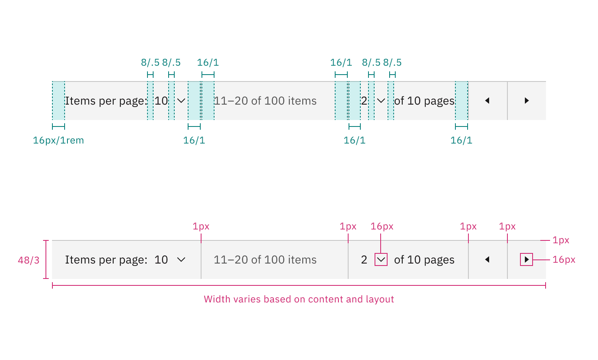
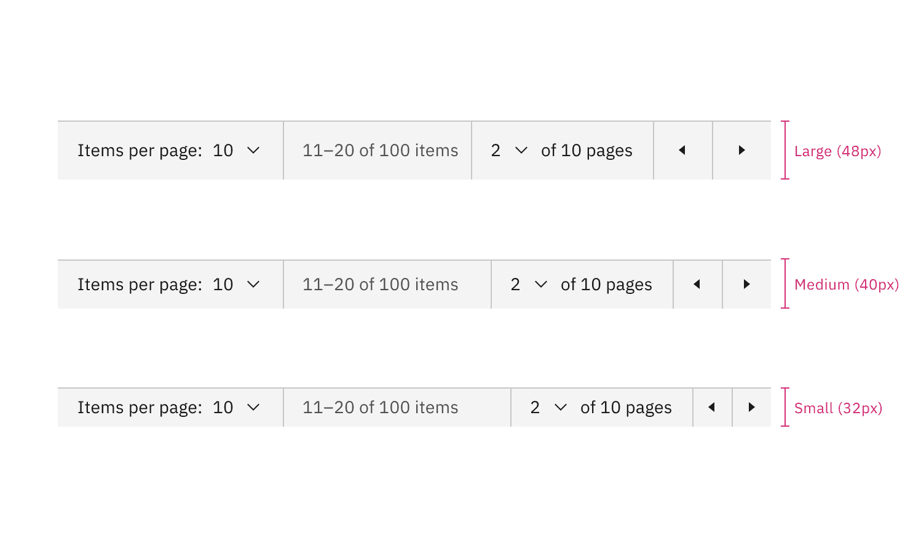
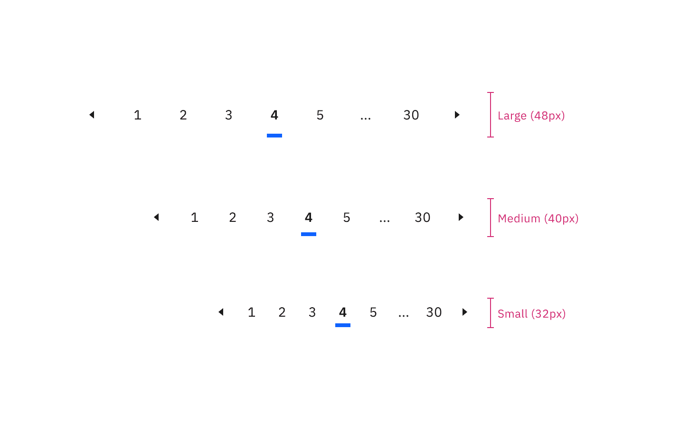

<PageDescription>

The following page documents visual specifications such as color, typography,
structure, and size.

</PageDescription>

<AnchorLinks>

<AnchorLink>Color</AnchorLink>
<AnchorLink>Typography</AnchorLink>
<AnchorLink>Structure</AnchorLink>
<AnchorLink>Size</AnchorLink>
<AnchorLink>Feedback</AnchorLink>

</AnchorLinks>

## Color

### Pagination color

| Element                         | Property         | Color token         |
| ------------------------------- | ---------------- | ------------------- |
| Container                       | background-color | `$layer` \*         |
| Border                          | border-top       | `$border-subtle` \* |
| Text: items per page            | text-color       | `$text-primary`     |
| Text: number of items           | text-color       | `$text-primary`     |
| Text: page range of total items | text-color       | `$text-secondary`   |
| Icon                            | fill             | `$icon-primary`     |

<Caption fullWidth>
  \* Denotes a contextual color token that will change values based on the layer
  it is placed on.
</Caption>

<Row>
<Column colLg={12}>

</Column>
</Row>

<Caption>Example of pagination color</Caption>

#### Pagination interactive state color

The pagination variant has nested select and ghost icon buttons with interactive
states. See the
[select](https://carbondesignsystem.com/components/select/style/) and
[button](https://carbondesignsystem.com/components/button/style/#ghost-button)
style tab for more information.

| State    | Element    | Property         | Color token     |
| -------- | ---------- | ---------------- | --------------- |
| Hover    | Background | background-color | `$layer` \*     |
| Focus    | Border     | border           | `$focus`        |
| Disabled | Text       | text-color       | `$text-primary` |
|          | Icon       | fill             | `$icon-primary` |
|          | Background | background-color | `$layer` \*     |

<Caption fullWidth>
  \* Denotes a contextual color token that will change values based on the layer
  it is placed on.
</Caption>

<Row>
<Column colLg={12}>

</Column>
</Row>

<Caption>Example of pagination interactive state color</Caption>

### Pagination nav color

| Element        | Property         | Color token           |
| -------------- | ---------------- | --------------------- |
| Container      | background-color | transparent           |
| Text           | text-color       | `$text-primary`       |
| Icon           | fill             | `$icon-primary`       |
| Page: selected | border           | `$border-interactive` |

<Row>
<Column colLg={12}>

</Column>
</Row>

<Caption>Example of pagination nav color</Caption>

#### Pagination nav interactive state color

The pagination nav variant has nested ghost icon buttons with interactive
states. See the
[button](https://carbondesignsystem.com/components/button/style/#ghost-button)
style tab for more information.

| State    | Element    | Property         | Color token           |
| -------- | ---------- | ---------------- | --------------------- |
| Hover    | Background | background-color | `$layer-hover` \*     |
| Focus    | Border     | border           | `$focus`              |
| Selected | Border     | border           | `$border-interactive` |
| Disabled | Text       | text-color       | `$text-disabled`      |
|          | Icon       | fill             | `$icon-disabled`      |
|          | Background | background-color | transparent           |

<Caption fullWidth>
  \* Denotes a contextual color token that will change values based on the layer
  it is placed on.
</Caption>

<Row>
<Column colLg={12}>

</Column>
</Row>

<Caption>Example of pagination nav interactive state color</Caption>

## Typography

Pagination text should be set in sentence case with the first letter of each
word capitalized.

### Pagination typography

| Element | Font-size (px/rem) | Font-weight   | Type token         |
| ------- | ------------------ | ------------- | ------------------ |
| Text    | 14 / 0.875         | Regular / 400 | `$body-compact-01` |

### Pagination nav typography

| Element          | Font-size (px/rem) | Font-weight    | Type token            |
| ---------------- | ------------------ | -------------- | --------------------- |
| Text: unselected | 14 / 0.875         | Regular / 400  | `$body-compact-01`    |
| Text: selected   | 14 / 0.875         | SemiBold / 600 | `$heading-compact-01` |

## Structure

### Pagination structure

The pagination variant is connected to the bottom of data tables, and its width
is determined by the width of the data table.

| Element                         | Property                    | px / rem  | Spacing token |
| ------------------------------- | --------------------------- | --------- | ------------- |
| Container                       | border                      | 1px       | –             |
|                                 | padding-left, padding-right | 16 / 1    | `$spacing-05` |
| Select control: items per page  | padding-left                | 8 / .5    | `$spacing-03` |
|                                 | padding-right               | 16 / 1    | `$spacing-05` |
| Select control: number of pages | padding-left                | 16 / 1    | `$spacing-05` |
|                                 | padding-right               | 8 / .5    | `$spacing-03` |
| Chevron icon                    | svg                         | 16 x 16px | –             |
| Caret icon                      | svg                         | 16 x 16px | –             |

<Caption>Structure and spacing measurements for pagination | px / rem</Caption>

### Pagination nav structure

The pagination nav variant is placed near the information it is paginated to,
and its width is determined by the number of pages available.

| Element          | Property | px / rem  | Spacing token |
| ---------------- | -------- | --------- | ------------- |
| Border: selected | border   | 4px       | –             |
| Caret icon       | svg      | 16 x 16px | –             |

<Caption>
  Structure and spacing measurements for pagination nav | px / rem
</Caption>

## Size

The pagination component is available in three sizes for both variants:
**large**, **medium**, and **small**.

| Element          | Size        | Height (px / rem) |
| ---------------- | ----------- | ----------------- |
| Container height | Large (lg)  | 48 / 3            |
|                  | Medium (md) | 40 / 2.5          |
|                  | Small (sm)  | 32 / 2            |
| Icon button      | Large (lg)  | 48 / 3            |
|                  | Medium (md) | 40 / 2.5          |
|                  | Small (sm)  | 32 / 2            |

### Pagination size

<Caption>Large, medium, and small sizes of pagination</Caption>

### Pagination nav size

<Caption>Large, medium, and small sizes of pagination nav</Caption>

## Feedback

Help us improve this component by providing feedback, asking questions, and
leaving any other comments
on[GitHub](https://github.com/carbon-design-system/carbon-website/issues/new?assignees=&labels=feedback&template=feedback.md).
