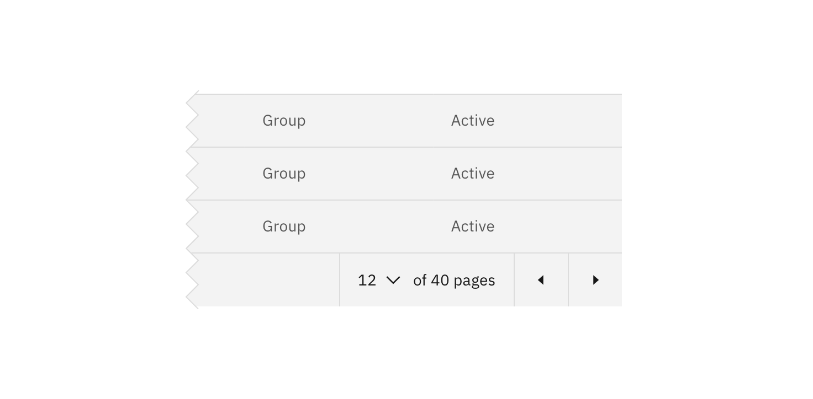
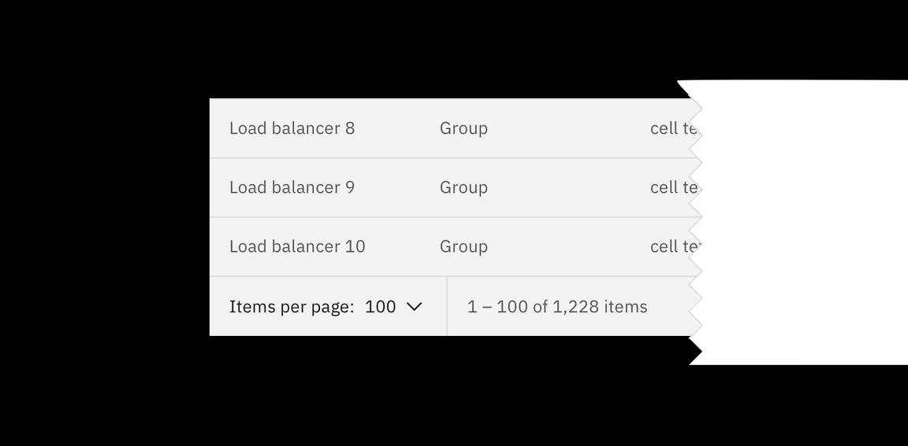

<PageDescription>

Pagination is used for splitting up content or data into several pages, with a
control for navigating to the next or previous page.

</PageDescription>

<AnchorLinks>

<AnchorLink>Overview</AnchorLink>
<AnchorLink>Live demo</AnchorLink>
<AnchorLink>Best practices</AnchorLink>
<AnchorLink>Feedback</AnchorLink>

</AnchorLinks>

## Overview

Generally, pagination is used if there are more than 25 items displayed in one
view.

The default number displayed will vary depending on the context.

## Live demo

<ComponentDemo
  components={[
    {
      id: 'pagination',
      label: 'Pagination',
    },
  ]}>
  <ComponentVariant
    id="pagination"
    knobs={{
      Pagination: [
        'disabled',
        'isLastPage',
        'pageInputDisabled',
        'pagesUnknown',
      ],
    }}
    links={{
      React:
        'https://react.carbondesignsystem.com/?path=/story/pagination--pagination',
      Angular:
        'https://angular.carbondesignsystem.com/?path=/story/components-pagination--basic',
      Vue:
        'http://vue.carbondesignsystem.com/?path=/story/components-cvpagination--default',
      Vanilla: 'https://the-carbon-components.netlify.com/?nav=pagination',
    }}>{`
  

    <Pagination
      backwardText="Previous page"
      forwardText="Next page"
      itemsPerPageText="Items per page:"
      page={1}
      pageNumberText="Page Number"
      pageSize={10}
      pageSizes={[
        10,
        20,
        30,
        40,
        50
      ]}
      totalItems={103}
    />
  

  `}</ComponentVariant>
</ComponentDemo>

## Best practices

#### Identify the current page

Clearly identify which page the user is on by displaying the current page
number. By providing context into how many pages there are in total (eg. 1 of 4
pages), you can help provide clarity around the data displayed.

#### Provide various options for navigating

_Previous_ and _next_ chevrons or links are the most useful way for the user to
move forward or backward through pages of data. Provide an
[inline select](/components/select/usage) in which users can choose the page
they wish to navigate to.

<Row>
<Column colLg={8}>

</Column>
</Row>

<Row>
<Column colLg={8}>

</Column>
</Row>

#### Items per page

Use an inline select within the pagination bar so the user can change the amount
of data displayed per page.

<Row>
<Column colLg={8}>

</Column>
</Row>

## Feedback

Help us improve this component by providing feedback, asking questions, and
leaving any other comments on
[GitHub](https://github.com/carbon-design-system/carbon-website/issues/new?assignees=&labels=feedback&template=feedback.md).
