import A11yStatus from 'components/A11yStatus';

<PageDescription>

Pagination splits content or data into several pages, with a control for
navigating to the next or previous page.

</PageDescription>

<AnchorLinks>

<AnchorLink>Live demo</AnchorLink>
<AnchorLink>Overview</AnchorLink>
<AnchorLink>Formatting</AnchorLink>
<AnchorLink>Content</AnchorLink>
<AnchorLink>Pagination</AnchorLink>
<AnchorLink>Pagination nav</AnchorLink>
<AnchorLink>Modifiers</AnchorLink>
<AnchorLink>Related</AnchorLink>
<AnchorLink>Feedback</AnchorLink>

</AnchorLinks>

## Live demo

<StorybookDemo
  themeSelector
  wide
  url="https://react.carbondesignsystem.com"
  variants={[
    {
      label: 'Default',
      variant: 'components-pagination--default',
    },
    {
      label: 'Multiple pagination components',
      variant: 'components-pagination--multiple-pagination-components',
    },
    {
      label: 'Pagination with custom page sizes label',
      variant: 'components-pagination--pagination-with-custom-page-sizes-label',
    },
    {
      label: 'Pagination nav',
      variant: 'components-paginationnav--default',
    },
  ]}
/>

<A11yStatus layout="cards" components={['Pagination', 'Pagination nav']} />

## Overview

Pagination organizes and divides large amounts of content on separate pages and
gives the user control over how much content they want to view on each page.
Pagination can be used with a data table or on a page.

<Row>
<Column colLg={12}>

</Column>
</Row>

<Caption>Example of the pagination component in a UI</Caption>

### When to use

- When it could take a considerable amount of time to load the available data at
  once or in a scrolling view
- When there is too much data to display on one page or within one view of a
  component
- To make large amounts of data more accessible to consume by users
- To optimize on-page real estate
- To give users more control over how they view large amounts of information

### When not to use

- Do not use it to display linear journeys, for example, in a form progression.
  Instead, use the
  [progress bar](https://carbondesignsystem.com/components/progress-bar/usage/)
  or [button](https://carbondesignsystem.com/components/button/usage/)
  components to navigate forward and backward.
- Do not use pagination superfluously, and aim to use it to improve usability or
  performance.

### Variants

| Variant                           | Usage                                                                                                                           |
| --------------------------------- | ------------------------------------------------------------------------------------------------------------------------------- |
| [Pagination](#pagination)         | The pagination variant is typically connected at the bottom of the data table component to help paginate large amounts of data. |
| [Pagination nav](#pagination-nav) | The pagination nav variant is mainly used in on-page situations to help paginate either a whole page or sections of a page.     |

## Formatting

### Anatomy of pagination

<Row>
<Column colLg={12}>

</Column>
</Row>

<Caption>Anatomy of the pagination variant</Caption>

1. **Items per page:** Shows the current number of items that appear per page.
2. **Range of items:** Shows the current range of items and lists the total
   amount of items.
3. **Current page:** Shows the current page the user is on and lists the total
   amount of pages.
4. **Previous and next buttons:** Buttons that take you to the previous or next
   page.
5. **Container:** The container bar of the whole pagination component.

### Anatomy of pagination nav

<Row>
<Column colLg={12}>

</Column>
</Row>

<Caption>Anatomy of the pagination nav variant</Caption>

1. **Unselected page button:** A page the user could select and view.
2. **Selected page button:** The current page the user is viewing.
3. **Overflow button:** Contains available pages that can be navigated to but
   cannot be shown upfront in the component because of the current viewport.
4. **Previous and next buttons:** Buttons that take you to the previous or next
   page.
5. **Container:** The container of the whole pagination component.

### Sizing

The pagination component is available in three sizes in both variants:
**large**, **medium**, and **small**.

<Row>
<Column colLg={12}>

</Column>
</Row>

<Caption>Sizes of pagination</Caption>

<Row>
<Column colLg={12}>

</Column>
</Row>

<Caption>Sizes of pagination nav</Caption>

### Data table size pairings

We recommend using the same height pagination as you do for the data table
component rows to which it is connected. In some cases, the height sizes of
these two components will not be the same because we do not offer extra small
and extra large sizes for pagination. When using the extra large data table row
height, use the large pagination. When using the extra small data table row
height, use the small pagination.

<Row>
<Column colLg={12}>

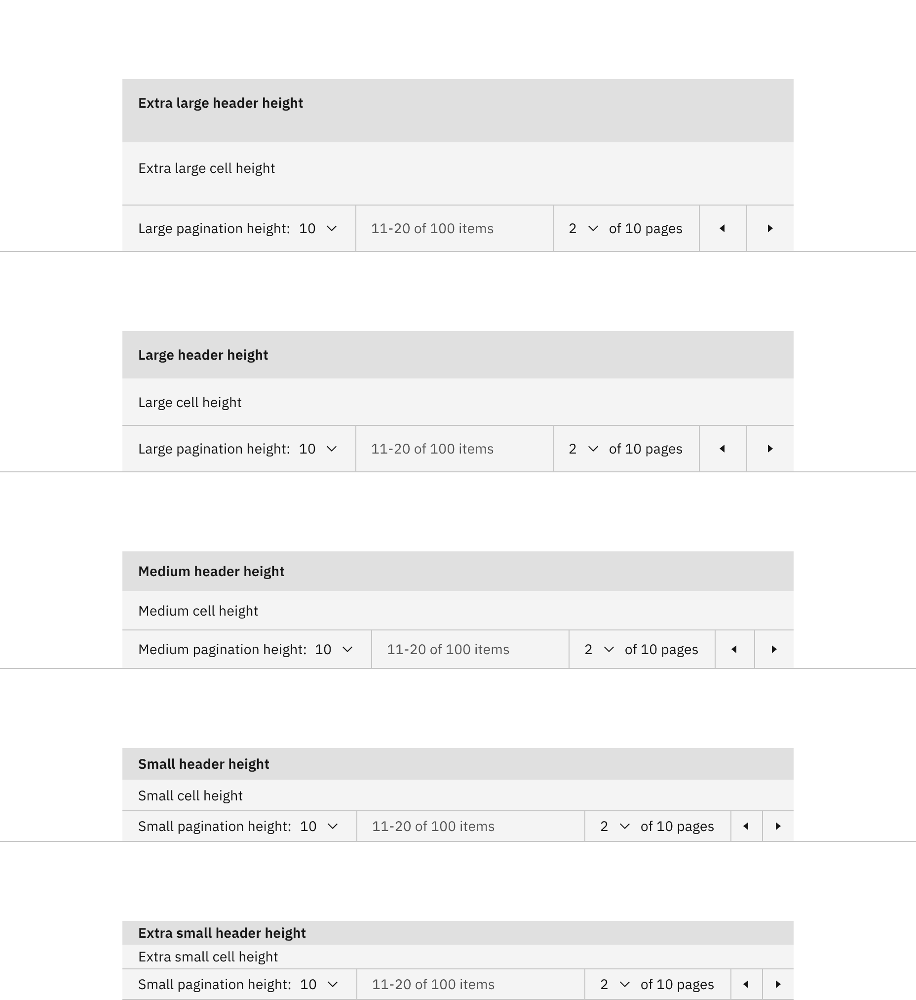

</Column>
</Row>

<Caption>Size pairings of the pagination and data table components</Caption>

### Placement

Place the pagination near the related component or area of the page where the
information will be paginated.

#### Placing pagination with data table

When using the pagination variant with a data table, the pagination should be
stacked and below the table with no padding between them.

<Row>
<Column colLg={12}>

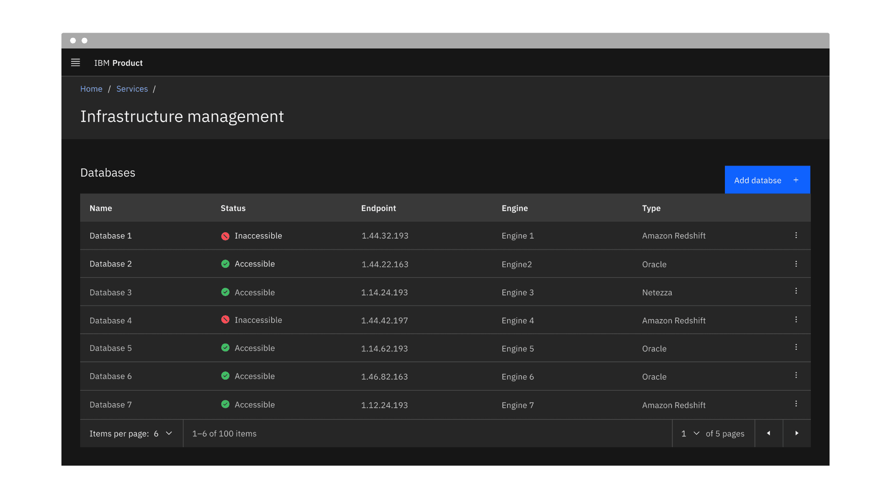

</Column>
</Row>

<Caption>Placement of the pagination variant</Caption>

<DoDontRow>
<DoDont
type="do"
colMd={6} colLg={6}
caption="Do stack the pagination component below the data table.">

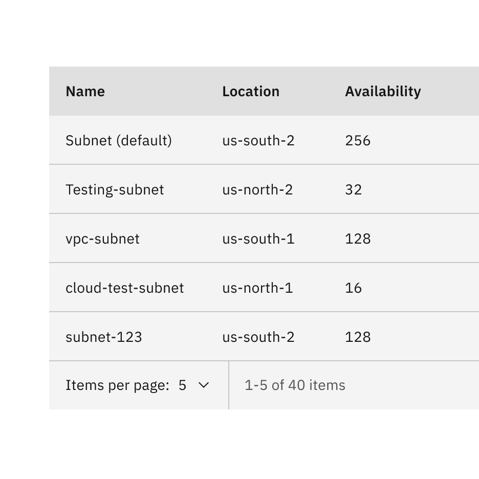

</DoDont>
<DoDont
colMd={6} colLg={6}
type="dont"
caption="Do not stack the pagination component above the data table.">

</DoDont>
</DoDontRow>

#### Placing pagination nav on a page

When using the pagination nav variant on a page, float it below the content to
which it is paginating and related to. The pagination can be right aligned or
left aligned to the content above it. When it doubt, choose right alignment.

<Row>
<Column colLg={12}>

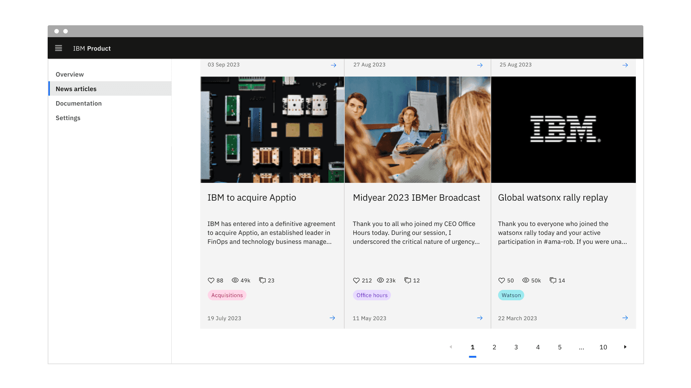

</Column>
</Row>

<Caption>Placement of the pagination nav variant</Caption>

## Content

### Main elements

#### Label text

The label text in the pagination component should be concise and instructional.
It describes the items per page and the number of pages or items. We recommend
not modifying the label text unless necessary for specific use cases.

#### Select component option text

The select components option text is shown as a number, indicating the items per
page and the current page. Alternatively, this can be indicated as a word for
the “Items per page” selection instead of a number.

### Overflow content

In the pagination nav variant, an ellipsis button appears between pages to
indicate that there are numerous pages to navigate to within the ellipsis button
menu. We recommend never placing the ellipsis button at the beginning or end of
a series of pages in the pagination component.

<Row>
<Column colLg={8}>

</Column>
</Row>

<Caption>
  Example of the ellipsis button for overflow content in the pagination nav
  variant
</Caption>

### Further guidance

For further content guidance, see Carbon's
[content guidelines](https://carbondesignsystem.com/guidelines/content/overview/).

## Pagination

The pagination variant is typically a bar attached to the bottom of a data table
to paginate its data.

<Row>
<Column colLg={12}>

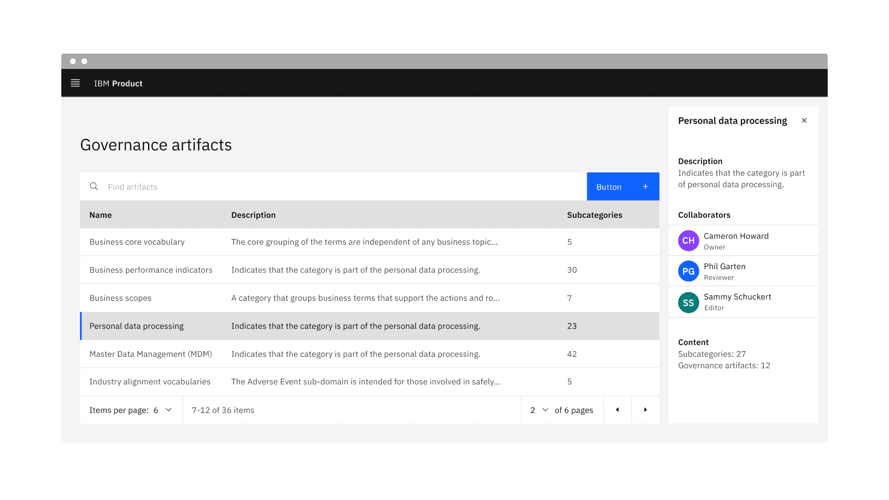

</Column>
</Row>

<Caption>Example of the pagination variant in a UI</Caption>

### States

The pagination variant has the select component and ghost icon button component
nested within it and inherits their component states. For more information on
these states, refer to the
[select](https://carbondesignsystem.com/components/select/style/) and
[ghost icon button](https://carbondesignsystem.com/components/button/style/)
style tab guidance.

### Interactions

#### Mouse

- Clicking on the select component will open the menu and reveal options.
- To close the menu, choose a different option or click outside the menu area.
- Clicking on a previous or next button will navigate you to the previous or
  next page.

#### Keyboard

- On focus, the select component menu is opened with pressing `Space`or with
  `Up` or `Down` arrows which also cycle through the values.
- Pressing `Space` or`Enter` selects a value and closes the menu.
- The menu can be closed by pressing `Esc`.
- The previous and next ghost icon buttons are activated by pressing `Space` or
  `Enter`.

### Responsive behavior

The pagination variant retains all its content and nested components at every
breakpoint except for the small breakpoint. The select components have been
removed at the small breakpoint, but information on the total number of items,
items being displayed, and previous and next buttons remain.

<Row>
<Column colLg={12}>

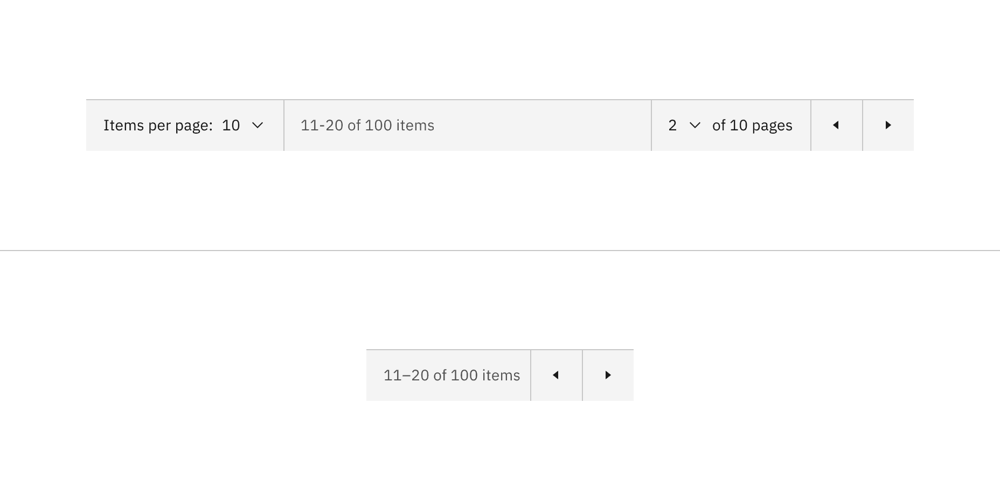

</Column>
</Row>

<Caption>
  Pagination variant responsive behavior in all breakpoints versus the small
  breakpoint
</Caption>

### Clickable areas

Within the pagination variant, there are four clickable areas. Two select
components allow you to change the number of items per page and the page number.
Two ghost icon buttons take you to the previous or next page.

<Row>
<Column colLg={12}>

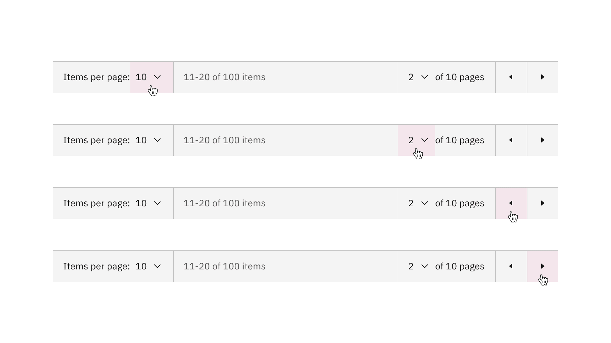

</Column>
</Row>

<Caption>Pagination variant clickable areas</Caption>

## Pagination nav

The pagination nav variant is most commonly used to paginate full pages or
sections of content on a page. It floats under and near the related content.

<Row>
<Column colLg={12}>

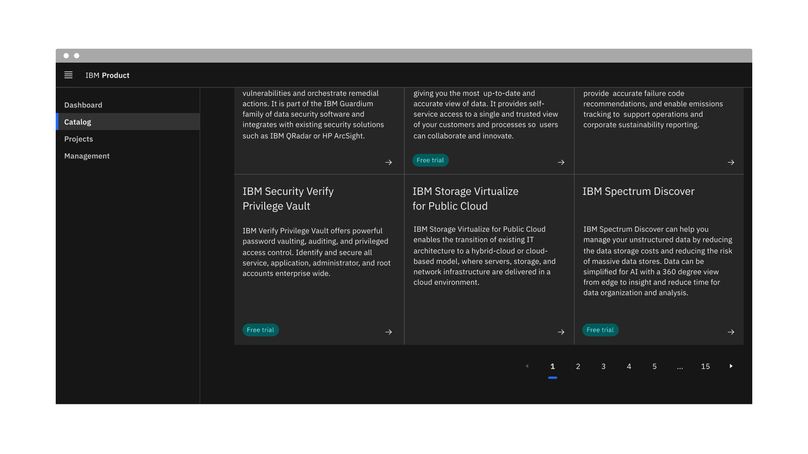

</Column>
</Row>

<Caption>Example of the pagination nav variant in a UI</Caption>

### States

The pagination nav variant has the ghost icon button component and the  
breadcrumb overflow button component nested within it that inherits their  
component states. For more information on these states, refer to the
[select](https://carbondesignsystem.com/components/select/style/) and
[breadcrumb overflow button](https://carbondesignsystem.com/components/breadcrumb/style/)
style tab guidance.

### Interactions

#### Mouse

- Clicking on a button number will navigate you to that page.
- Clicking on a previous or next caret button will navigate you to the previous
  and next pages of the one you are currently viewing.
- Clicking on an overflow ellipsis button will open a select menu to choose a
  page to navigate to. Upon clicking on a page option from the menu, you will
  navigate to that page.

#### Keyboard

- The icon button receives focus and you can move between buttons by pressing
  the `Up` or `Down` arrows.
- The page number buttons are activated by pressing `Space` or `Enter`.
- The previous and next buttons are activated by pressing `Space` or `Enter`.

### Responsive behavior

In small screens, the pagination nav variant can provide an ellipsis button to
indicate there are more pages to navigate to within the ellipsis button menu.

<Row>
<Column colLg={8}>

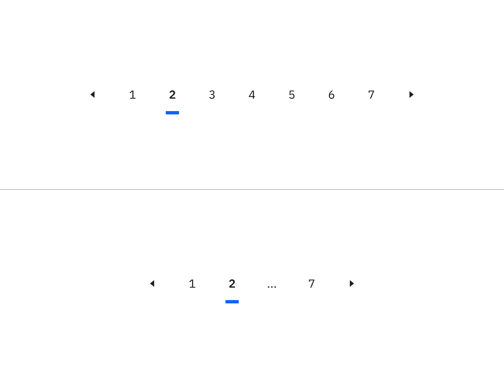

</Column>
</Row>

<Caption>
  Pagination nav variant responsive behavior in large versus small breakpoints
</Caption>

### Clickable areas

Every button in the pagination nav variant is clickable. Two ghost icon buttons
take you to the previous or next page. The rest of the page number buttons take
you to that particular page.

<Row>
<Column colLg={8}>

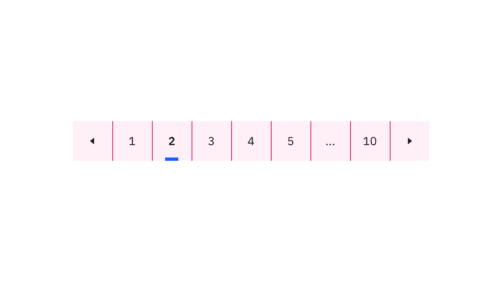

</Column>
</Row>

<Caption>Clickable areas within the pagination nav variant</Caption>

## Modifiers

### Page looping

For the pagination nav variant, instead of turning off the previous or next
caret buttons when you reach either the first or last page of the pagination
component, you can enable the option to loop through the available pages
continuously.

### Page naming

By default, the select component option text is displayed as a number, showing
items per page and the current page. However, we offer an alternative option to
use a word instead of a number for the “Items per page” selection if that better
meets your requirements.

<Row>
<Column colLg={8}>

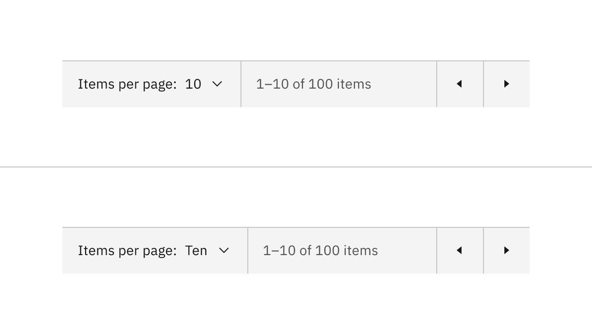

</Column>
</Row>

<Caption>Select components content alternative of numbers versus words</Caption>

## Related

- [Data table](https://carbondesignsystem.com/components/data-table/usage/)

## Feedback

Help us improve this component by providing feedback, asking questions, and
leaving any other comments on
[GitHub](https://github.com/carbon-design-system/carbon-website/issues/new?assignees=&labels=feedback&template=feedback.md).
