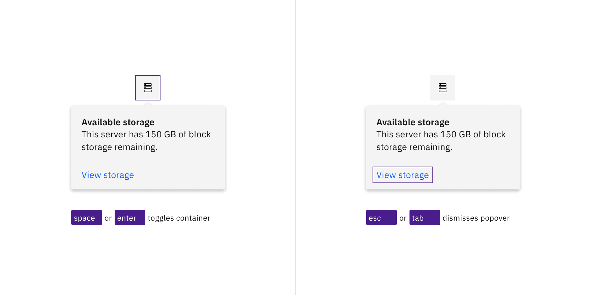

import A11yStatus from 'components/A11yStatus';

import { Popover } from '@carbon/react';

<PageDescription>

No accessibility annotations are needed for popover, but keep these
considerations in mind if you are modifying Carbon or creating a custom
component.

</PageDescription>

<AnchorLinks>
  <AnchorLink>What Carbon provides</AnchorLink>
  <AnchorLink>Development considerations</AnchorLink>
</AnchorLinks>

<A11yStatus layout="table" components="Popover" />

## What Carbon provides

Carbon bakes keyboard operation into its components, improving the experience of
blind users and others who operate via the keyboard. Carbon incorporates many
other accessibility considerations, some of which are described below.

### Keyboard interactions

Popovers use an icon button for the trigger. These buttons are in the tab order
and are activated by pressing `Enter` or `Space`. The activation toggles the
popover open and closed, and focus remains on the trigger.

When the popover contains interactive elements, pressing `Tab` will move focus
to the first component in the popover. When the popover only has non-interactive
text, or when the focus is on the last component in the popover, pressing `Tab`
will close the popover and move focus to the next tab stop on the page.

<Row>
<Column colLg={12}>

<Caption>
  The icon button trigger and interactive elements inside of the popover are in
  the page tab order.
</Caption>

</Column>
</Row>

<Row>
<Column colLg={12}>

<Caption>
  Use Space or Enter to open and close the popover, and use Esc or Tab on the
  last component to dismiss it.
</Caption>

</Column>
</Row>

## Development considerations

Keep these considerations in mind if you are modifying Carbon or creating a
custom component.

- The icon button has an `aria-label` that defines or describe the icon is.
- The button uses `aria-expanded` to set popover visibility and `aria-controls`
  to handle navigation to the content.
