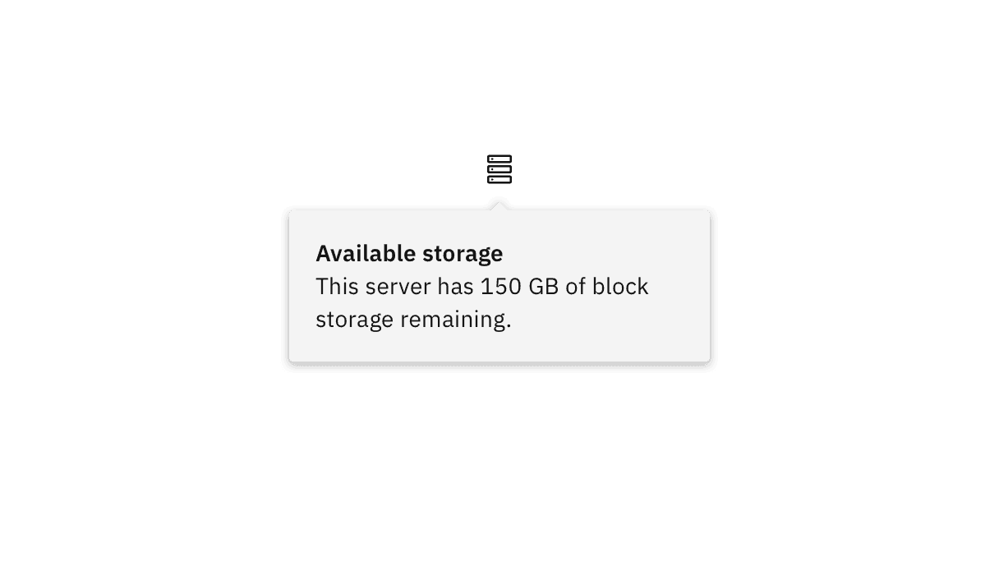
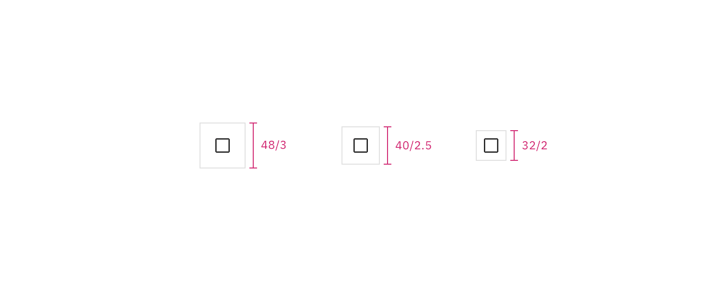
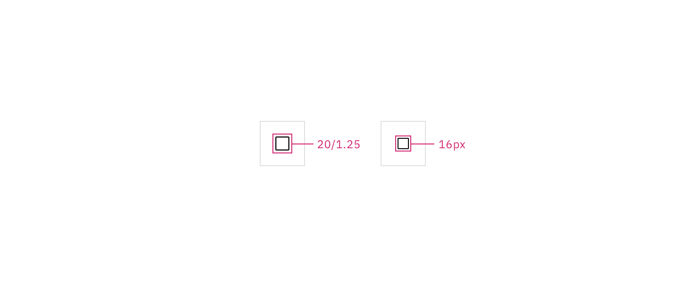

## Color

| Element   | Property         | Color token           |
| --------- | ---------------- | --------------------- |
| Container | background-color | `$layer-01`           |
|           | background-color | `$layer-02`           |
|           | background-color | `$background-inverse` |

<Row>
<Column colLg={8}>

</Column>
</Row>

## Typography

| Element   | Font-size (px/rem) | Font-weight    | Type token               |
| --------- | ------------------ | -------------- | ------------------------ |
| Heading   | background-color   | SemiBold / 600 | `$productive-heading-01` |
| Body text | background-color   | Regular / 400  | `$body-short-01`         |

<Row>
<Column colLg={8}>

</Column>
</Row>

## Structure

The width and height of a popover container can vary depending on the amount of
content within it. We recommend to not exceed a popover width size of four
columns.

| Element           | Property      | px / rem | Spacing token |
| ----------------- | ------------- | -------- | ------------- |
| Popover container | max-width     | 352 / 22 | –             |
|                   | padding       | 16 / 1   | `$spacing-05` |
| Caret tip         | height, width | 8 / .5   | –             |
|                   | margin-top    | 4 / .25  | `$spacing-02` |

<Caption>
  Structure and spacing measurements a popover container. | px / rem
</Caption>

<Caption>
  Structure and spacing measurements between a popover container and trigger
  button. | px / rem
</Caption>

## Sizes

| Element           | Size   | Height (px / rem) |
| ----------------- | ------ | ----------------- |
| Trigger container | Small  | 32 / 2            |
|                   | Medium | 40 / 2.5          |
|                   | Large  | 48 / 3            |
| Trigger svg       | size   | 16 x 16           |
|                   | size   | 20 x 20           |

<Caption>
  Structure and spacing measurements for a popover trigger container. | px / rem
</Caption>

<Caption>
  Structure and spacing measurements for a popover trigger icon. | px / rem
</Caption>
