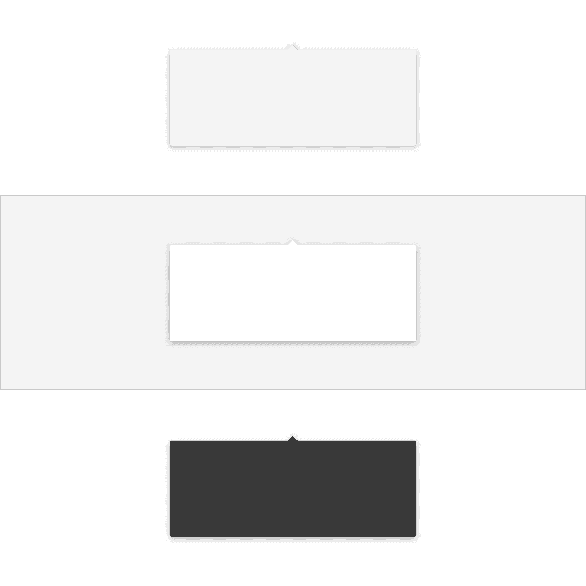
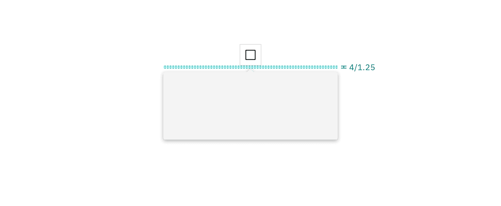

## Color

| Element   | Property         | Color token           |
| --------- | ---------------- | --------------------- |
| Container | background-color | `$layer` \*           |
|           | background-color | `$background-inverse` |

<Caption fullWidth>
  \* Denotes a contextual color token that will change values based on the layer
  it is placed on.
</Caption>

<Row>
<Column colLg={8}>

</Column>
</Row>

## Structure

The width and height of a popover container can vary depending on the amount of
content within it. We recommend to not exceed a popover width size of four
columns.

| Element   | Property      | px / rem | Spacing token |
| --------- | ------------- | -------- | ------------- |
| Container | max-width     | 352 / 22 | –             |
|           | padding       | 16 / 1   | `$spacing-05` |
| Caret tip | height, width | 8 / .5   | –             |
|           | margin-top    | 4 / .25  | `$spacing-02` |

<Caption>
  Structure and spacing measurements a popover container. | px / rem
</Caption>

<Caption>
  Structure and spacing measurements between a popover container and trigger
  button. | px / rem
</Caption>
