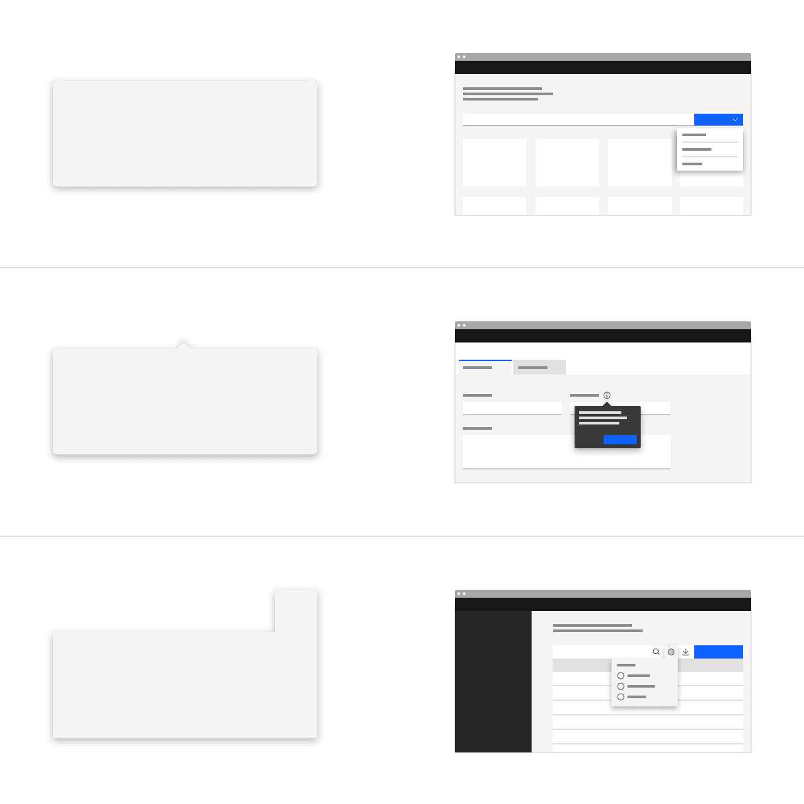
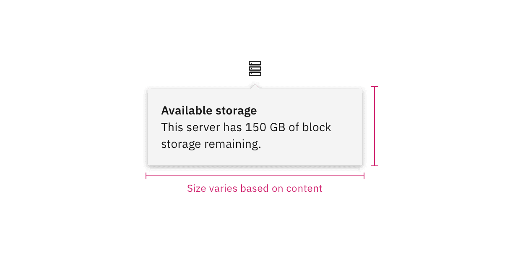
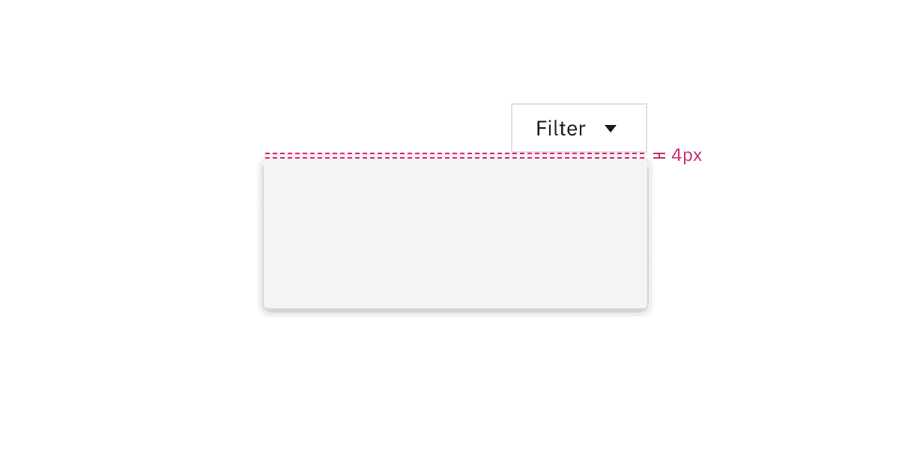
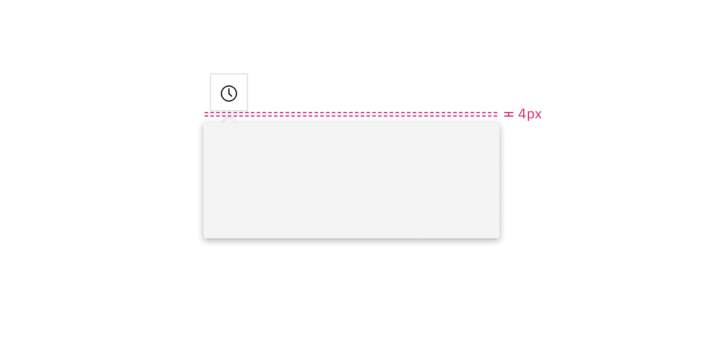
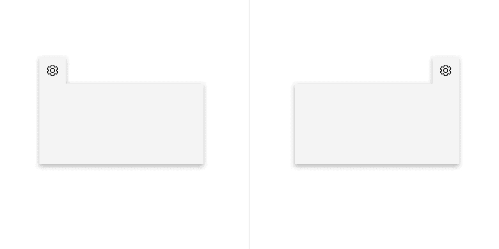
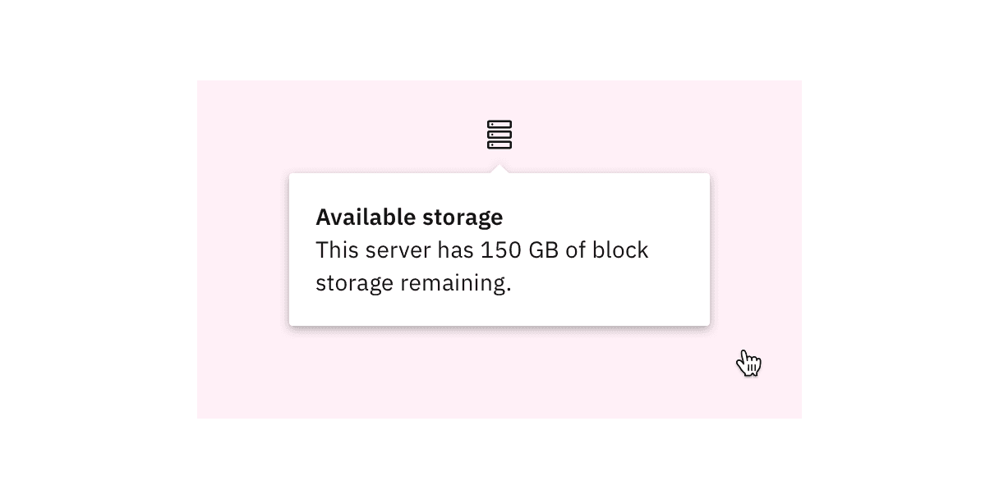

<PageDescription>

A popover is a layer that pops up over all other elements on a page.

</PageDescription>

<AnchorLinks>

<AnchorLink>Overview</AnchorLink>
<AnchorLink>Live demo</AnchorLink>
<AnchorLink>Variants</AnchorLink>
<AnchorLink>Formatting</AnchorLink>
<AnchorLink>Content</AnchorLink>
<AnchorLink>Behaviors</AnchorLink>
<AnchorLink>Modifiers</AnchorLink>
<AnchorLink>Related</AnchorLink>
<AnchorLink>References</AnchorLink>
<AnchorLink>Feedback</AnchorLink>

</AnchorLinks>

## Overview

A popover is a layer that appears above all other content on the page. Only one
popover can appear at a time and can contain varying text and interactive
elements. Popovers are used as a base layer in some of our components like
tooltips, overflow menus, and dropdown menus.

#### When to use

- Use when placing interactive elements, like links, buttons, or rich media to
  make the component accessible. Disclosures that contain interactive elements,
  like interactive toggletips, use popovers as a base container layer to achieve
  this accessibility standard. For further guidance on how to display content
  within a popover, see the [disclosure pattern].
- Use when you need to display additional details for specific elements on a
  page. If your popover exceeds four columns in width, use a modal instead.

## Live demo

## Variants

By default, a popovers structure is made up of a container with no additional
tip. Depending on the usecase, caret tips or tab tips can be added to the
container to help show the relationship between the popover and where it was
triggered from.

| Variant   | Purpose                                                                                                                                                                                                                                             |
| --------- | --------------------------------------------------------------------------------------------------------------------------------------------------------------------------------------------------------------------------------------------------- |
| No tip    | Popovers without a tip are typically used when the trigger button has a visually defined down state.                                                                                                                                                |
| Caret tip | Popovers with a caret tip should be used to help show the relationship between the popover and where it was triggered from. A caret tip is typically used when the trigger button does not have a visually defined down state and for icon buttons. |
| Tab tip   | Popovers can have a tab tip when the popover is connected to a toolbar or header area.                                                                                                                                                              |

<Row>
<Column colLg={8}>

</Column>
</Row>

## Formatting

### Anatomy

<Row>
<Column colLg={8}>

</Column>
</Row>

1. **UI trigger button:** An interactive element that triggers the popover to
   open on click, hover, or focus.
2. **Tip:** An indicator that is added to a popover container to help show the
   relationship between the popover and where it was triggered from.
3. **Content area:** An area to place text and interactive elements.
4. **Container:** An area to place text and interactive elements.

### Sizing

#### Container

The width and height of a popover container can vary depending on the amount of
content placed within it. We recommend to not exceed a popover width size of
four columns.

<Row>
<Column colLg={8}>

</Column>
</Row>

<DoDontRow>
  <DoDont caption="Do keep the width size of a popover within four columns.">

  </DoDont>
  <DoDont type="dont" caption="Don't exceed a popover width size of four columns.">

  </DoDont>
</DoDontRow>

#### Trigger button

The trigger button can use any of our button types and can be set at these three
sizes—48px (lg), 40px (md) or 32px (sm).

<Row>
<Column colLg={8}>

</Column>
</Row>

#### Icon

If a trigger button contains an icon, the icon size should be either 20px or
16px.

<Row>
<Column colLg={8}>

</Column>
</Row>

## Content

### Main elements

Heading, body, and footer content can vary based on your usecase. To see
examples of content used in popovers, visit the disclosure pattern.

### Further guidance

For further content guidance, see Carbon's
[content guidelines]([https://www.carbondesignsystem.com/guidelines/content/overview/]).

## No tip

Popovers without a tip can be used for a wide variety of different usecases. No
tip popovers are typically used when the trigger button has a visually defined
down state.

### Placement

Popover directions by default are set to auto. Upon opening, popovers can detect
the edges of the browser to properly be placed in view so the container does not
get cutoff. Alternatively, popovers can also specify distinct directions.
Direction options vary depending on the popover variant.

When a popover does not have a tip, the trigger button should be flush to the
side of the popover. The popover can open from the **left**, **right**,
**bottom**, or **top** of the trigger button.

<Row>
<Column colLg={8}>

</Column>
</Row>

<Row>
<Column colLg={8}>

</Column>
</Row>

### Alignment

The trigger button should be placed 4px away from the popover container and
should always be the same distance away from the popover container regardless of
what size button is being used.

<Row>
<Column colLg={8}>

</Column>
</Row>

<DoDontRow>
  <DoDont caption="Do flush align the popover edge with the trigger button.">

  </DoDont>
  <DoDont type="dont" caption="Don't arbitrarily place the popover near the trigger button.">

  </DoDont>
</DoDontRow>

## Caret tip

A caret tip should be added to a popover to help show the relationship between
the popover and where it was triggered from. A caret tip is typically used when
the trigger button does not have a visually defined down state and for icon
buttons.

### Placement

The popover can open from the left, right, bottom, or top of the trigger button.
When using a caret tip, the trigger button and caret tip should be vertically
center with eachother.

### Alignment

The container of the popover may be aligned to start, center, or end to keep the
container from bleeding off the page or covering important information.

<Row>
<Column colLg={8}>

</Column>
</Row>

<Row>
<Column colLg={8}>

</Column>
</Row>

Similarly with no tip popovers, a trigger button paired with a caret tip popover
should be placed 4px away from the popover container.

<Row>
<Column colLg={8}>

</Column>
</Row>

<DoDontRow>
  <DoDont caption="Do align the caret tip center with the trigger button.">

  </DoDont>
  <DoDont type="dont" caption="Don't misalign the caret tip with the trigger button.">

  </DoDont>
</DoDontRow>

## Tab tip

Popovers can have a tab tip when the popover is connected to a toolbar or header
area where the trigger button sits within.

### Placement

Tab tip popovers nest within another layer on a page. The tab tip can appear on
the left and right of the container and the edges should be flush with the layer
edges it sits within.

<Row>
<Column colLg={8}>

</Column>
</Row>

### Alignment

Popovers with a tab tip have 0px space between the trigger button and the
container because they are connected to eachother.

<Row>
<Column colLg={8}>

</Column>
</Row>

<DoDontRow>
  <DoDont caption="Do top align the tab tip with the layer behind it to keep clean lines between the popover and the layer underneath.">

  </DoDont>
  <DoDont type="dont" caption="Don't misalign the tab tip with the layer behind it to avoid creating jagged lines between the popover and the layer underneath.">

  </DoDont>
</DoDontRow>

## Behaviors

### Interactions

**Mouse**

Users trigger a popover to open by clicking the trigger button. Users can close
the popover by clicking again on the trigger button or anywhere outside of the
open popover container.

<Row>
<Column colLg={8}>

</Column>
</Row>

**Keyboard**

When the popover control has focus:

- `Enter` and `Space` activates the popover control and toggles the visibility
  of the popover content.

**Screen readers**

VoiceOver: Users can trigger a button to open a popover by pressing `Enter` or
`Space` while the button has focus.

JAWS: Users can trigger a button to open a popover by pressing `Enter` or
`Space` while the button has focus.

NVDA: Users can trigger a button to open a popover by pressing `Enter` or
`Space` while the button has focus.

## Modifiers

**Containers**

There are three different container variants of a popover—no tip, caret tip, and
tab tip. The default popover has no tip. No tip popovers are typically used when
the trigger button has a visually defined down state. Caret tips should be used
to help show the relationship between a popover and where it was triggered from.
Tab tips are specifically used in headers and toolbars.

<Row>
<Column colLg={8}>

</Column>
</Row>

**Colors**

Popovers come in three different container colors—`$layer-01`, `$layer-02`, and
`$background-inverse`.

<Row>
<Column colLg={8}>

</Column>
</Row>

**Corners**

A popover container has rounded corners by default and the corner radius is set
to 2px. Use straight corners when the popover structure contains a tab tip and
is connected to a toolbar or header to keep clean lines between the popover and
the layer underneath.

<Row>
<Column colLg={8}>

</Column>
</Row>

## Related

**Form components**

Form components that have menus, like dropdowns, selects and date pickers, use
popovers as a base layer.

**Disclosures**

Disclosures use popovers as a base layer, and then build off of that layer to
include varying text, and interactive elements for a wide variety of usecases.
For further guidance, see Carbon's [disclosure pattern].

**Overflow menus**

Overflow menus use popovers as a base layer. When the overflow menu icon button
is triggered, the menu opens and uses a tab tip popover as its base. For further
guidance, see Carbon's
[overflow menu](<[https://www.carbondesignsystem.com/components/overflow-menu/usage/](https://www.carbondesignsystem.com/components/overflow-menu/usage/)>).

**Tooltips**

Tooltips use popovers as a base layer. Tooltips are comprised of a popover
container and text. For further guidance, see Carbon's
[tooltip](<[https://www.carbondesignsystem.com/components/tooltip/usage/](https://www.carbondesignsystem.com/components/tooltip/usage/)>).

## References

Popup,
[Component research documentation](https://open-ui.org/components/popup.research#popup),
(OpenUI)

Disclosure, [W3C WAI-ARIA
practices](https://www.w3.org/TR/wai-aria-practices-1.1/#disclosure](https://www.w3.org/TR/wai-aria-practices-1.1/#disclosure),
(W3C Working Group Note)

## Feedback

Help us improve this component by providing feedback, asking questions, and
leaving any other comments on
[GitHub](https://github.com/carbon-design-system/carbon-website/issues/new?assignees=&labels=feedback&template=feedback.md).
