import A11yStatus from 'components/A11yStatus';

<PageDescription>

A popover is a layer that pops up over all other elements on a page.

</PageDescription>

<AnchorLinks>

<AnchorLink>Live demo</AnchorLink>
<AnchorLink>Overview</AnchorLink>
<AnchorLink>Formatting</AnchorLink>
<AnchorLink>Content</AnchorLink>
<AnchorLink>Universal behaviors</AnchorLink>
<AnchorLink>Modifiers</AnchorLink>
<AnchorLink>Related</AnchorLink>
<AnchorLink>References</AnchorLink>
<AnchorLink>Feedback</AnchorLink>

</AnchorLinks>

## Live demo

<StorybookDemo
  themeSelector
  wide
  url="https://react.carbondesignsystem.com"
  variants={[
    {
      label: 'Auto align',
      variant: 'components-popover--experimental-auto-align',
    },
    {
      label: 'Tab tib',
      variant: 'components-popover--tab-tip',
    },
  ]}
/>

<A11yStatus layout="cards" components="Popover" />

## Overview

A popover is a layer that appears above all other content on the page. Only one
popover can appear at a time and can contain varying text and interactive
elements. Popovers are used as a base layer in some of our components like
tooltips, overflow menus, and dropdown menus.

### When to use

- Use when placing interactive elements, like links, buttons, or rich media to
  make the component more accessible. Disclosures that contain interactive
  elements use popovers as a base container layer to achieve this accessibility
  standard. For further guidance on how to display content within a popover, see
  the [disclosure pattern](/patterns/disclosures-pattern/).
- Use when you need to display additional details for specific elements on a
  page. If your popover exceeds four columns in width, use a modal instead.

### When not to use

Avoid nesting popovers or placing popovers within other popovers. This can
create confusing interactions and accessibility issues. Consider using a modal
or a different experience instead.

### Variants

By default, a popovers structure is made up of a container with no additional
tip. Depending on the use case, caret tips or tab tips can be added to the
container to help show the relationship between the popover and where it was
triggered from.

| Variant                 | Purpose                                                                                                                                                                                                                                             |
| ----------------------- | --------------------------------------------------------------------------------------------------------------------------------------------------------------------------------------------------------------------------------------------------- |
| [No tip](#no-tip)       | Popovers without a tip are typically used when the trigger button has a visually defined down state.                                                                                                                                                |
| [Caret tip](#caret-tip) | Popovers with a caret tip should be used to help show the relationship between the popover and where it was triggered from. A caret tip is typically used when the trigger button does not have a visually defined down state and for icon buttons. |
| [Tab tip](#tab-tip)     | Popovers can have a tab tip when the popover is connected to a toolbar or header area.                                                                                                                                                              |

<Row>
<Column colLg={8}>

</Column>
</Row>

## Formatting

### Anatomy

<Row>
<Column colLg={8}>

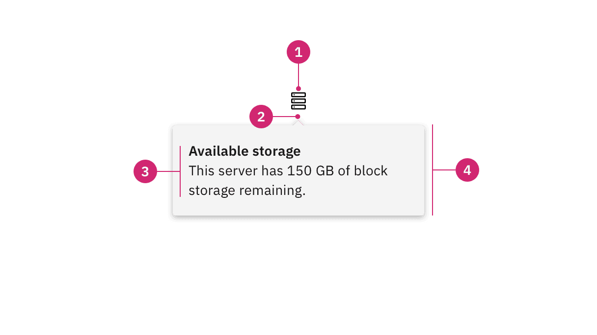

</Column>
</Row>

1. **UI trigger button:** An interactive element that triggers the popover to
   open on click, hover, or focus.
2. **Tip:** An indicator that is added to a popover container to help show the
   relationship between the popover and where it was triggered from.
3. **Content area:** An area to place text and interactive elements.
4. **Container:** An area to place text and interactive elements.

### Sizing

#### Container

The width and height of a popover container can vary depending on the amount of
content placed within it. We recommend to not exceed a popover width size of
four columns.

<Row>
<Column colLg={8}>

</Column>
</Row>

<DoDontRow>
  <DoDont type="do" caption="Do keep width between one to four columns.">

  </DoDont>
  <DoDont type="dont" caption="Don't exceed width of four columns.">

  </DoDont>
</DoDontRow>

#### Trigger button

A popover is controlled by a trigger button. By default, we use an icon button
to trigger a popover to open. However, as long as the trigger button is
interactive it can visually change its shape and size depending on the usecase.

The trigger button can open the popover on click, hover, or focus depending on
what it is being used for. For more information about trigger buttons, see the
[disclosure pattern](/patterns/disclosures-pattern/).

## Content

### Main elements

Heading, body, and footer content can vary based on your usecase. To see
examples of content used in popovers, see the
[disclosure pattern](/patterns/disclosures-pattern/).

### Overflow content

Scrolling is usually not needed when using a popover. If scrolling is needed, in
a dropdown like situation for instance, then the body section should scroll
vertically with the header and footer remaining fixed in place if those elements
are present. Do not scroll horizontally or let content bleed off the page.

### Further guidance

For further content guidance, see Carbon's
[content guidelines](/guidelines/content/overview/).

## No tip

Popovers without a tip can be used for a wide variety of different use cases. No
tip popovers are typically used when the trigger button has a visually defined
down state.

### Placement

Popover directions by default are set to auto. Upon opening, popovers can detect
the edges of the browser to properly be placed in view so the container does not
get cutoff. Alternatively, popovers can also specify distinct directions.
Direction options vary depending on the popover variant.

When a popover does not have a tip, the trigger button should be flush to the
side of the popover. The popover can open from the **left**, **right**,
**bottom**, or **top** of the trigger button.

<Row>
<Column colLg={8}>

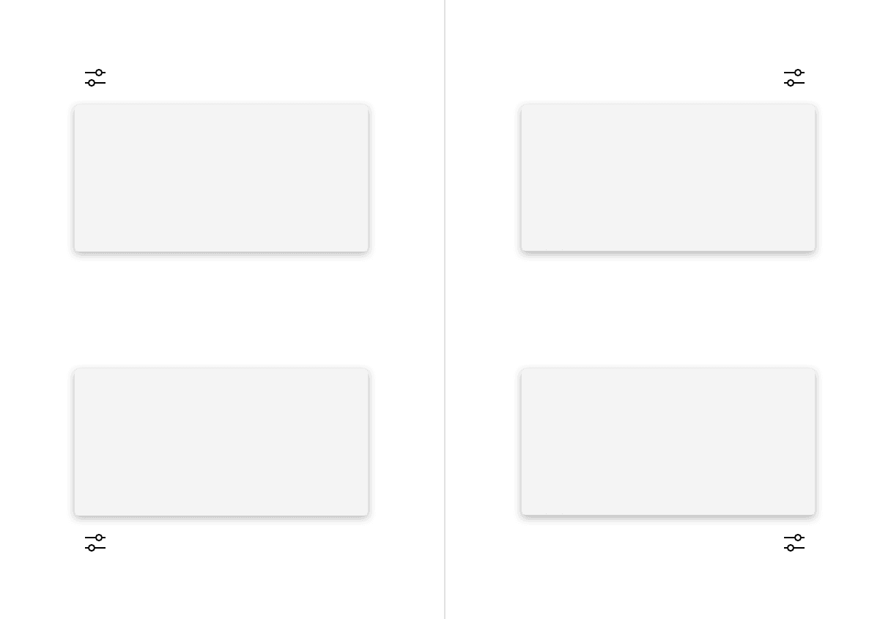

</Column>
</Row>

<Row>
<Column colLg={8}>

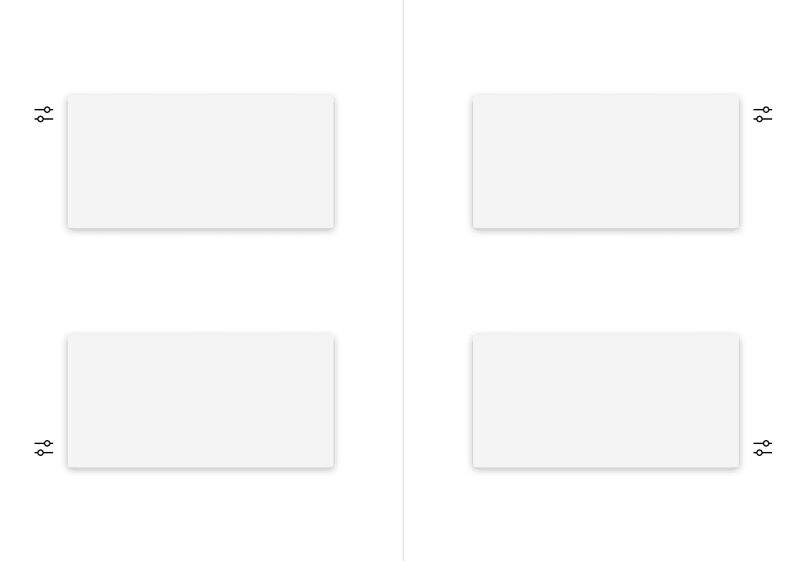

</Column>
</Row>

### Alignment

The trigger button should be placed 4px away from the popover container and
should always be the same distance away from the popover container regardless of
what size button is being used.

<Row>
<Column colLg={8}>

</Column>
</Row>

<DoDontRow>
  <DoDont type="do" caption="Do flush align the popover edge with the trigger button.">

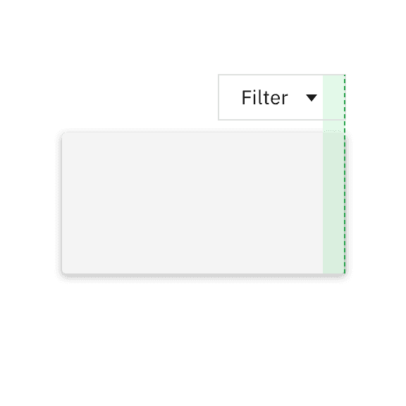

  </DoDont>
  <DoDont type="dont" caption="Don't arbitrarily place the popover near the trigger button.">

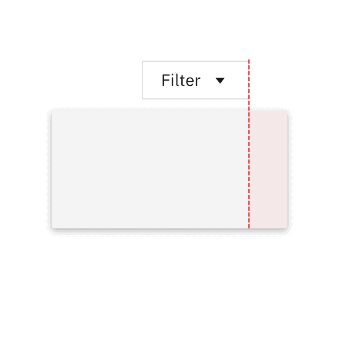

  </DoDont>
</DoDontRow>

## Caret tip

A caret tip should be added to a popover to help show the relationship between
the popover and where it was triggered from. A caret tip is typically used when
the trigger button does not have a visually defined down state and for icon
buttons.

### Placement

The popover can open from the **left**, **right**, **bottom**, or **top** of the
trigger button. When using a caret tip, the trigger button and caret tip should
be vertically centered with each other.

### Alignment

The container of the popover may be aligned to **start**, **center**, or **end**
to keep the container from bleeding off the page or covering important
information.

<Row>
<Column colLg={8}>

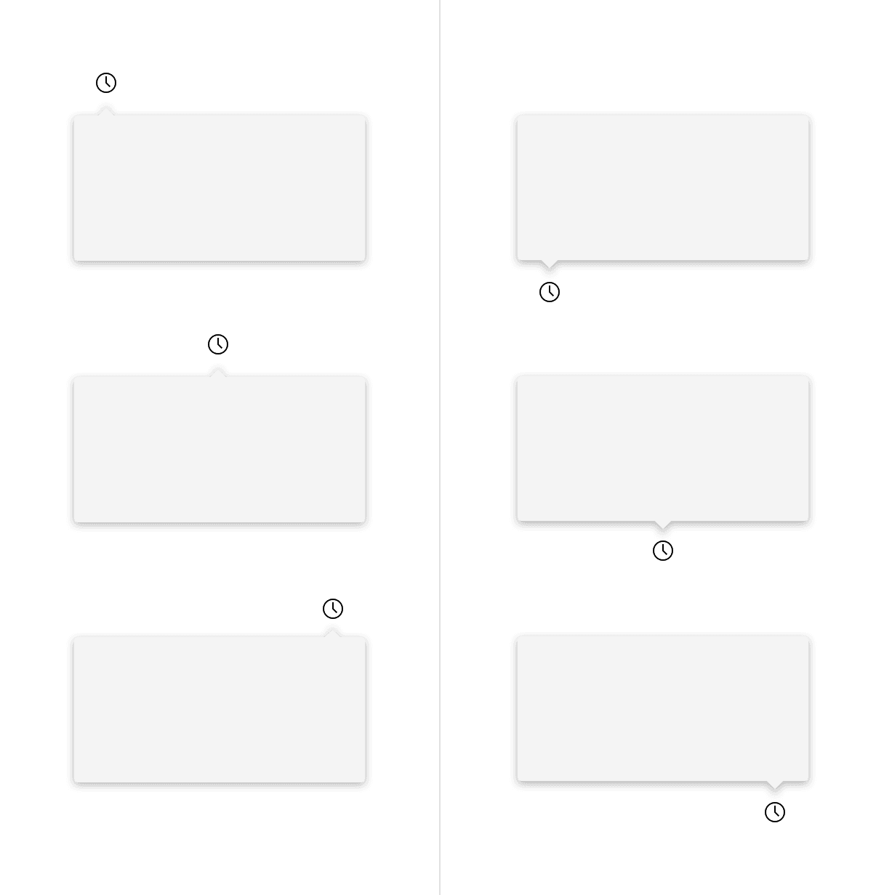

</Column>
</Row>

<Row>
<Column colLg={8}>

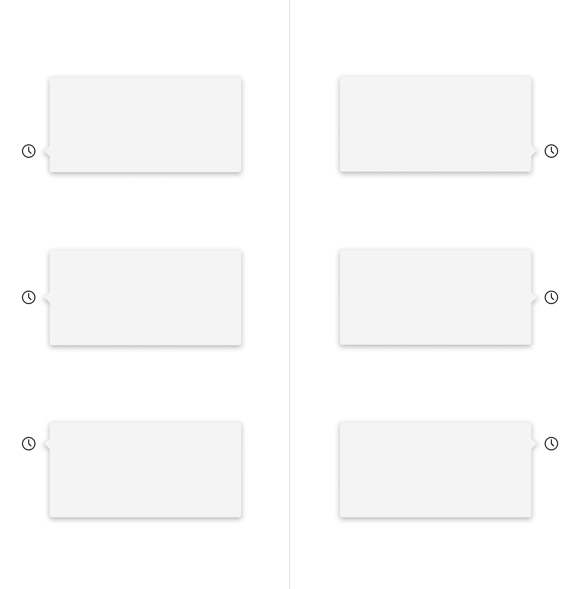

</Column>
</Row>

Similarly with no tip popovers, a trigger button paired with a caret tip popover
should be placed 4px away from the popover container.

<Row>
<Column colLg={8}>

</Column>
</Row>

<DoDontRow>
  <DoDont type="do" caption="Do align the caret tip center with the trigger button.">

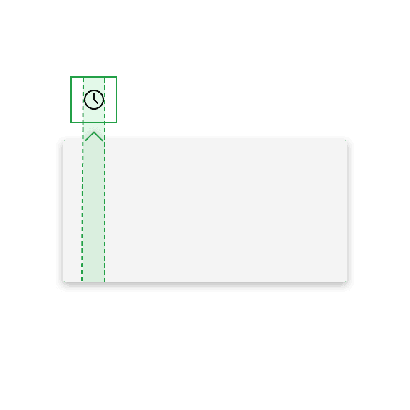

  </DoDont>
  <DoDont type="dont" caption="Don't misalign the caret tip with the trigger button.">

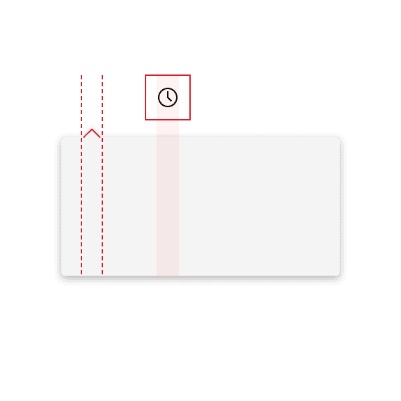

  </DoDont>
</DoDontRow>

## Tab tip

Popovers can have a tab tip when the popover is connected to a toolbar or header
area where the trigger button sits within.

### Placement

Tab tip popovers nest within another layer on a page. The tab tip can appear on
the **left** and **right** of the container and the edges should be flush with
the layer edges it sits within.

<Row>
<Column colLg={8}>

</Column>
</Row>

### Alignment

Popovers with a tab tip have 0px space between the trigger button and the
container because they are connected to each other.

<Row>
<Column colLg={8}>

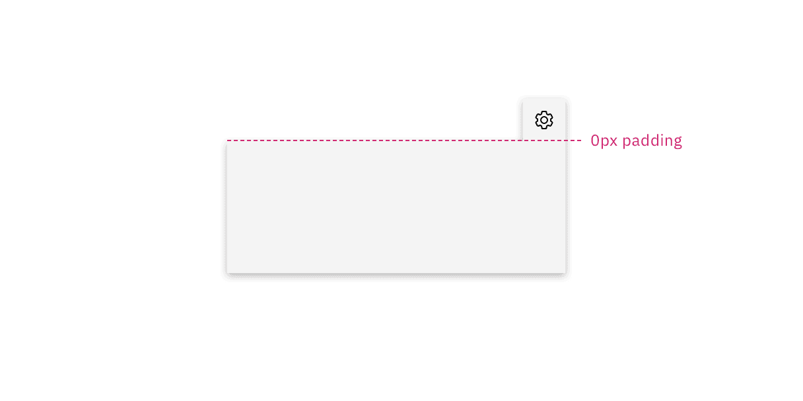

</Column>
</Row>

<DoDontRow>
  <DoDont type="do" caption="Do top align the tab tip with the layer behind it.">

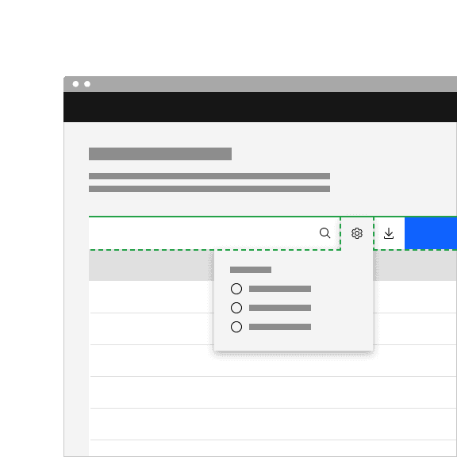

  </DoDont>
  <DoDont type="dont" caption="Don't misalign the tab tip with the layer behind it.">

  </DoDont>
</DoDontRow>

## Universal behaviors

### Interactions

#### Mouse

Users trigger a popover to open and close by clicking or hovering on the trigger
button depending on the use case.

Click: Open the popover by clicking on the trigger button. Close the popover by
clicking on the trigger button again, or anywhere outside of the open popover
container.

Hover: Open the popover by hovering over the trigger button. Close the popover
by hovering off of the popover or clicking anywhere outside of the open popover
container.

<Row>
<Column colLg={8}>

</Column>
</Row>

#### Keyboard

Focus: When the popover control has focus `Enter` or `Space` activates the
popover control and toggles the visibility of the popover content.

#### Screen readers

VoiceOver: Users can trigger a button to open a popover by pressing `Enter` or
`Space` while the button has focus.

JAWS: Users can trigger a button to open a popover by pressing `Enter` or
`Space` while the button has focus.

NVDA: Users can trigger a button to open a popover by pressing `Enter` or
`Space` while the button has focus.

### Nesting

Placing one popover inside another can cause confusing interactions and
accessibility issues. Consider using a modal or a different experience instead.

Tooltips can be used on interactive elements within a popover, but consider
their placement carefully. Ensure tooltips are positioned in a way that prevents
them from being cut off within the popover container.

<Row>
<Column colLg={8}>

</Column>

</Row>

<Caption>Example of tooltip within popover</Caption>

## Modifiers

#### Colors

Popovers are most commonly used in these three different container
colors—`$layer-01`, `$layer-02`, and `$background-inverse`.

<Row>
<Column colLg={8}>

</Column>
</Row>

#### Corners

A popover container has rounded corners by default and the corner radius is set
to 2px. Use straight corners when the popover structure contains a tab tip and
is connected to a toolbar or header to keep clean lines between the popover and
the layer underneath.

<Row>
<Column colLg={8}>

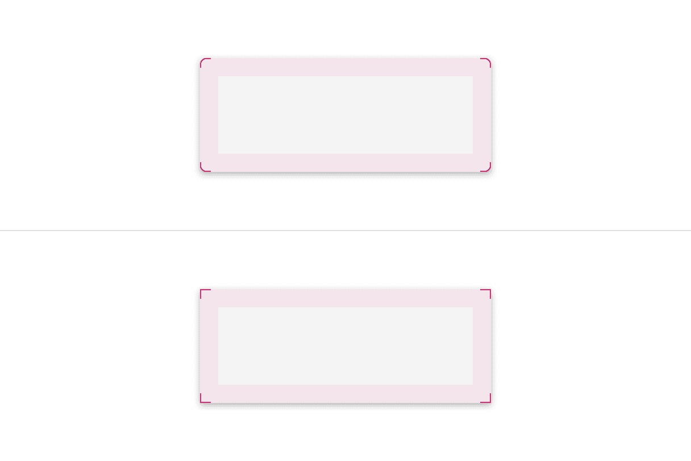

</Column>
</Row>

## Related

#### Form components

Form components that have menus, like dropdowns, use popovers as a base layer.

#### Disclosures

Disclosures use popovers as a base layer. Disclosures are comprised of a popover
container, text, and interactive elements. For further guidance, see Carbon's
[disclosure pattern](/patterns/disclosures-pattern/).

#### Overflow menus

Overflow menus use popovers as a base layer. When the overflow menu icon button
is triggered, the menu opens and uses a tab tip popover as its base. For further
guidance, see Carbon's [overflow menu](/components/overflow-menu/usage/).

#### Toggletips

Toggletips use the popovers as a base layer. Toggletips allow interactive
elements within the popover container while still being accessible. For further
guidance, see Carbon's [toggletip component](/components/toggletip/usage/)

#### Tooltips

Tooltips use popovers as a base layer. Tooltips are comprised of a trigger
button, popover container and text. For further guidance, see Carbon's
[tooltip component](/components/tooltip/usage/).

## References

Popup,[Component research](https://open-ui.org/components/popup.research#popup),
(OpenUI)

Disclosure,
[W3C WAI-ARIA practices](https://www.w3.org/TR/wai-aria-practices-1.1/#disclosure),
(W3C Working Group Note)

## Feedback

Help us improve this component by providing feedback, asking questions, and
leaving any other comments on
[GitHub](https://github.com/carbon-design-system/carbon-website/issues/new?assignees=&labels=feedback&template=feedback.md).
