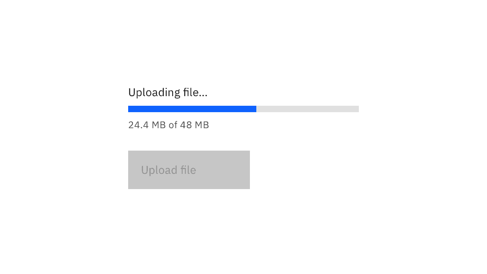
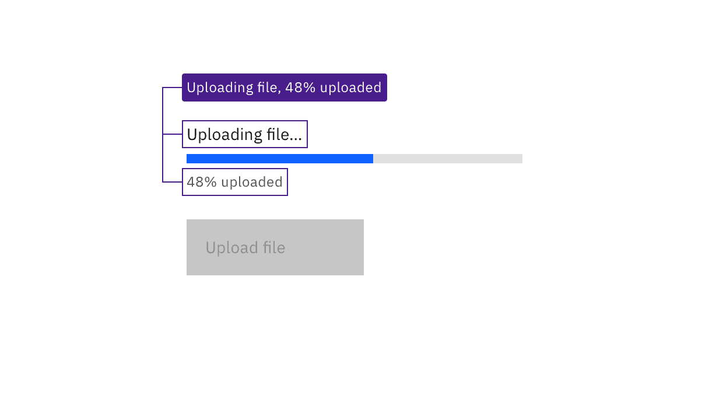
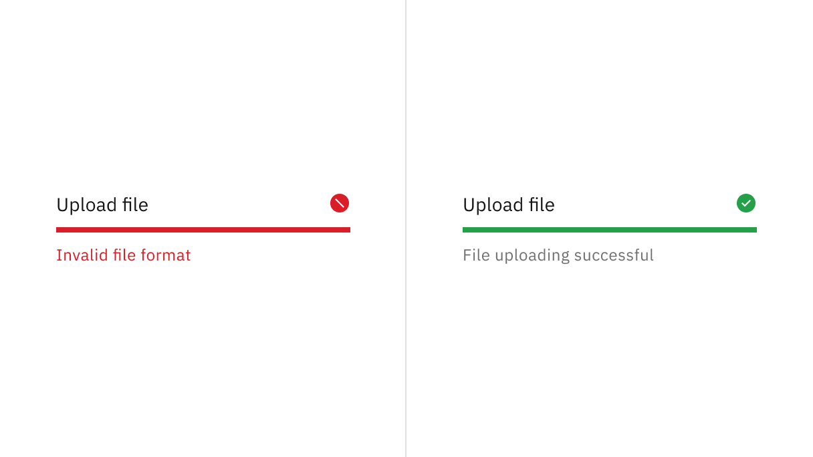

import A11yStatus from 'components/A11yStatus';

<PageDescription>

Design annotations are needed for specific instances shown below, but for the
standard progress bar component, Carbon already incorporates accessibility.

</PageDescription>

<AnchorLinks>

<AnchorLink>What Carbon provides</AnchorLink>
<AnchorLink>Design recommendations</AnchorLink>
<AnchorLink>Development considerations</AnchorLink>

</AnchorLinks>

## What Carbon provides

Carbon bakes keyboard operation into its components, improving the experience of
blind users and others who operate via keyboard. Carbon also incorporates other
accessibility considerations, some of which are described below.

### Keyboard interaction

The progress bar itself is not keyboard operable; however, when a progress bar
is active, it may temporarily disable any dependent components. For example, if
a progress bar is being used to upload a file, the Upload button is disabled
until the progress bar state changes to either error or completed.

<Row>
<Column colLg={8}>

<Caption>
  Progress bars are not interactive, but may temporarily disable dependent
  components.
</Caption>

</Column>
</Row>

### Labelling and states

The label above the progress bar as well as the optional helper text below it
are surfaced to assistive technologies. Changes to the helper text are provided
programmatically as status updates.

<Row>
<Column colLg={8}>

<Caption>
  The label, the progress bar’s status, and the optional helper text underneath
  are all surfaced to assistive technologies.
</Caption>

</Column>
</Row>

## Design recommendations

Design annotations are needed for the following instance.

### Provide status for indeterminate and errored progress bars

The indeterminate progress bar does not measure progress, and so cannot
programmatically inform the user when the process is complete. Also, neither
variant of the progress bar can programmatically indicate to assistive
technologies when it is in error. Information on both outcomes must be presented
in the help text below the progress bar.

<Row>
<Column colLg={8}>

<Caption>
  Helper text is required when a progress bar is in error or indeterminate.
</Caption>

</Column>
</Row>

## Development considerations

Keep this in mind if you’re modifying Carbon or creating a custom component:

- Carbon uses `aria-valuemin`, `aria-valuemax`, `aria-valuenow`, and `aria-busy`
  to provide status on the progress bar. Due to inconsistent support for these
  attributes, Carbon also assigns an `aria-live="polite"` to the container
  holding the helper text.
- Carbon uses `aria-labelledby` and `aria-describedby` to associate the label
  and helper text with the component.
- The red error and green success SVG icons have `aria-hidden="true"` set, since
  the helper text and aria attributes provide the same information.

<A11yStatus layout="table" components="Progress bar" />
