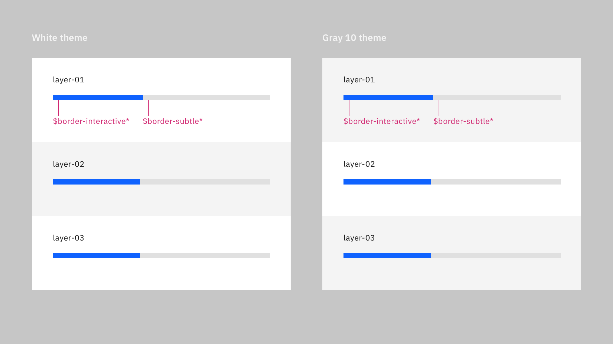
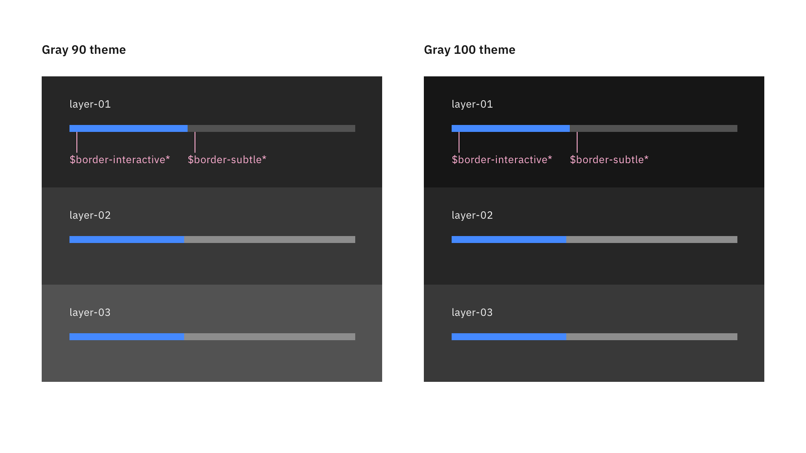

## Color

| Element       | Property   | Color token           |
| ------------- | ---------- | --------------------- |
| Label         | text color | `$text-primary`       |
| Helper text   | text color | `$text-helper`        |
| Track         | Background | `$border-subtle`      |
| Bar: active   | background | `$border-interactive` |
| Bar: success  | background | `$support-success`    |
| Icon: success | fill       | `$support-success`    |
| Bar: error    | background | `$support-error`      |
| Icon: error   | fill       | `$support-error`      |

<Row>
<Column colLg={8}>

<Caption>Status colors</Caption>

</Column>
</Row>

<Row>
<Column colLg={12}>

<Caption>Progress bar colors for light themes</Caption>

</Column>
</Row>

<Row>
<Column colLg={12}>

<Caption>Progress bar colors for dark themes</Caption>

</Column>
</Row>

## Typography

| Element     | Font-size (px/rem) | Font-weight   | Type token        |
| ----------- | ------------------ | ------------- | ----------------- |
| Label       | 14px / 0.875rem    | Regular / 400 | `$label-01`       |
| Helper text | 12px / 0.75rem     | Regular / 400 | `$helper-text-01` |

## Structure

Progress bar can have two ways for text alignment. The first one has text
aligned left with progress bar and the second one has text aligned to the middle
of the progress bar. The width of a progress bar can be customized appropriately
for its context. The minimum width of a progress bar is 48px and keep its width
to a maximum of six columns when possible.

| Element              | Property       | px / rem | Spacing token |
| -------------------- | -------------- | -------- | ------------- |
| Label (top aligned)  | Padding-bottom | 8 / 0.5  | `$spacing-03` |
| Helper text          | Padding-top    | 8 / 0.5  | `$spacing-03` |
| Label (left aligned) | Padding-right  | 16 / 1   | `$spacing-05` |

<Caption>
  Structure and spacing measurements a popover container. | px / rem
</Caption>

## Sizes

There are two sizes for the progress bar height, default and small.

| Size    | Height px / rem |
| ------- | --------------- |
| Default | 8 / 0.5         |
| Small   | 4 / 0.25        |

<Caption>
  Structure and spacing measurements between a popover container and trigger
  button. | px / rem
</Caption>
