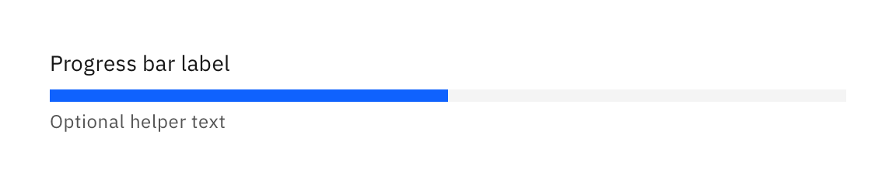
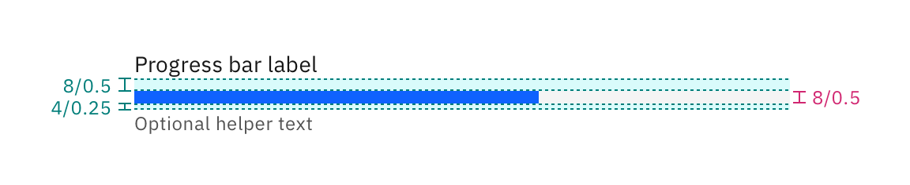

## Color

| Element     | Property         | Color token       |
| ----------- | ---------------- | ----------------- |
| Track       | background-color | `$layer`          |
| Bar         | background-color | `$interactive`    |
| Label       | text color       | `$text-primary`   |
| Helper text | text color       | `$text-secondary` |

<Row>
  <Column colLg={8}>

  </Column>
</Row>

## Typography

| Element     | Font-size (px / rem) | Font weight | Type token        |
| ----------- | -------------------- | ----------- | ----------------- |
| Label       | 14 / 0.875           | 400         | `$body-short-01`  |
| Helper text | 12 / 0.75            | 400         | `$helper-text-01` |

## Structure

| Element     | Property      | px / rem | Spacing token |
| ----------- | ------------- | -------- | ------------- |
| Label       | margin-bottom | 8 / 0.5  | `$spacing-03` |
| Track       | height        | 8 / 0.5  | `$spacing-03` |
| Bar         | height        | 8 / 0.5  | `$spacing-03` |
| Helper text | margin-top    | 4 / 0.25 | `$spacing-02` |

<Row>
  <Column colLg={8}>

  </Column>
</Row>
