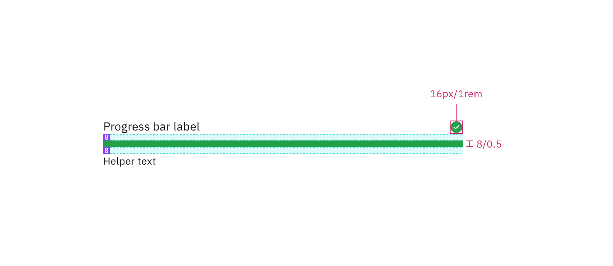

## Color

| Element       | Property   | Color token           |
| ------------- | ---------- | --------------------- |
| Label         | text color | `$text-primary`       |
| Helper text   | text color | `$text-helper`        |
| Track         | background | `$border-subtle`      |
| Bar: active   | background | `$border-interactive` |
| Bar: success  | background | `$support-success`    |
| Icon: success | fill       | `$support-success`    |
| Bar: error    | background | `$support-error`      |
| Icon: error   | fill       | `$support-error`      |

<Row>
<Column colLg={8}>

<Caption>Status colors</Caption>

</Column>
</Row>

## Typography

| Element     | Font-size (px/rem) | Font-weight   | Type token        |
| ----------- | ------------------ | ------------- | ----------------- |
| Label       | 14px / 0.875rem    | Regular / 400 | `$label-01`       |
| Helper text | 12px / 0.75rem     | Regular / 400 | `$helper-text-01` |

## Structure

Depending on the use case, progress bar can have three ways for text alignment:
default, inline, and indented. The width of a progress bar can be customized
appropriately for its context. The minimum width of a progress bar is 48px and
keep its width to a maximum of six columns when possible.

| Element              | Property       | px / rem | Spacing token |
| -------------------- | -------------- | -------- | ------------- |
| Label (top aligned)  | padding-bottom | 8 / 0.5  | `$spacing-03` |
| Helper text          | padding-top    | 8 / 0.5  | `$spacing-03` |
| Label (left aligned) | padding-right  | 16 / 1   | `$spacing-05` |

<Caption>
  Structure and spacing measurements the progress bar | px / rem
</Caption>

<Caption>
  Structure and spacing measurements the progress bar with an icon | px / rem
</Caption>

## Sizes

There are two sizes for the progress bar height, big and small.

| Size  | Height px / rem |
| ----- | --------------- |
| Big   | 8 / 0.5         |
| Small | 4 / 0.25        |

