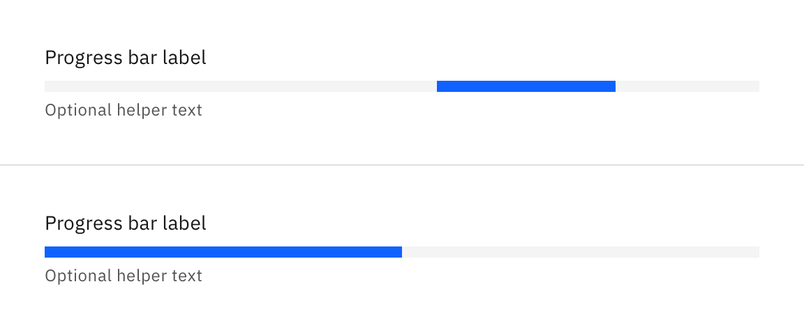
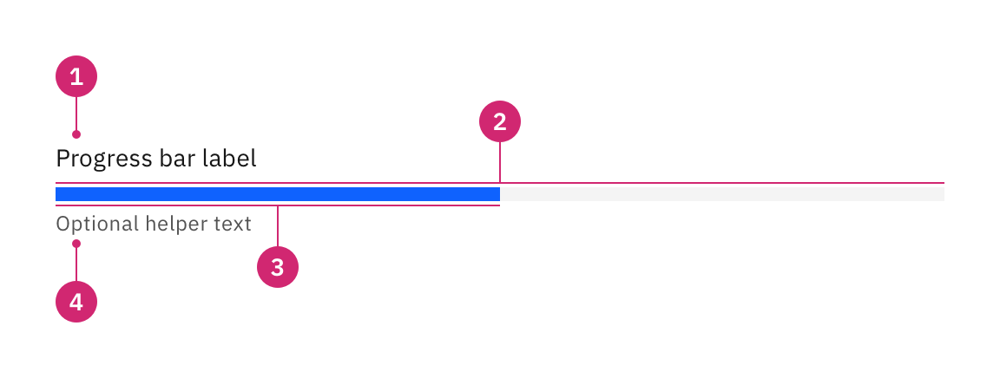
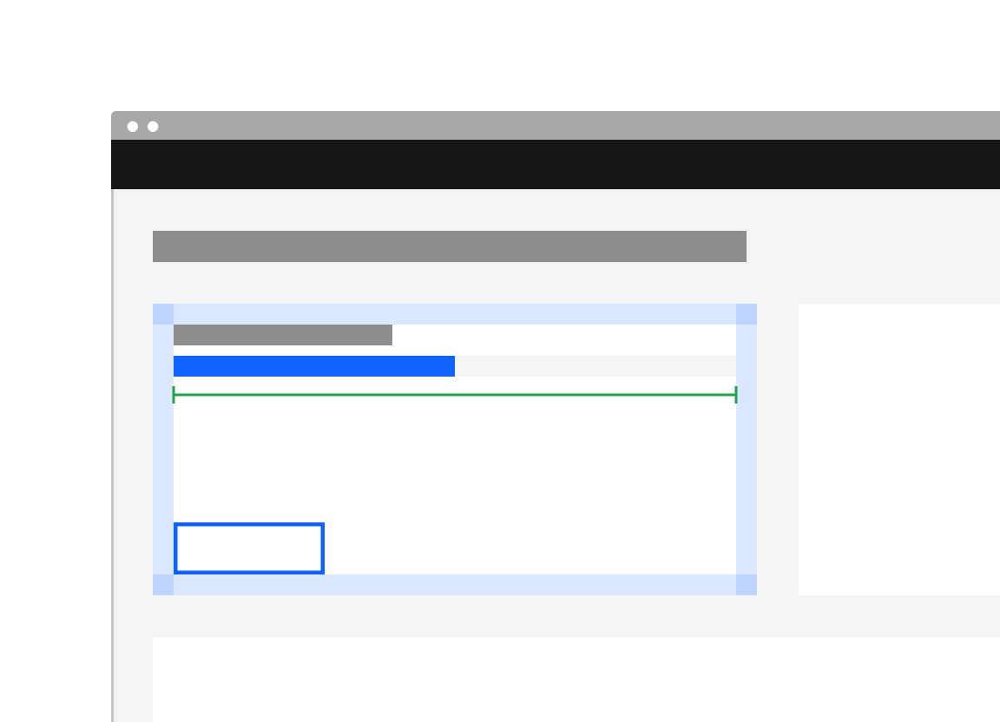
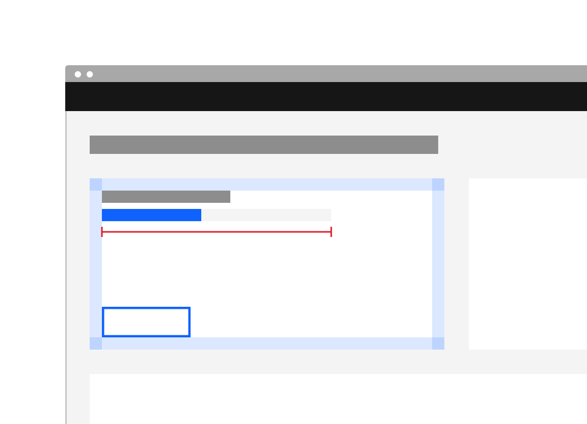
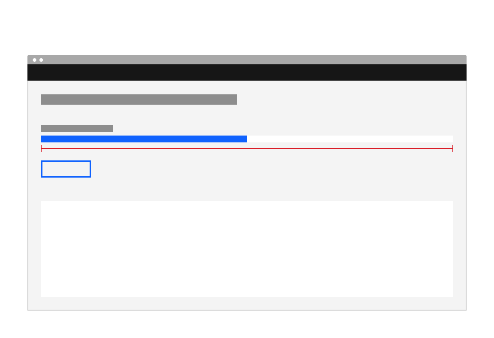

<PageDescription>
  A progress bar provides feedback about the duration and progression of a
  process.
</PageDescription>

<AnchorLinks>
  <AnchorLink>Overview</AnchorLink>
  <AnchorLink>Live demo</AnchorLink>
  <AnchorLink>Variants</AnchorLink>
  <AnchorLink>Formatting</AnchorLink>
  <AnchorLink>Related</AnchorLink>
  <AnchorLink>References</AnchorLink>
  <AnchorLink>Feedback</AnchorLink>
</AnchorLinks>

## Overview

A progress bar provides feedback about the duration and progression of a
process. Progress bars can either be used to inform the user about how long a
process will take or serve as a affirmation that the process is still running
and the user's action or request is being executed.

#### When to use

- When a process is (or could be) taking a considerable amount of time which the
  user might interpret as if the process failed to execute.
- The process can be described with quantitative information (percentage).
- To convey that data is being requested, transferred or processed.

#### When not to use

- When the progress bar will be replaced by a minor user interface element once
  loaded, use [skeleton states](/patterns/loading-pattern/#skeleton-states)
  instead
- When manual user actions are required to progress, use a
  [progress indicator](/components/progress-indicator/usage) instead

## Live demo

## Variants

A progress bar can either be indeterminate or determinate. The indeterminate
variant is visualized as a track on which a bar is moving along in constant
speed, repeating over time. The determinate variant is visualized as a track on
which a bar fills up from left to right representing the progress.

| Variant       | Purpose                                                                                                                                                                                                                               |
| ------------- | ------------------------------------------------------------------------------------------------------------------------------------------------------------------------------------------------------------------------------------- |
| Indeterminate | Use the indeterminate variant when the remaining time is unknown or you don't have exact information baout the process, but you still want to convey to the user that their request / action / data is being processed at the moment. |
| Determinate   | Use the determinate variant when you have exact, quantiative information about the progression.                                                                                                                                       |

<Row>
  <Column colLg={8}>

  </Column>
</Row>

## Formatting

### Anatomy

<Row>
  <Column colLg={8}>

  </Column>
</Row>

1. **Heading:** Describes what process the progress bar is refering to /
   visualizing (can be visually hidden).
2. **Track:** The area the bar is moving on. Provides a reference of what the
   total length / duration of the process will be.
3. **Bar:** Indicates how far the process has progressed so far.
4. **Helper text (optional)**: Can be used to convey additional information
   about the process such as the current step (e.g. _"Fetching assets..."_), the
   exact progression (e.g. _"42/256 items"_), or the estimated remaining time
   (e.g. _"about 3min remaining"_).

### Sizing

The progress bar's width / length should be related to the container the loaded
content will appear in. However, stretching it too long reduces the readability.
Keep the width to a maximum of 6 columns if possible.

<DoDontRow>
  <DoDont caption="Do stretch the progress bar the entire width of a related element (like a tile in which the content will appear).">

  </DoDont>
  <DoDont
    type="dont"
    caption="Don't use an arbitrary width for the progress bar.">

  </DoDont>
</DoDontRow>
<DoDontRow>
  <DoDont
    type="dont"
    caption="Don't stretch the progress bar over the entire width of the window / application.">

  </DoDont>
</DoDontRow>

## Related

#### Components

- [Loading](/components/loading/usage)
- [Inline loading](/components/inline-loading/usage)
- [Progress indicator](/components/progress-indicator/usage)

#### Patterns

- [Loading](/components/loading-pattern)
  - [Skeleton states](patterns/loading-pattern/#skeleton-states)

## References

- Accessible Rich Internet Applications Working Group,
  ["progressbar" role](https://www.w3.org/TR/wai-aria-1.1/#progressbar),
  (W3C, 2017)
- Jakob Nielsen,
  [Progress Indicators Make a Slow System Less Insufferable](https://www.nngroup.com/articles/progress-indicators/)
  (Nielsen Norman Group, 2001)

## Feedback

Help us improve this component by providing feedback, asking questions, and
leaving any other comments on
[GitHub](https://github.com/carbon-design-system/carbon-website/issues/new?assignees=&labels=feedback&template=feedback.md).
