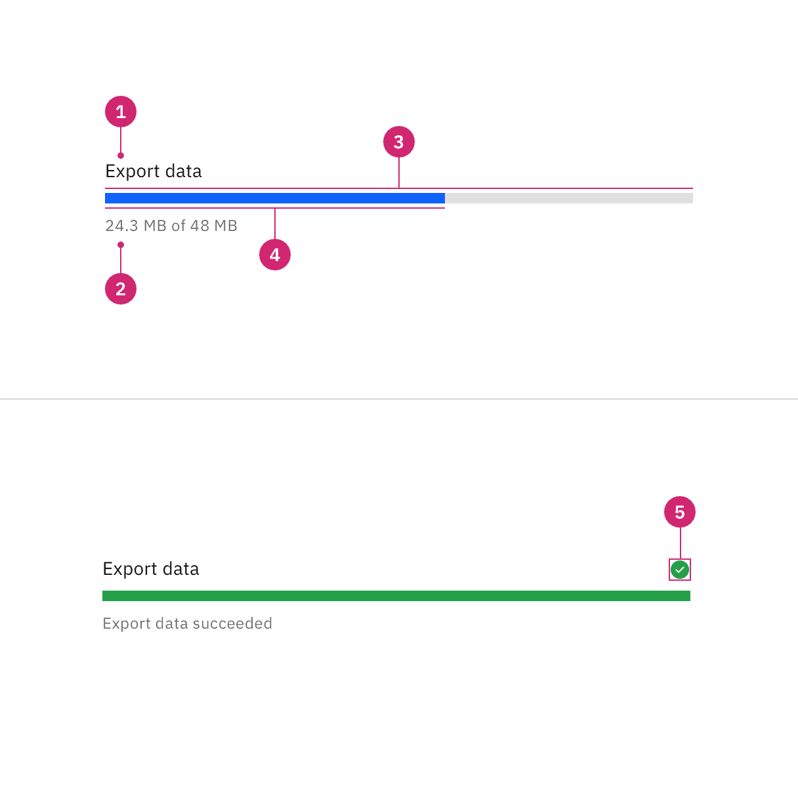
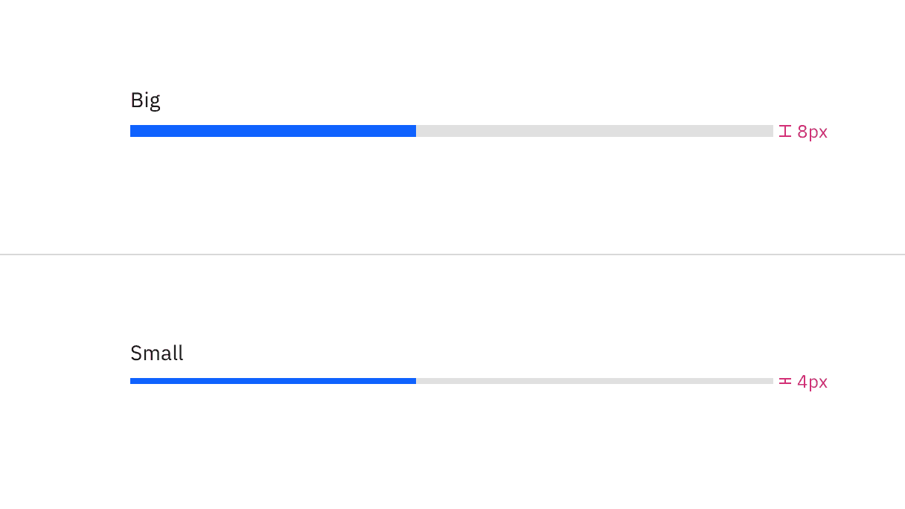
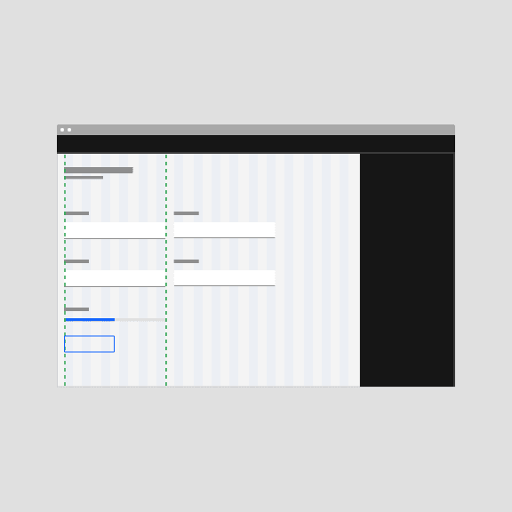
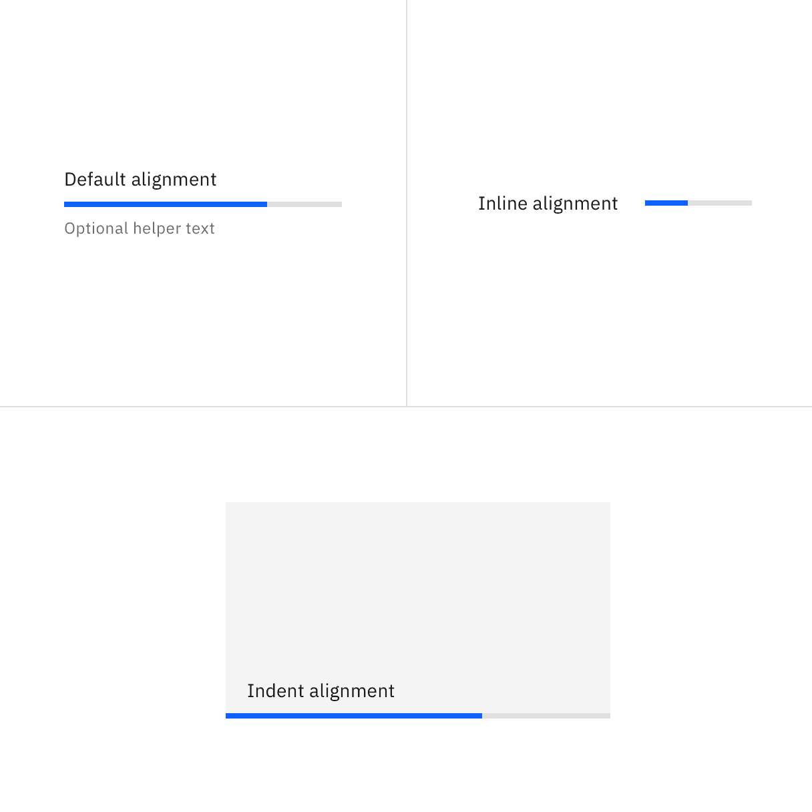
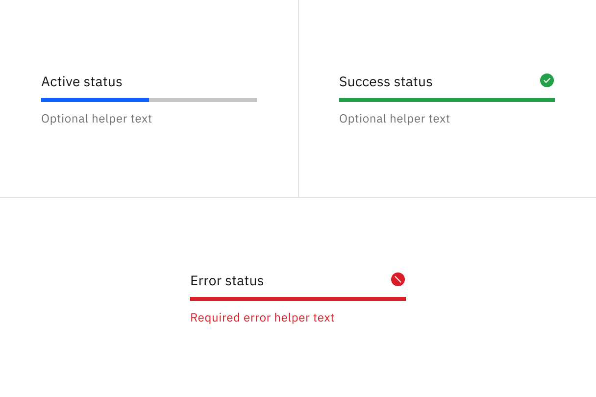
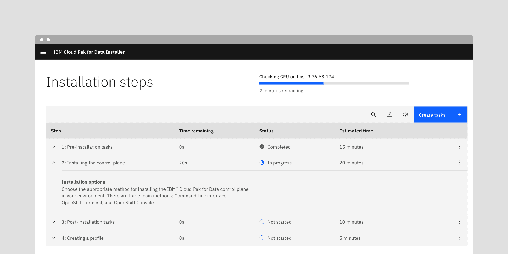
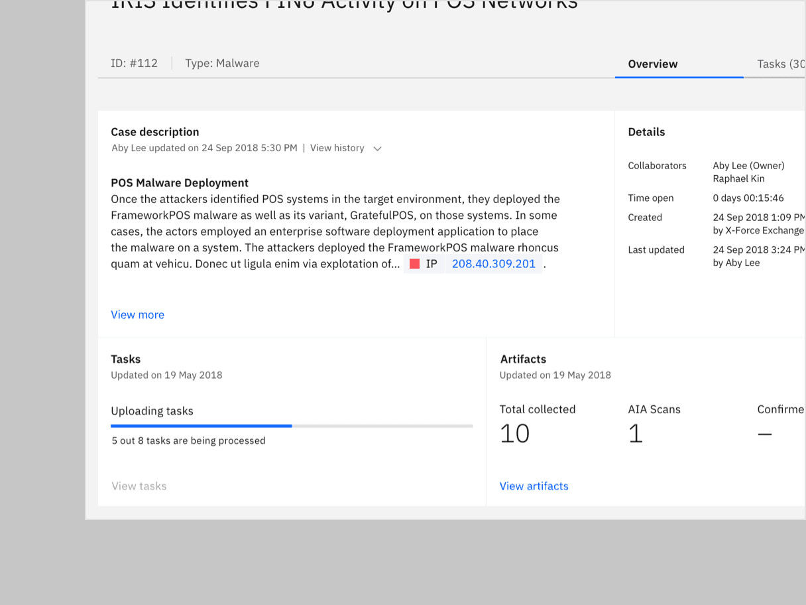

import A11yStatus from 'components/A11yStatus';
import localVideo1 from './videos/progress-bar-usage-5.mp4';
import localPoster1 from './images/progress-bar-usage-5.png';

import localVideo2 from './videos/progress-bar-usage-11.mp4';
import localPoster2 from './images/progress-bar-usage-11.png';

import localVideo3 from './videos/progress-bar-usage-17.mp4';
import localPoster3 from './images/progress-bar-usage-17.png';

import localVideo4 from './videos/progress-bar-usage-18.mp4';
import localPoster4 from './images/progress-bar-usage-18.png';

import localVideo5 from './videos/progress-bar-usage-21.mp4';
import localPoster5 from './images/progress-bar-usage-21.png';

<PageDescription>

A progress bar provides feedback about the duration and progression of a
process, such as a download, file transfer, or installation, to indicate how
long a user will be waiting.

</PageDescription>

<AnchorLinks>

<AnchorLink>Live demo</AnchorLink>
<AnchorLink>Overview</AnchorLink>
<AnchorLink>Formatting</AnchorLink>
<AnchorLink>Content</AnchorLink>
<AnchorLink>Universal behaviors</AnchorLink>
<AnchorLink>Modifiers</AnchorLink>
<AnchorLink>Accessibility</AnchorLink>
<AnchorLink>Related</AnchorLink>
<AnchorLink>References</AnchorLink>
<AnchorLink>Feedback</AnchorLink>

</AnchorLinks>

## Live demo

<StorybookDemo
  themeSelector
  url="https://react.carbondesignsystem.com"
  variants={[
    {
      label: 'Default',
      variant: 'components-progressbar--default',
    },
    {
      label: 'Example',
      variant: 'components-progressbar--example',
    },
    {
      label: 'Indeterminate',
      variant: 'components-progressbar--indeterminate',
    },
  ]}
/>

<A11yStatus layout="cards" components="Progress bar" />

## Overview

A progress bar indicates that the user's request has been received and the
application is making progress toward completing the requested action. Progress
bars inform users about the status of ongoing processes, the estimated time of
how long a process will take, or if a request is being executed.

<Row>
<Column colLg={12}>

</Column>
</Row>

#### When to use

- For a long operation or a process that can take a considerable or unknown
  amount of time
- When the process can be described with quantitative information, such as a
  percentage
- To visually show the progression of a system operation such as downloading,
  uploading, loading data, submitting a form, or saving updates
- To convey that data is being requested, transferred, or processed

#### When not to use

- When the load time is expected to display expanded information, use
  [skeleton states](/patterns/loading-pattern/#skeleton-states) instead
- When manual user actions are required to progress, use a
  [progress indicator](/components/progress-indicator/usage) instead
- When the progress is determined by user actions such as tutorials completed,
  or storage space, rather than system actions
- If the process takes less than 5 seconds to load, use
  [loading](/components/loading/usage) instead.

### Variants

A progress bar can either be determinate or indeterminate. The determinate
variant is visualized as a track on which a bar fills up from left to right
representing the progress. The indeterminate variant is visualized as a track on
which a bar is moving along in constant speed, repeating over time.

| Variant                                                                    | Purpose                                                                                                                                                                                                                          |
| -------------------------------------------------------------------------- | -------------------------------------------------------------------------------------------------------------------------------------------------------------------------------------------------------------------------------- |
| [Determinate](Determinate)                                                 | Use determinate progress bars where there is clear information about the progression — they convey exact and qualitative information about the progression.                                                                      |
| [Indeterminate](/components/progress-bar/usage#indeterminate-progress-bar) | Use indeterminate progress bars where there is unclear information about the progression — they convey that users’ request, action, or data is being processed at the moment without indicating how long the activity will take. |

<Row>

<Column colLg={4}>
<GifPlayer color='dark'>

</GifPlayer>

<Caption>
  Determinate progress bars fill from 0 to 100%.
</Caption>
</Column>

<Column colLg={4}>
<GifPlayer color='dark'>

</GifPlayer>

<Caption>
  Indeterminate progress bars move along a fixed track continually until the process is complete.
</Caption>
</Column>

</Row>

## Determinate progress bar

Determinate progress bars are used when the loading progress can be tracked and
translated into a bar indicator which fills the track from 0% to 100% and never
decreases in value or resets.

Use a determinate progress bar when the progress can be calculated against a
specific goal. For example, when downloading a file of a known size.

## Indeterminate progress bar

Indeterminate progress bars are used when the loading progress is unknown or the
amount of wait time can't be calculated.

Once triggered, the bar indicator will quickly and repeatably move from left to
right (Carbon reserves back and forth motions for
[skeletons](/patterns/loading-pattern/#skeleton-states)), while data is being
gathered during the first stages of the load. In this scenario, a percentage
value would not be present. This bar may change to a determinate indicator if
enough information is gathered to calculate the load completion. The final
determinate stage of the load is used to visually indicate the completion of the
task to the user.

<Row>
  <Column colLg={8}>
    <Video src={localVideo1} poster={localPoster1} />
  </Column>
</Row>

### Progress status

It's best to give the user transparency about the process which usually leads to
increased trust in the software or platform. However, it may not be possible to
provide progress estimation in certain cases. If progress data is not available,
an indeterminate progress bar can be used.

As a more concrete set of examples, there are generally three different major
progressions of a system operation: downloading, uploading, and local
processing.

#### Downloading

For downloading actions, it's usually possible to get a value of progress and
update it in real time for a determinate progress bar. Depending on the
information reported from a data source, time remaining could be estimated based
on how much has been downloaded so far over a time period.

#### Uploading

Upload actions may be unable to report real time progress status depending on
the data source and API configuration. However, always strive to provide users
the determinate value whenever it's possible to inform them about the process.

#### Data processing

Data processing refers to manipulations of data to produce meaningful
information. This can include currency exchange, file generation, data
reformatting, or similar operations. Depending on the operation, time estimated
or cycles to complete processing could be used to populate a determinate
progress bar.

## Formatting

### Anatomy

<Row>
<Column colLg={8}>

</Column>
</Row>

1. **Label:** The text describes the process that the progress bar refers to.
   The label can be visually hidden, but must be defined in order to be
   accessible.
2. **Helper text (optional, except for error):** Assistive text to show
   additional information about the process taking place. For determinate, the
   text is usually a percentage, fraction, ratio, or numeric value showing
   progression. Such values are not applicable when a progress bar is
   indeterminate. A progress bar that receives an error status must convey the
   problem in the error helper text.
3. **Track:** The static area that the bar indicator moves on top of and acts as
   a fixed visual reference of what the total length and duration of the process
   could be.
4. **Bar indicator:** Indicates how much the process has progressed.
5. **Status icon:** Indicates the status of the progress bar, either in error or
   success status.

### Sizing

#### Height

The progress bar is offered in two different sizes—big (8px) and small (4px).
The big progress bar height is typically used when there is large amounts of
space on a page. The small progress bar height is commonly used when space is
restricted and can be placed within cards, data tables, or side panels.

<Row>
<Column colLg={8}>

</Column>
</Row>

#### Width

The width of a progress bar can vary based on the content. The minimum width of
a progress bar is 48px and keep its width to a maximum of six columns when
possible. If the progress bar width is too long, it can reduce readability.
Don't increase the progress bar length to fill the entire width of a window or
application.

<DoDontRow>

  <DoDont type="do" caption="Do keep a width within six columns.">

  </DoDont>
  <DoDont type="dont" caption="Do not exceed a width of six columns.">

  </DoDont>
</DoDontRow>

### Text alignment

Text alignment depends on the context and area given. Progress bar can have
three ways for text alignment: default, inline, and indent. Indent alignment
should only be used inside containers, tiles, or side panels which the progress
bar will extend to the edges.

<Row>
<Column colLg={8}>

<Caption>A few common examples of text alignment for progress bars</Caption>

</Column>
</Row>

<Row>
<Column colLg={8}>

</Column>
</Row>

| Text alignment | Use case                                  |
| -------------- | ----------------------------------------- |
| Default        | Full page, cards, dialogs                 |
| Inline         | Data table                                |
| Indent         | Side panels, cards (usually on dashboard) |

#### Text placement

Labels should always be placed above the progress bar for readability, and
helper text below or beside. Avoid placing text inside the progress bar
indicator or track. This visual could cause clutter and inconsistency in text
alignment. Meanwhile, placing the text far away from the progress bar could
cause confusion in the context.

<DoDontRow>
  <DoDont type="do" caption="Do place text close to the progress bar.">

  </DoDont>
  <DoDont type="dont" caption="Do not embed text into the progress bar.">

  </DoDont>
</DoDontRow>

<DoDontRow>
  <DoDont type="do" caption="Do place text close to the progress bar.">

  </DoDont>
  <DoDont type="dont" caption="Do not place text far away from the progress bar.">

  </DoDont>
</DoDontRow>

#### Internationalization (RTL)

For RTL (right-to-left) languages, the layout of the progress bar is mirrored
for both determinate and indeterminate options. The label is right-aligned, the
value is left-aligned, and the fill progresses from right to left. Keep in mind
that the placement of the percent sign differs depending on the locale.

<Row>
  <Column colLg={8}>
    <Video src={localVideo2} poster={localPoster2} />
  </Column>
</Row>

## Content

Determinate and indeterminate progress bars both have a label and an optional
helper text. However, the indeterminate can’t provide the exact, quantitative
information about the progression in the optional helper text.

#### Labels

- Labels inform users what information the progress bar is processing.
- Keep the label short and concise by limiting it to a few words or a single
  line of text.
- Label text should never change as the progress bar is loading. It also does
  not need to be updated when the process ends, since the success or error
  information is provided by the bar indicator color and an icon, along with any
  helper text.

#### Helper text

- Helper text is used to show additional information about the process taking
  place.
- Common use cases of helper text for a progress bar can either be a generic
  phrase, for example “Fetching assets…”, or it can indicate an exact amount of
  something to be completed, for example "42/256 items".
- When indicating a loading percentage, the percentage number should count up as
  the bar progresses.

### Further guidance

For further content guidance, see Carbon's
[content guidelines]([https://www.carbondesignsystem.com/guidelines/content/overview/]).

## Universal behaviors

### Statuses

There are three statuses for the progress bar: active, success, and error. These
statuses also apply on both indeterminate and determinate progress bars. After
the process completes successfully or unsuccessfully, a progress bar can either
remain persistent as confirmation or validation, or it can be automatically
dismissed depending on what is most suitable for the use case.

<Row>
<Column colLg={8}>

</Column>
</Row>

#### Active

The active status, represented by an animated blue bar indicator, conveys that
the action is still in progress.

#### Success

The success status, conveyed by a full-width green progress bar and checkmark
icon, indicates that the action completed successfully.

#### Error

The error status indicates that the action did not successfully complete. If an
error occurs, an inline notification or error handling within the form should
appear. As soon as a process fails, the indicator bar’s progress spans full
width, turns red, and remains visible. A failed icon is also shown.

<Row>
<Column colLg={8}>

<Video src={localVideo3} poster={localPoster3} />

<Caption>
  The example shows the progress bar with error remains persistent as
  confirmation inside the image tile.
</Caption>

</Column>
</Row>

<Row>
<Column colLg={8}>

<Video src={localVideo4} poster={localPoster4} />

<Caption>
  The example shows the progress bar is automatically dismissed once it’s done
  uploading.
</Caption>

</Column>
</Row>

### Interactions

#### Part of a page

While the progress bar is processing information on part of a page, you can
still interact with other elements on the page. When the progress bar finishes
processing it can either remain persistent on the page for confirmation or
automatically dismiss itself depending on the use case.

<Row>
<Column colLg={12}>

<Caption>
  The example shows the progress bar is active and separated from other
  interactive elements.
</Caption>

</Column>
</Row>

#### Inside a container

While the progress bar is processing information that could affect multiple
pieces of content within a container, such as a card, depending on the use case,
the whole container should become inactive until processing has been completed
or the specific section within the container being processed should become
inactive until processing has been completed. The user should be able to
interact with the rest of the container or page that is unaffected by the
progress bar.

<Row>
<Column colLg={8}>

<Caption>
  The example shows the 'View task' action button is disabled inside the 'Tasks'
  container while the progress bar is active.
</Caption>

</Column>
</Row>

## Modifiers

#### Transitions

An indeterminate bar can change to a determinate indicator (finishing from left
to right) when enough information is gathered to end the load animation.

<Row>
  <Column colLg={8}>
    <Video src={localVideo5} poster={localPoster5} />
  </Column>
</Row>

## Accessibility

- The loading component is implemented using the ARIA 1.1 progressbar pattern.
  For determinate progress bar, it outputs an ARIA `role="progressbar"` and uses
  `aria-valuemin`, `aria-valuemax`, and `aria-valuenow` to convey the loaded
  percentage to screen reader users.
- If the progress bar shows the loading of a specific part or region of the
  application, set `aria-busy="true"` and `aria-describedby="[progressbar-id]"`
  on the related element to ensure assistive technologies can correctly convey
  this relation to the user.
- Only hide the label when it is absolute clear to the user which process the
  progress bar represents. Note that you are still required to pass an
  appropriate label which will be read by screen readers.

## Related

#### Components

- [Loading](/components/loading/usage)
- [Inline loading](/components/inline-loading/usage)
- [Progress indicator](/components/progress-indicator/usage)

#### Pattern

- [Loading: skeleton states](https://carbondesignsystem.com/patterns/loading-pattern/#skeleton-states)

## References

- Accessible Rich Internet Applications Working Group,
  [“progressbar” role](https://developer.mozilla.org/en-US/docs/Web/Accessibility/ARIA/ARIA_Techniques/Using_the_progressbar_role),
  (W3C, 2017)
- Katie Sherwin,
  [Progress Indicators Make a Slow System Less Insufferable](https://www.nngroup.com/articles/progress-indicators/)
  (Nielsen Norman Group, 2001)
- Jakob Nielsen,
  [Response Times: The 3 Important Limits (Nielsen Norman Group](https://www.nngroup.com/articles/response-times-3-important-limits/),
  (Nielsen Norman Group, 1993)

## Feedback

Help us improve this component by providing feedback, asking questions, and
leaving any other comments on
[GitHub](https://github.com/carbon-design-system/carbon-website/issues/new?assignees=&labels=feedback&template=feedback.md).
