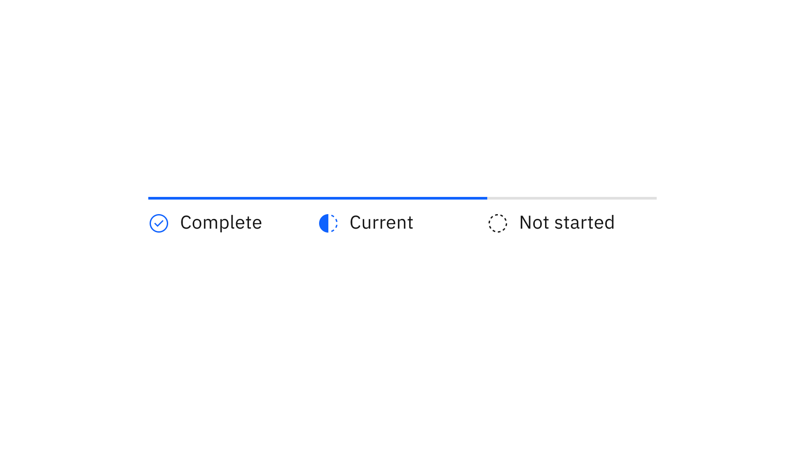
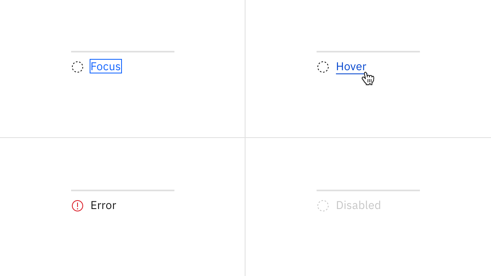
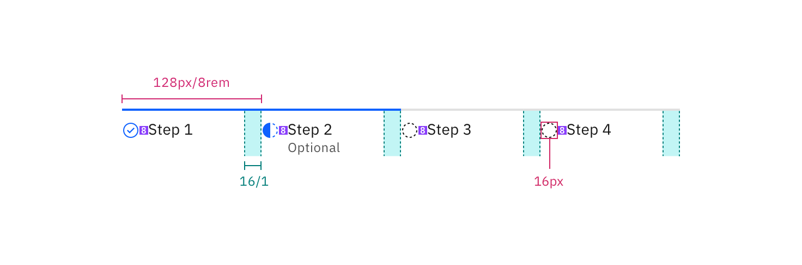

<PageDescription>

The following page documents visual specifications such as color, typography,
structure, and size.

</PageDescription>

<AnchorLinks>

<AnchorLink>Color</AnchorLink> <AnchorLink>Typography</AnchorLink>
<AnchorLink>Structure</AnchorLink>
<AnchorLink>Feedback</AnchorLink>

</AnchorLinks>

## Color

A progress indicator step may be complete, current, or not started. The
following table describes the color tokens used for each of these
[states](/components/progress-indicator/usage#states).

| Element            | Property         | Color token           |
| ------------------ | ---------------- | --------------------- |
| Complete icon      | fill             | `$interactive`        |
| Current icon       | fill             | `$interactive`        |
| Not started icon   | fill             | `$icon-primary`       |
| Active step line   | background-color | `$border-interactive` |
| Inactive step line | background-color | `$border-subtle` \*   |
| Label              | text color       | `$text-primary`       |
| Helper text        | text color       | `$text-secondary`     |

<Caption fullWidth>
  \* Denotes a contextual color token that will change values based on the layer
  it is placed on.
</Caption>

<Row>
<Column colLg={8}>

</Column>
</Row>

<Caption>
  Examples of completed, current, and future steps for progress indicator
</Caption>

### Interactive states

| Element        | Property   | Color token           |
| -------------- | ---------- | --------------------- |
| Step: focus    | border     | `$focus`              |
| Label: hover   | text color | `$link-primary-hover` |
| Icon: error    | fill       | `$support-error`      |
| Icon: disabled | fill       | `$icon-disabled`      |

<Row>
<Column colLg={8}>

</Column>
</Row>

<Caption>
  Examples of focus, hover, error, and disabled states for progress indicator
</Caption>

## Typography

Labels should be one to two words only, with a limit of 16 characters total per
label. All labels should be set in sentence case.

| Element     | Font-size (px/rem) | Font-weight   | Type token         |
| ----------- | ------------------ | ------------- | ------------------ |
| Label       | 14 / 0.875         | Regular / 400 | `$body-compact-01` |
| Helper text | 12 / 0.75          | Regular / 400 | `$label-01`        |

## Structure

All icons can be found in the [icons](/elements/icons/library) library.

| Element | Property                 | px / rem | Spacing token |
| ------- | ------------------------ | -------- | ------------- |
| Step    | min-width                | 128 / 8  | –             |
| Icon    | height, width            | 16 / 1   | –             |
|         | margin-top, margin-right | 16 / 1   | `$spacing-05` |
| Label   | margin-top               | 16 / 1   | `$spacing-05` |

<Caption fullwidth>
  Structure and spacing measurements for progress indicator | px / rem
</Caption>

## Feedback

{/* Include a request for feedback here. */}

Help us improve this component by providing feedback, asking questions, and
leaving any other comments on
[GitHub](https://github.com/carbon-design-system/carbon-website/issues/new?assignees=&labels=feedback&template=feedback.md).
