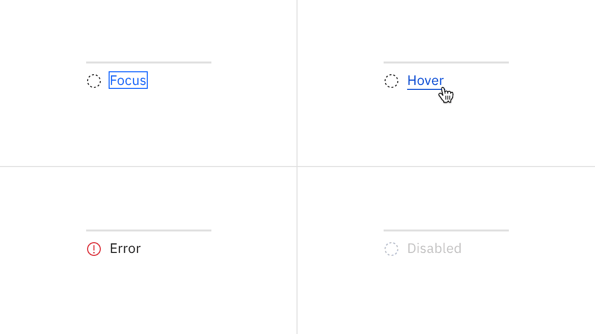

## Color

All steps that have been completed are indicated by an outlined circle with a
checkmark. The current step the user is on is indicated by a filled circle.
Steps the user has not encountered yet, or future steps, are indicated by an
outlined circle.

| Element              | Property         | Color token           |
| -------------------- | ---------------- | --------------------- |
| Current icon         | fill             | `$interactive`        |
| Complete icon        | fill             | `$interactive`        |
| Incomplete icon      | fill             | `$icon-primary`       |
| Current step line    | background-color | `$border-interactive` |
| Incomplete step line | background-color | `$border-subtle` \*   |
| Label                | text color       | `$text-primary`       |
| Optional label       | text color       | `$text-secondary`     |

<Caption>
  * Denotes a contextual color token that will change values based on the layer
  it is placed on.
</Caption>

### Interactive states

| Element       | Property         | Color token           |
| ------------- | ---------------- | --------------------- |
| Step:focus    | border           | `$focus`              |
| Label:hover   | text color       | `$link-primary-hover` |
| Icon:error    | fill             | `$support-error`      |
| Icon:disabled | fill             | `$icon-disabled`      |
| Line:disabled | background-color | `$border-disabled`    |

<Caption>
  Examples of current, completed, and future steps for progress indicator
</Caption>

## Typography

Labels should be one to two words only, with a limit of 16 characters total per
label. All labels should be set in sentence case.

| Element        | Font-size (px/rem) | Font-weight   | Type token         |
| -------------- | ------------------ | ------------- | ------------------ |
| Label          | 14 / 0.875         | Regular / 400 | `$body-compact-01` |
| Optional label | 12 / 0.75          | Regular / 400 | `$label-01`        |

## Structure

All icons can be found in the [icons](/guidelines/icons/library) library.

| Element | Property                 | px / rem | Spacing token |
| ------- | ------------------------ | -------- | ------------- |
| Step    | min-width                | 128 / 8  | –             |
| Icon    | height, width            | 16 / 1   | –             |
|         | margin-top, margin-right | 16 / 1   | `$spacing-05` |
| Label   | margin-top               | 16 / 1   | `$spacing-05` |

<Caption>
  Structure and spacing measurements for progress indicator | px / rem
</Caption>

<!---

### Recommended

The following specs are not built into the progress indicator component but are
recommended by design as the proper amount between progress indicator elements.

| Element           | Property | px / rem | Spacing token |
| --------------- | -------- | -------- | ------------- |
| Progress indicator | margin   | 16 / 1   | `$spacing-05` |

<Caption>
  Recommended structure and spacing measurements for progress indicator | px /
  rem
</Caption>

--->
