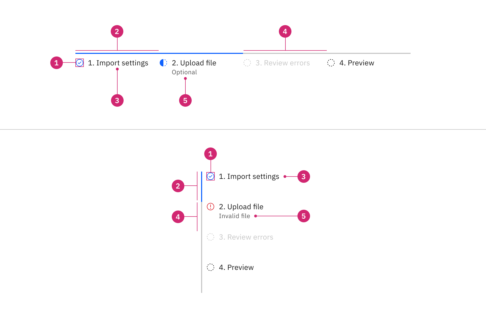
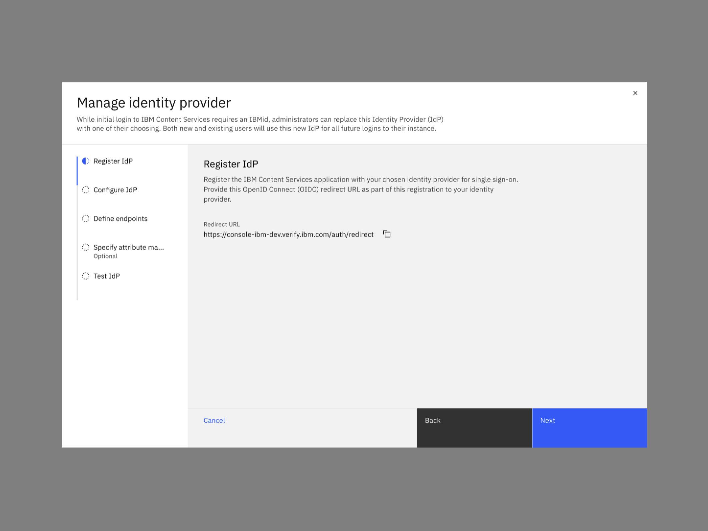
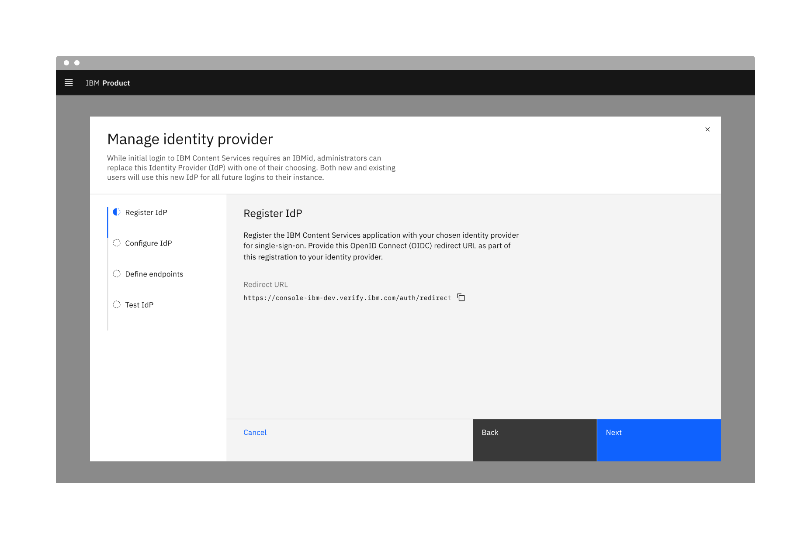
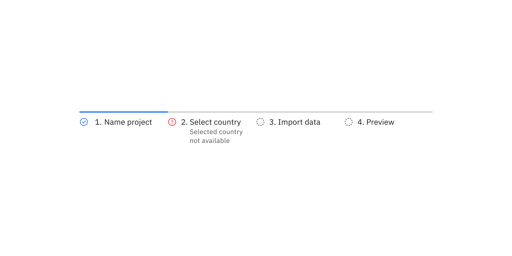

import A11yStatus from 'components/A11yStatus';

<PageDescription>

A progress indicator shows where a user is in a linear, multistep process. The
interactive variant also allows users to return to previously completed steps.

</PageDescription>

<AnchorLinks>

<AnchorLink>Live demo</AnchorLink>
<AnchorLink>Overview</AnchorLink>
<AnchorLink>Formatting</AnchorLink>
<AnchorLink>Content</AnchorLink>
<AnchorLink>Behaviors</AnchorLink>
<AnchorLink>Related</AnchorLink>
<AnchorLink>Feedback</AnchorLink>

</AnchorLinks>

## Live demo

<StorybookDemo
  themeSelector
  url="https://react.carbondesignsystem.com"
  variants={[
    {
      label: 'Default',
      variant: 'components-progressindicator--default',
    },
    {
      label: 'Interactive',
      variant: 'components-progressindicator--interactive',
    },
  ]}
/>

<A11yStatus layout="cards" components="Progress indicator" />

## Overview

Progress indicators help manage a user's expectations when completing a
multistep process. They show which step the user is currently on, the total
number of steps, and overall progress in completing a task.

<Row>
<Column colLg={8}>

</Column>
</Row>

### When to use

- When the user is working through a linear process that can be organized into
  three or more steps.
- When the user could benefit from understanding their progress on long forms
  such as eCommerce checkouts, onboarding, or visa applications.
- When user inputs should be validated before progressing to the next step.
- To complement standard back/next navigation in a linear sequence.

### When not to use

- When a process or form has fewer than three steps.
- When the process may be completed in any order.
- When the number of steps may change based on conditional logic.

### Variants

| Variant     | Purpose                                                            |
| ----------- | ------------------------------------------------------------------ |
| Default     | Allows users to see where they are in a linear, multistep process. |
| Interactive | Allows users to return to a previously completed step.             |

## Formatting

### Anatomy

<Row>
<Column colLg={8}>

</Column>
</Row>

1. **Status indicator:** Communicates if a step is completed, incomplete, not
   started, or has an error. See the
   [status indicator pattern](/patterns/status-indicator-pattern/) for guidance.
2. **Active step line:** Indicates completed steps and the step the user is
   currently on.
3. **Label:** Communicates what the user will accomplish in each step. Numbering
   each step also makes the progression more obvious.
4. **Inactive step line:** Indicates incomplete steps as well as steps that are
   in an error, disabled, or skeleton state.
5. **Optional label or error label:** Shows that a step is optional or in an
   error state.

### Alignment

Progress indicators can be in vertical or horizontal position depending on the
use case and the structure of the UI. When possible, arrange the progress
indicator vertically for easier reading.

<Row>
<Column colLg={8}>

</Column>
</Row>

### Placement

The progress indicator component is often used in
[forms](https://carbondesignsystem.com/components/form/usage). Forms can be
placed on a full page, in a modal, or in a side panel.

IMAGE TK: Get high res image. Likely needs design work first.

<Row>
<Column colLg={8}>

</Column>
</Row>

Checkboxes in a form should be placed at least 32px (layout-03) below or before
the next component. Spacing of 24px (layout-02) or 16px (layout-01) can also be
used when space is more restricted or if the form is more complex.

For more information on spacing in forms, see our
[form style guidance](https://carbondesignsystem.com/components/form/style/).

## Content

### Main elements

#### Label

The label should communicate what the user will accomplish in each step in one
or two words. Choose a label that either starts with a verb ("Define endpoints")
or is universally understood ("Shipping"), and avoid vague terms ("Processing").
You may also number each step to make the progression more obvious.

#### Optional label

Optional labels indicate a step as optional or additional context about a step.
Optional label is required when there step is invalid or in the error state.

### Overflow content

#### Label

When there is not enough space, consider rewording the label or truncate the
label text with an ellipsis and provide a tooltip to convey additional
information.

#### Optional label

Long optional labels may wrap to a second line, and this is preferable to
truncation. Optional labels should wrap beneath the label so both types of label
are always left aligned.

### Further guidance

For further content guidance, see Carbon's
[content guidelines](/guidelines/content/overview/).

## Behaviors

### States

The progress indicator has five main progress states: **completed**,
**current**, **not started**, **error**, and **disabled** and two main
interactive states: **focus** and **hover**. View the
[Style](/components/progress-indicator/style/) tab for visual specs of each
state and see the
[status indicator pattern](/patterns/status-indicator-pattern/) for additional
guidance.

| State       | Description                                                                                                                                                                                                                                                                                                                                   |
| ----------- | --------------------------------------------------------------------------------------------------------------------------------------------------------------------------------------------------------------------------------------------------------------------------------------------------------------------------------------------- |
| Completed   | A step is complete when a user has filled out the required information within a step and progressed to the following step. When possible, use validation to confirm that a step has been completed before the user continues. All steps that have been completed are indicated by an outlined circle with a checkmark and a blue active line. |
| Current     | A step is current when a user is interacting with the information within that step. The current step the user is on is indicated by a half-filled circle and a blue active line.                                                                                                                                                              |
| Not started | A step is not started when a user has not yet interacted with that step. Steps the user has not encountered yet, or future steps, are indicated by an outlined circle and a gray active line.                                                                                                                                                 |
| Error       | A step may be in error when a user has entered invalid or incomplete information. There could also be a server-side error. Provide clear information about the error and guidance on how to resolve the issue.                                                                                                                                |
| Disabled    | A step is disabled when all interactive functions have been removed. Unlike read-only states, disabled states are not focusable, are not read by screen readers, and do not need to pass visual contrast, making them inaccessible if they need to be interpreted.                                                                            |
| Hover       | Use hover state when a user's mouse cursor is hovering over the progress indicator's step.                                                                                                                                                                                                                                                    |
| Focus       | When a user tabs to or clicks on the progress indicator's step, the step becomes focused, indicating the user has successfully navigated to the component.                                                                                                                                                                                    |

### Interactions

#### Mouse

Users can trigger a state change by clicking anywhere in the step progress area.

#### Keyboard

One tab should be selected by default. Users can navigate between tabs by
pressing right or left arrow keys. For additional keyboard interactions, see the
[Accessibility](/components/progress-indicator/accessibility/) tab.

#### Screen readers

VoiceOver: Users can navigate between tabs by pressing right or left arrow keys.

JAWS: Users can navigate between tabs by pressing right or left arrow keys.

NVDA: Users can navigate between tabs by pressing right or left arrow keys.

For additional information, see
[screen reader tests](/components/overview/accessibility-status#accessibility-test-categories).

### Validation

When possible, use validation to confirm that a step has been completed before
the user continues. If any entry is invalid, the progress indicator should show
an error state. Additionally, the invalid entry should be marked with an error
state and include an inline error message that helps the user understand the
problem and how to fix it. This kind of inline validation (aka client-side
validation) should happen as soon as the field loses focus.

If the user cannot proceed due to a server-side issue, then an
[Inline Notification](/components/notification/code#inline-notification) should
appear.

<Row>
<Column colLg={8}>

</Column>
</Row>

## Related

- [Dialogs](/patterns/dialog-pattern/)
- [Forms](/patterns/forms-pattern/)
- [Status indicators](/patterns/status-indicator-pattern/)

## Feedback

Help us improve this component by providing feedback, asking questions, and
leaving any other comments on
[GitHub](https://github.com/carbon-design-system/carbon-website/issues/new?assignees=&labels=feedback&template=feedback.md).
