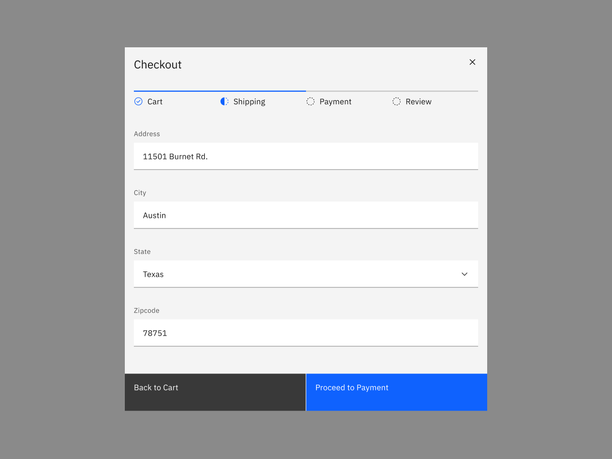

<PageDescription>

A progress indicator is a visual representation of a user's progress through a
set of steps, guiding toward the completion of a specified process.

</PageDescription>

<AnchorLinks>

<AnchorLink>Overview</AnchorLink>
<AnchorLink>Live demo</AnchorLink>
<AnchorLink>Best practices</AnchorLink>
<AnchorLink>Feedback</AnchorLink>

</AnchorLinks>

## Overview

Use progress indicators to keep the user on track when completing a specific
task. By dividing the end goal into smaller, sub-tasks, it increases the
percentage of completeness as each task is completed.

## Live demo

<ComponentDemo
  components={[
    {
      id: 'progress-indicator',
      label: 'Progress indicator',
    },
  ]}>
  <ComponentVariant
    id="progress-indicator"
    knobs={{
      ProgressStep: ['complete', 'current', 'disabled', 'invalid'],
      ProgressIndicator: ['vertical'],
    }}
    links={{
      React:
        'https://react.carbondesignsystem.com/?path=/story/progressindicator--default',
      Angular:
        'https://angular.carbondesignsystem.com/?path=/story/components-progress-indicator--basic',
      Vue:
        'http://vue.carbondesignsystem.com/?path=/story/components-cvprogress--default',
      Vanilla:
        'https://the-carbon-components.netlify.com/?nav=progress-indicator',
    }}>{`
  

    <ProgressIndicator currentIndex={1}>
        <ProgressStep
          label="First step"
          description="Step 1: Getting started with Carbon Design System"
        />
        <ProgressStep
          current
          label="Second step with tooltip"
          description="Step 2: Getting started with Carbon Design System"
          renderLabel={() => (
            <Tooltip
              direction="bottom"
              showIcon={false}
              triggerClassName="bx--progress-label"
              triggerText="Second step with tooltip"
              tooltipId="tooltipId-0">
              
Second step with tooltip

            </Tooltip>
          )}
        />
        <ProgressStep
          label="Third step"
          description="Step 3: Getting started with Carbon Design System"
          secondaryLabel="Optional label"
        />
        <ProgressStep
          invalid
          label="Fourth step"
          description="Step 4: Getting started with Carbon Design System"
        />
        <ProgressStep
          disabled
          label="Fifth step"
          description="Step 5: Getting started with Carbon Design System"
        />
      </ProgressIndicator>
  

`}</ComponentVariant>
</ComponentDemo>

## Best practices

#### Logical progression

Display the steps in order from left to right. Indicate to the user that they
are performing a multistep process, and show the direction of movement. Allow
the user to return to a previous step to review their data submission.

#### Indicate the current step

Keeping the user informed of where they currently are within the process or task
at hand will give them a sense of control. This helps the user to know where
they are in relation to where they have been, and what sections are to follow.
Clear labels should accompany the progress indicator to indicate what the user
will accomplish within each step. Keep labels between one to two words.

#### Validation

Use validation to confirm that a previous step has been completed. If the user
cannot proceed onto another step without first completing a task, use an
[Inline Notification](/components/notification/code#inline-notification) to
inform them.

<Row>
<Column colLg={8}>

</Column>
</Row>

## Feedback

Help us improve this component by providing feedback, asking questions, and
leaving any other comments on
[GitHub](https://github.com/carbon-design-system/carbon-website/issues/new?assignees=&labels=feedback&template=feedback.md).
