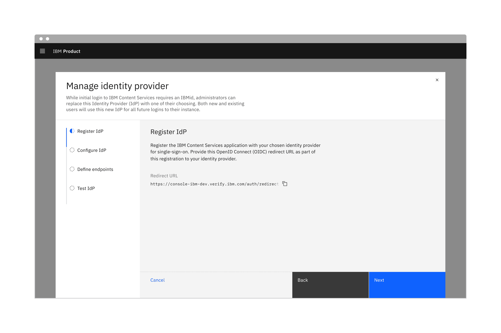
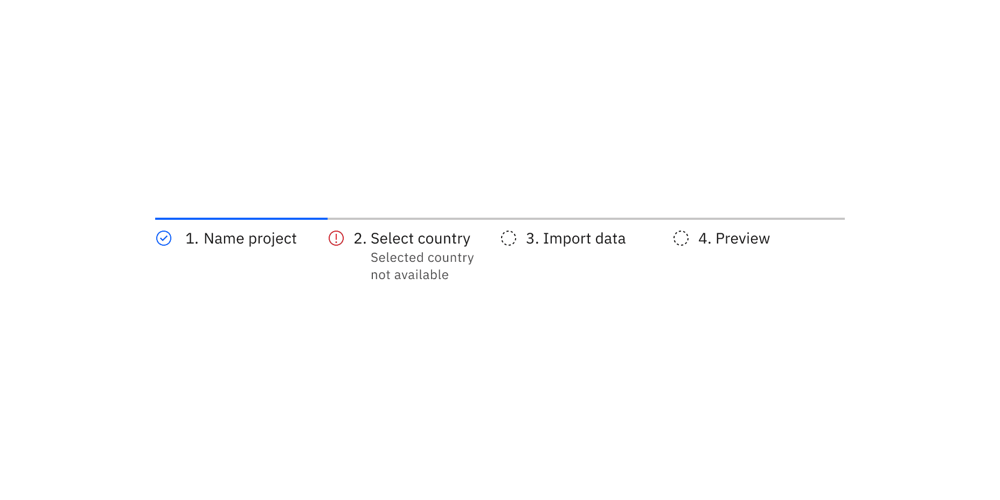

import A11yStatus from 'components/A11yStatus';

<PageDescription>

A progress indicator shows where a user is in a linear, multistep process. The
interactive variant also allows users to return to previously completed steps.

</PageDescription>

<AnchorLinks>

<AnchorLink>Live demo</AnchorLink>
<AnchorLink>Overview</AnchorLink>
<AnchorLink>Formatting</AnchorLink>
<AnchorLink>Content</AnchorLink>
<AnchorLink>Modifiers</AnchorLink>
<AnchorLink>Related</AnchorLink>
<AnchorLink>References</AnchorLink>
<AnchorLink>Feedback</AnchorLink>

</AnchorLinks>

## Live demo

<StorybookDemo
  themeSelector
  url="https://react.carbondesignsystem.com"
  variants={[
    {
      label: 'Default',
      variant: 'components-progressindicator--default',
    },
    {
      label: 'Interactive',
      variant: 'components-progressindicator--interactive',
    },
  ]}
/>

<A11yStatus layout="cards" components="Progress indicator" />

## Overview

Progress indicators help manage a user's expectations when completing a
multistep process. They show which step the user is currently on, the total
number of steps, and overall progress in completing a task.

<Row>
<Column colLg={8}>

</Column>
</Row>

### When to use

- When the user is working through a linear process that can be organized into
  three or more steps.
- When the user could benefit from understanding their progress on long forms
  such as eCommerce checkouts, onboarding, or visa applications.
- When user inputs should be validated before progressing to the next step.
- To complement standard back/next navigation in a linear sequence.

### When not to use

- When a process or form has fewer than three steps.
- When the process may be completed in any order.
- When the number of steps may change based on conditional logic.

### Variants

| Variant     | Purpose                                                            |
| ----------- | ------------------------------------------------------------------ |
| Default     | Allows users to see where they are in a linear, multistep process. |
| Interactive | Allows users to return to a previously completed step.             |

## Formatting

### Anatomy

<Row>
<Column colLg={8}>

</Column>
</Row>

1. **Status indicator:** Communicates if a step is completed, incomplete, not
   started, or has an error. See the
   [status indicator pattern](/patterns/status-indicator-pattern/) for guidance.
2. **Active step line:** Indicates completed steps and the step the user is
   currently on.
3. **Label:** users a word or two to communicate what the user will accomplish
   in each step. Numbering each step also makes the progression more obvious.
4. **Inactive step line:** Indicates incomplete steps as well as steps that are
   in an error, disabled, or skeleton state.
5. **Optional label or error label:** Shows that a step is optional or in an
   error state.

### Alignment

Progress indicators can be in vertical or horizontal position depending on the
use case and the structure of the UI. When possible, arrange the progress
indicator vertically for easier reading.

<Row>
<Column colLg={8}>

</Column>
</Row>

### Placement

The progress indicator component is often used in
[forms](https://carbondesignsystem.com/components/form/usage). Forms can be
placed on a full page, in a modal, or in a side panel.

IMAGE TK: Get high res image. Likely needs design work first.

<Row>
<Column colLg={8}>

</Column>
</Row>

Checkboxes in a form should be placed at least 32px (layout-03) below or before
the next component. Spacing of 24px (layout-02) or 16px (layout-01) can also be
used when space is more restricted or if the form is more complex.

For more information on spacing in forms, see our
[form style guidance](https://carbondesignsystem.com/components/form/style/).

## Content

### Main elements

#### Indicate the current step

- Keeping the user informed of where they currently are within the process or
  task at hand will give them a sense of control. This helps the user to know
  where they are in relation to where they have been, and what sections are to
  follow.
- When it comes to labels or optional labels in progress indicator, it is best
  to keep them short, descriptive, and meaningful. Avoid using complex words or
  sentences and use one or two words instead.

#### Label

Labels indicate steps which users need to complete to accomplish a task. Avoid
vague terms like "Loading" and "Processing".

#### Optional label

Optional labels indicate a step as optional or additional context about a step.
Optional label is required when there step is invalid or in the error state.

### Overflow content

- When there is not enough space, consider rewording the label or truncate the
  label text with an ellipsis and provide a tooltip to convey additional
  information.
- Long optional labels may wrap to a second line, and this is preferable to
  truncation.
- Optional label should wrap beneath the label so both types of label are always
  left aligned.

  IMAGE TK: find high res version of Figma prototype

### Further guidance

For further content guidance, see Carbon's
[content guidelines](<[https://www.carbondesignsystem.com/guidelines/content/general](https://www.carbondesignsystem.com/guidelines/content/general)>).

## Behaviors

#### Logical progression

Display the steps in order from left to right. Indicate to the user that they
are performing a multistep process, and show the direction of movement. Allow
the user to return to a previous step to review their data submission.

#### Indicate the current step

Keeping the user informed of where they currently are within the process or task
at hand will give them a sense of control. This helps the user to know where
they are in relation to where they have been, and what sections are to follow.
Clear labels should accompany the progress indicator to indicate what the user
will accomplish within each step. Keep labels between one to two words.

### States

Progress indicator has five main progress states: **incomplete**, **current**,
**completed**, **error**, and **disabled** and two main interactive states:
**focus** and **hover**. View the [Style](/components/progress-indicator/style/)
tab for more visual presentation of each state

| Variant    | Purpose                                                                                                                                                                                                                                                                                       |
| ---------- | --------------------------------------------------------------------------------------------------------------------------------------------------------------------------------------------------------------------------------------------------------------------------------------------- |
| Incomplete | When users have not interacted with the information within a step                                                                                                                                                                                                                             |
| Current    | When users are interacting with the info within the current step                                                                                                                                                                                                                              |
| Completed  | When users complete filling out the information within a step                                                                                                                                                                                                                                 |
| Error      | When users have interacted with the information within the step but have not completed the step. There could also be an error or failure has occurred during the process. It should provide clear information about the error and guidance on how to resolve the issue                        |
| Disabled   | When the user cannot interact with a component and all interactive functions have been removed. Unlike read-only states, disabled states are not focusable, are not read by screen readers, and do not need to pass visual contrast, making them inaccessible if they need to be interpreted. |
| Hover      | When a user's mouse cursor is hovering over the progress indicator's step                                                                                                                                                                                                                     |
| Focus      | When a user tabs to or clicks on the progress indicator's step, the step becomes focused, indicating the user has successfully navigated to the component.                                                                                                                                    |

### Interactions

#### Mouse

Users can trigger a state change by clicking anywhere in the step progress area.

#### Keyboard

One tab should be selected by default. Users can navigate between tabs by
pressing right or left arrow keys.. For additional keyboard interactions, see
the [Accessibility](/components/progress-indicator/accessibility/) tab.

#### Screen readers

VoiceOver: Users can navigate between tabs by pressing right or left arrow keys.

JAWS: Users can navigate between tabs by pressing right or left arrow keys.

NVDA: Users can navigate between tabs by pressing right or left arrow keys.

For additional information, see
[screen reader tests](/components/overview/accessibility-status#accessibility-test-categories).

### Validation

When possible, use validation to confirm that a step has been completed before
the user continues. If any entry is invalid, the progress indicator should show
an error state. Additionally, the invalid entry should be marked with an error
state and include an inline error message that helps the user understand the
problem and how to fix it. This kind of inline validation (aka client-side
validation) should happen as soon as the field loses focus.

If the user cannot proceed due to a server-side issue, then an
[Inline Notification](/components/notification/code#inline-notification) should
appear.

<Row>
<Column colLg={8}>

</Column>
</Row>

### Responsive behavior

Display the steps in order from left to right or top to bottom. Indicate to the
user that they are performing a multistep process, and show the direction of
movement. Allow the user to return to a previous step to review their data
submission.

### Default selection

<!--
Cover guidance around default settings and provide rationale. See [Form](https://www.carbondesignsystem.com/components/form/usage/#default-values) and [Radio button](https://www.carbondesignsystem.com/components/radio-button/usage/#default-selection) for examples.
-->

### Clickable areas

<!--
Provide details about the clickable areas of the component.
-->

### Loading

<!--
If applicable, use this section to cross reference to the specific loading type in the [Loading component](https://www.carbondesignsystem.com/patterns/loading-pattern) and/or the [Loading pattern](https://www.carbondesignsystem.com/patterns/loading-pattern/).
-->

## Component type name

<!--
Rename this H2 heading with the first component type name, and include as many H2 sections as you have types.

This section describes each of the component types listed in the Types table in the Overview, and highlights any behavior that is *unique* to the component type. Cover the topics from Universal behaviors above, as needed.

And again, if any behavior is *universal* to the component, cover that in the "Universal behaviors" section above.

For examples of how to lay out this kind of information, see [Dropdown](https://www.carbondesignsystem.com/components/dropdown/usage) and [Modal](https://www.carbondesignsystem.com/components/modal/usage#variations).
-->

## Modifiers

<!--
The modifiers section shows different ways of styling the component. Here are some examples:

- adding an icon to a [button](https://www.carbondesignsystem.com/components/button/usage/#variations)
- adding a button to a [notification](https://www.carbondesignsystem.com/components/notification/usage/#anatomy)
- styling a dropdown to appear inline with other content
- using high and low contrast styles for [notifications](https://www.carbondesignsystem.com/components/notification/usage/#high-and-low-contrast)
-->

## Related

- [Dialogs](/patterns/dialog-pattern/)
- [Forms](/patterns/forms-pattern/)
- [Status indicators](/patterns/status-indicator-pattern/)

## References

<!--
Include links to any research, citations, books or articles that you found helpful.
-->

## Feedback

Help us improve this component by providing feedback, asking questions, and
leaving any other comments on
[GitHub](https://github.com/carbon-design-system/carbon-website/issues/new?assignees=&labels=feedback&template=feedback.md).
