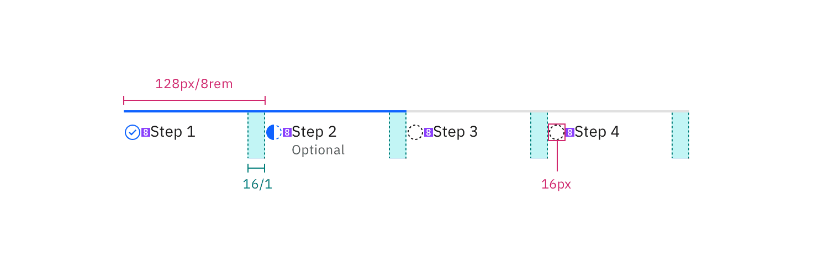

<AnchorLinks>

<AnchorLink>General guidance</AnchorLink>
<AnchorLink>Formatting</AnchorLink>
<AnchorLink>Content</AnchorLink>
<AnchorLink>Behavior</AnchorLink>
<AnchorLink>Accessibility</AnchorLink>
<AnchorLink>Variations</AnchorLink>
<AnchorLink>Style</AnchorLink>
<AnchorLink>Code</AnchorLink>
<AnchorLink>Feedback</AnchorLink>

</AnchorLinks>

## General guidance

Progress indicator is a visual representation of a users progress through a set of steps. They guide the user through a number of steps in order to complete a specified process.

Use progress indicators to keep the user on track when completing a specific task. By dividing the end goal into smaller, sub-tasks, it increases the percentage of completeness as each task is completed.

<ComponentCode
  name="Progress indicator"
  component="progress-indicator"
  variation="progress-indicator"
  hasReactVersion="progressindicator--default"
  hasVueVersion="progress--default"
  hasAngularVersion="?path=/story/progress-indicator--basic"
  codepen="dLMppM"></ComponentCode>

## Formatting

## Content 

**Clear labels should accompany the progress indicator to indicate what the user will accomplish within each step.** Keep labels between one to two words.

**Display the steps in order from left to right.** Indicate to the user that they are performing a multi-step process, and show the direction of movement. Allow the user to return to a previous step to review their data submission.

## Behavior

**Indicate the current step.** Keeping the user informed of where they currently are within the process or task at hand will give them a sense of control. This helps the user to know where they are in relation to where they have been, and what sections are to follow.

**Use validation to confirm that a previous step has been completed.** If the user cannot proceed onto another step without first completing a task, use an Inline Notification to inform them.

## Accessibility

## Variations 

## Style

### Color

All steps that have been completed are indicated by an outlined circle with a checkmark. The current step the user is on is indicated by a filled circle. Steps the user has not encountered yet, or future steps, are indicated by an outlined circle.

| Class                                                       | Property         | Color token       |
| ----------------------------------------------------------- | ---------------- | ----------------- |
| `.bx--progress-step--complete svg`                          | fill             | `$interactive-04` |
| `.bx--progress-step--incomplete svg`                        | fill             | `$interactive-04` |
| `.bx--progress-step--current`   `.bx--progress-line`    | background-color | `$interactive-04` |
| `.bx--progress-step--incomplete`   `.bx--progress-line` | background-color | `$ui-03`          |
| `.bx--progress-label`                                       | text color       | `$text-01`        |
| `.bx--progress-optional`                                    | text color       | `$text-02`        |

### Interactive states

| Class                       | Property   | Color token   |
| --------------------------- | ---------- | ------------- |
| `.bx--progress-step:focus`  | border     | `$focus`      |
| `.bx--progress-label:hover` | text color | `$link-01`    |
| `.bx--progress__warning`    | fill       | `$support-01` |

<Caption>
  Examples of current, completed, and future steps for progress indicator
</Caption>

### Typography

Labels should be one to two words only, with a limit of 16 characters total per label. All labels should be set in sentence case.

| Class                    | Font-size (px/rem) | Font-weight   | Type token       |
| ------------------------ | ------------------ | ------------- | ---------------- |
| `.bx--progress-label`    | 14 / 0.875         | Regular / 400 | `$body-short-01` |
| `.bx--progress-optional` | 14 / 0.875         | Regular / 400 | `$label-01`      |

### Structure

The checkmark icon can be found in the [iconography](/style/iconography/library) library.

| Class                    | Property                 | px / rem | Spacing token |
| ------------------------ | ------------------------ | -------- | ------------- |
| `.bx--progress-step`     | min-width                | 128 / 8  | –             |
| `.bx--progress-step svg` | height, width            | 16 / 1   | –             |
| `.bx--progress-step svg` | margin-top, margin-right | 16 / 1   | `$spacing-05` |
| `.bx--progress-label`    | margin-top               | 16 / 1   | `$spacing-05` |

<Caption>
  Structure and spacing measurements for progress indicator | px / rem
</Caption>

#### Recommended

The following specs are not built into the progress indicator component but are recommended by design as the proper amount between progress indicator elements.

| Class           | Property | px / rem | Spacing token |
| --------------- | -------- | -------- | ------------- |
| `.bx--progress` | margin   | 16 / 1   | `$spacing-05` |

<Caption>
  Recommended structure and spacing measurements for progress indicator | px /
  rem
</Caption>

## Code

<ComponentDocs component="progress-indicator"></ComponentDocs>

## Feedback
