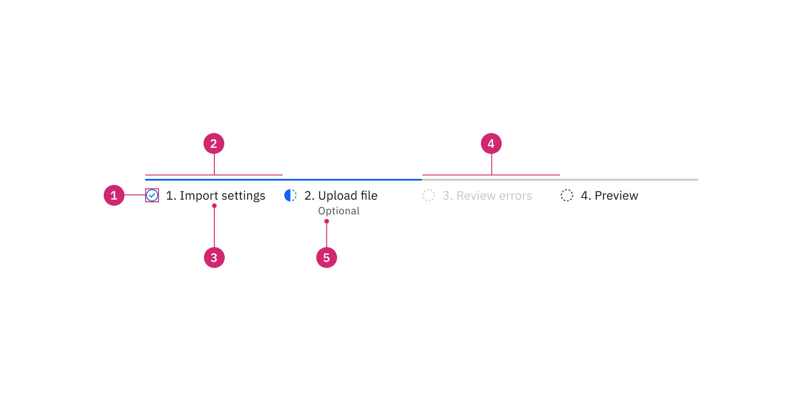
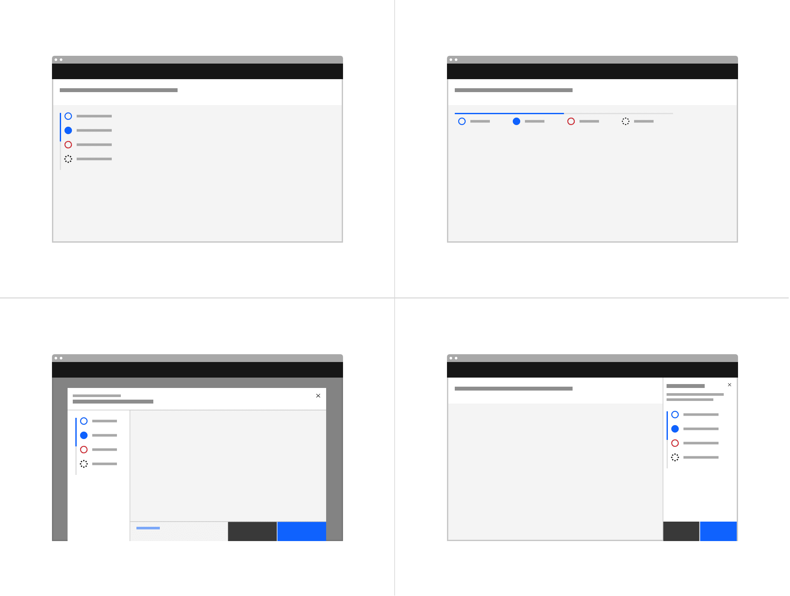
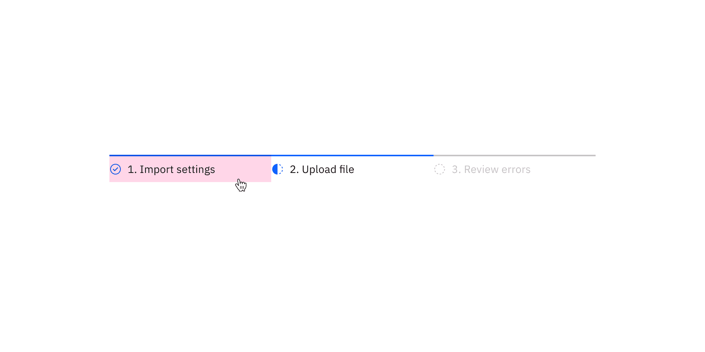
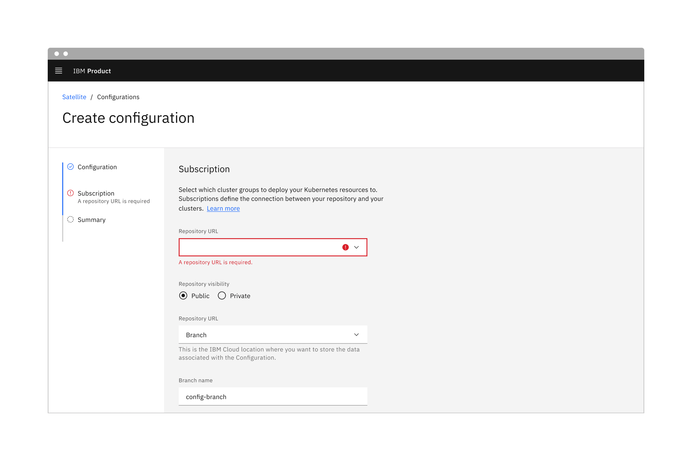

import A11yStatus from 'components/A11yStatus';

<PageDescription>

A progress indicator guides users through any linear, multistep task by showing
the user their completed, current, and future steps.

</PageDescription>

<AnchorLinks>

<AnchorLink>Live demo</AnchorLink>
<AnchorLink>Overview</AnchorLink>
<AnchorLink>Formatting</AnchorLink>
<AnchorLink>Content</AnchorLink>
<AnchorLink>Behaviors</AnchorLink>
<AnchorLink>Related</AnchorLink>
<AnchorLink>Feedback</AnchorLink>

</AnchorLinks>

## Live demo

<StorybookDemo
  themeSelector
  url="https://react.carbondesignsystem.com"
  variants={[
    {
      label: 'Default',
      variant: 'components-progressindicator--default',
    },
    {
      label: 'Interactive',
      variant: 'components-progressindicator--interactive',
    },
  ]}
/>

<A11yStatus layout="cards" components="Progress indicator" />

## Overview

Progress indicators help manage a user's expectations when completing a
multistep process. They show which step the user is currently on, the total
number of steps, and overall progress in completing a task.

<Row>
<Column colLg={8}>

<Caption>
  Example of a progress indicator used in a payment UI.
</Caption>
</Column>
</Row>

### When to use

- When the user is working through a linear process that can be organized into
  three or more steps.
- When the user could benefit from understanding their progress on long forms
  such as eCommerce checkouts, onboarding, or visa applications.
- When user inputs should be validated before progressing to the next step.
- To complement standard back/next navigation in a linear sequence.

### When not to use

- When a process or form has fewer than three steps.
- When the process may be completed in any order.
- When the number of steps may change based on conditional logic.

## Formatting

### Anatomy

<Row>
<Column colLg={12}>

</Column>
</Row>

1. **Status indicator:** Communicates if a step is completed, incomplete, not
   started, or has an error. See the
   [status indicator pattern](/patterns/status-indicator-pattern/) for guidance.
2. **Active step line:** Indicates completed steps and the step the user is
   currently on.
3. **Label:** Communicates what the user will accomplish in each step. Numbering
   each step also makes the progression more obvious.
4. **Inactive step line:** Indicates incomplete steps as well as steps that are
   in an error, disabled, or skeleton state.
5. **Helper text:** Labels a step as optional or in an error state.

### Alignment

Progress indicators can be in vertical or horizontal positions depending on the
use case and the structure of the UI. When possible, arrange the progress
indicator vertically for easier reading.

<Row>
<Column colLg={12}>

<Caption>Example of a progress indicator using vertical alignment.</Caption>

</Column>
</Row>

### Placement

The progress indicator component can be placed on a full page, in a modal, or in
a side panel. It is also common to use the progress indicator in a
[tearsheet](https://pages.github.ibm.com/cdai-design/pal/components/tearsheet/usage/),
a component provided by Carbon for IBM Products.

<Row>
<Column colLg={8}>

<Caption>
  Examples of progress indicators on a full page, tearsheet, and side panel.
</Caption>

</Column>
</Row>

## Content

### Main elements

#### Label

The label should communicate what the user will accomplish in each step in one
or two words. One option is to clearly indicate the action of the step by using
the {verb} + {noun} content formula. For example, "Configure IdP" or "Define
endpoints." A label may use one word if it is universally understood, such as
"Cart," "Shipping," or "Payment." Avoid vague terms like "Processing." You may
also number each step to make the progression more obvious.

#### Helper text

Use the helper text to indicate that a step is optional or that a step is in an
error state.

### Overflow content

#### Label

When there is not enough space, consider rewording the label or truncate the
label text with an ellipsis and provide a tooltip to convey additional
information.

#### Helper text

Long helper text may wrap to a second line, and this is preferable to
truncation. Wrap the helper text beneath the label so that both maintain left
alignment.

<Row>
<Column colLg={12}>

<Caption>
  Example of a helper text that wraps to the second line and maintains left alignment with the label.
</Caption>
</Column>
</Row>

### Further guidance

For further content guidance, see Carbon's
[content guidelines](/guidelines/content/overview/).

## Behaviors

### States

The progress indicator has seven states: **completed**, **current**, **not
started**, **error**, **disabled**, **hover**, and **focus**. View the
[Style](/components/progress-indicator/style/) tab for visual specs of each
state and see the
[status indicator pattern](/patterns/status-indicator-pattern/) for additional
guidance.

| State       | Description                                                                                                                                                                                                                                                                                                                                   |
| ----------- | --------------------------------------------------------------------------------------------------------------------------------------------------------------------------------------------------------------------------------------------------------------------------------------------------------------------------------------------- |
| Completed   | A step is complete when a user has filled out the required information within a step and progressed to the following step. When possible, use validation to confirm that a step has been completed before the user continues. All steps that have been completed are indicated by an outlined circle with a checkmark and a blue active line. |
| Current     | A step is current when a user is interacting with the information within that step. The current step the user is on is indicated by a half-filled circle and a blue active line.                                                                                                                                                              |
| Not started | A step is not started when a user has not yet interacted with that step. Steps the user has not encountered yet, or future steps, are indicated by an outlined circle and a gray active line.                                                                                                                                                 |
| Error       | A step may be in error when a user has entered invalid or incomplete information. There could also be a server-side error. Provide clear information about the error and guidance on how to resolve the issue.                                                                                                                                |
| Disabled    | A step is disabled when all interactive functions have been removed. Unlike read-only states, disabled states are not focusable, are not read by screen readers, and do not need to pass visual contrast, making them inaccessible if they need to be interpreted.                                                                            |
| Hover       | Use the hover state when a user's mouse cursor is hovering over the progress indicator's step.                                                                                                                                                                                                                                                |
| Focus       | When a user tabs to or clicks on the progress indicator's step, the step becomes focused, indicating the user has successfully navigated to the component.                                                                                                                                                                                    |

### Interactions

By default, the progress indicator is not interactive, providing only a visual
update of the users' progress. There is also an option for an interactive
progress indicator, which allows users to navigate to each step.

#### Mouse

If the progress indicator is interactive, users can navigate to a step by
clicking anywhere within the step label container.

<Row>
<Column colLg={12}>

</Column>
</Row>

#### Keyboard

The first step should be selected by default. Users can navigate between steps
by pressing `Right` or `Left` arrow keys. For additional keyboard interactions,
see the [Accessibility](/components/progress-indicator/accessibility/) tab.

### Validation

When possible, use validation to confirm that a step has been completed before
the user continues. If any entry is invalid, the progress indicator should show
an error state. Additionally, the invalid entry should be marked with an error
state and include an inline error message that helps the user understand the
problem and how to fix it. This kind of inline validation (or client-side
validation) should happen as soon as the field loses focus.

If the user cannot proceed due to a server-side issue, then an
[inline notification](/components/notification/code#inline-notification) should
appear.

<Row>
<Column colLg={12}>

<Caption>
  Example of a progress indicator using validation.
</Caption>
</Column>
</Row>

## Related

- The progress indicator component is commonly used in
  [dialogs](/patterns/dialog-pattern/) or [forms](/patterns/forms-pattern/).
- It is also common to use the progress indicator in a
  [tearsheet](https://pages.github.ibm.com/cdai-design/pal/components/tearsheet/usage/),
  a component provided by Carbon for IBM Products.

## Feedback

Help us improve this component by providing feedback, asking questions, and
leaving any other comments on
[GitHub](https://github.com/carbon-design-system/carbon-website/issues/new?assignees=&labels=feedback&template=feedback.md).
