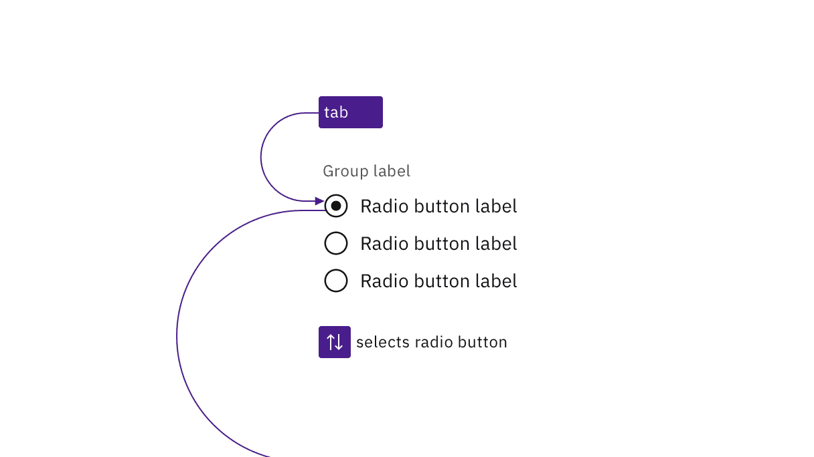
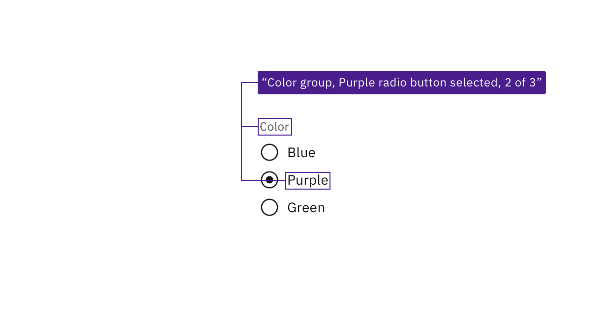

import {
  StructuredListWrapper,
  StructuredListHead,
  StructuredListBody,
  StructuredListRow,
  StructuredListInput,
  StructuredListCell,
  OrderedList,
  ListItem,
} from '@carbon/react';

<PageDescription>

No accessibility annotations are needed for radio buttons, but keep these
considerations in mind if you are modifying Carbon or creating a custom
component.

</PageDescription>

<AnchorLinks>

<AnchorLink>What Carbon provides</AnchorLink>
<AnchorLink>Development considerations</AnchorLink>

</AnchorLinks>

## What Carbon provides

Carbon bakes keyboard operation into its components, improving the experience of
blind users and others who operate via the keyboard. Carbon incorporates many
other accessibility considerations, some of which are described below.

### Keyboard interaction

A group of radio buttons takes a single tab stop. Carbon requires an item to be
selected by default, and this item will always take focus. The user changes the
selected radio button using the arrow keys (up/down or left/right). Pressing
`Tab` again will move focus out of the radio button group to the next component.

<Row>
<Column colLg={8}>

<Caption>
  A radio button group is a single tab stop and radio buttons are selected using
  arrow keys.
</Caption>

</Column>
</Row>

### Labeling and states

Carbon surfaces the labeling of radio buttons and groups to screen readers and
other assistive technologies. Carbon also provides state and context
information, such as the number of items in the radio button group.

<Row>
<Column colLg={8}>

<Caption>
  JAWS screen reader output, based on the information provided by Carbon.
</Caption>

</Column>
</Row>

## Development considerations

Keep this in mind if you’re modifying Carbon or creating a custom component.

- Carbon uses `fieldset` and `legend` to group and label sets of radio buttons.
- Carbon uses `label` and `for` to programmatically connect radio buttons with
  their labels.
- Required radio button groups must be identified programmatically, either via
  the label or with `aria-required`.
- See the
  [ARIA authoring practices](https://www.w3.org/WAI/ARIA/apg/patterns/radiobutton/)
  for more considerations.
