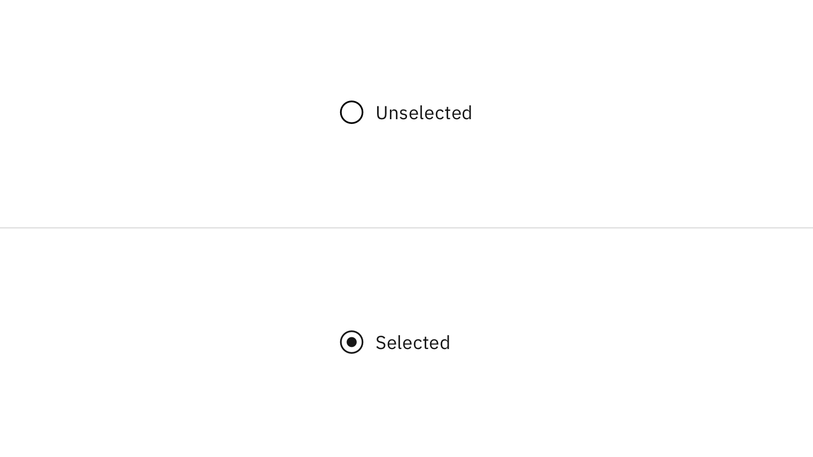
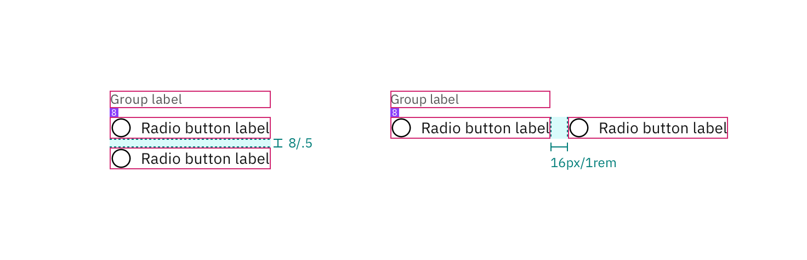
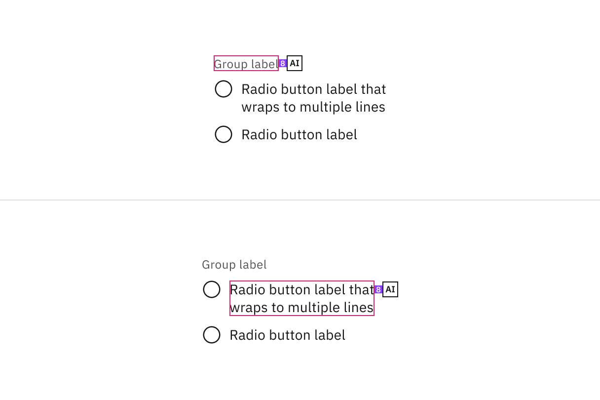

<PageDescription>

The following page documents visual specifications such as color, typography,
and structure.

</PageDescription>

<AnchorLinks>

<AnchorLink>Color</AnchorLink>
<AnchorLink>Typography</AnchorLink>
<AnchorLink>Structure</AnchorLink>
<AnchorLink>AI presence</AnchorLink>
<AnchorLink>Feedback</AnchorLink>

</AnchorLinks>

## Color

| Element                   | Property         | Color token       |
| ------------------------- | ---------------- | ----------------- |
| Group label               | text color       | `$text-secondary` |
| Radio button label        | text color       | `$text-primary`   |
| Radio button (unselected) | border           | `$icon-primary`   |
|                           | background-color | Transparent       |
| Radio button (selected)   | border           | `$icon-primary`   |
|                           | dot              | `$icon-primary`   |
| Helper text               | text color       | `$text-secondary` |

<Row>
<Column colLg={8}>

</Column>
</Row>

### Interactive colors

| State     | Element         | Property   | Color token        |
| --------- | --------------- | ---------- | ------------------ |
| Focus     | Radio button    | border     | `$focus`           |
| Disabled  | Label           | text color | `$text-disabled`   |
|           | Radio button    | border     | `$icon-disabled`   |
|           |                 | inner fill | `$icon-disabled`   |
| Read-only | Label           | text color | `$text-primary`    |
|           | Radio button    | border     | `$icon-disabled`   |
|           |                 | inner fill | `$icon-primary`    |
| Error     | Label           | text color | `$text-primary`    |
|           | Radio button    | border     | `$support-error`   |
|           | Error message   | text color | `$text-error`      |
|           | Error icon      | svg        | `$support-error`   |
| Warning   | Label           | text color | `$text-primary`    |
|           | Radio button    | border     | `$icon-primary`    |
|           | Warning message | text color | `$text-primary`    |
|           | Warning icon    | svg        | `$support-warning` |
|           |                 | inner fill | `$black`           |

<Row>
<Column colLg={8}>

</Column>
</Row>

## Typography

Radio button labels should be set in sentence case, with only the first word in
a phrase and any proper nouns capitalized.

| Element            | Font-size (px/rem) | Font-weight   | Type token         |
| ------------------ | ------------------ | ------------- | ------------------ |
| Group label        | 12 / 0.75          | Regular / 400 | `$label-01`        |
| Radio button label | 14 / 0.875         | Regular / 400 | `$body-compact-01` |
| Helper text        | 12 / 0.75          | Regular / 400 | `$helper-text-01`  |
| Error message      | 12 / 0.75          | Regular / 400 | `$label-01`        |
| Warning message    | 12 / 0.75          | Regular / 400 | `$label-01`        |

## Structure

| Element               | Property      | px / rem  | Spacing token |
| --------------------- | ------------- | --------- | ------------- |
| Radio button icon     | height, width | 20 / 1.25 | –             |
|                       | margin-right  | 8 / 0.5   | `$spacing-03` |
| Dot                   | height, width | 8 / 0.5   | –             |
|                       | margin-right  | 8 / 0.5   | `$spacing-03` |
| Group label           | margin-bottom | 8 / 0.5   | `$spacing-03` |
| Horizontal group item | margin-left   | 8 / 0.5   | `$spacing-03` |
| Vertical group item   | margin-bottom | 8 / 0.5   | `$spacing-03` |

<Caption fullwidth>
  Structure and spacing measurements for radio button | px | rem
</Caption>

<Caption fullwidth>
  Structure and spacing measurements for radio button | px | rem
</Caption>

## AI presence

The only style modification an AI variant of the radio button has is the
addition of the AI label. All other tokens in the component remain the same as
the non-AI variants.

For more information on the AI style elements, see the
[Carbon for AI](/guidelines/carbon-for-ai/) guidelines.

| Element  | Property | Token / Size |
| -------- | -------- | ------------ |
| AI label | size     | mini         |

<Row>
<Column colLg={8}>

</Column>
</Row>

## Feedback

Help us improve this component by providing feedback, asking questions, and
leaving any other comments on
[GitHub](https://github.com/carbon-design-system/carbon-website/issues/new?assignees=&labels=feedback&template=feedback.md).
