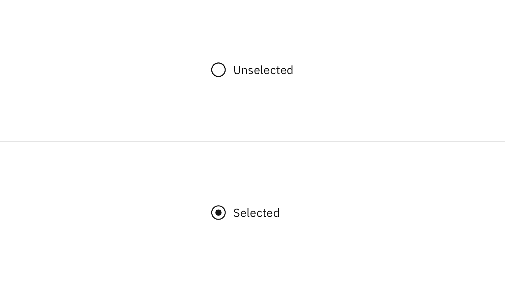
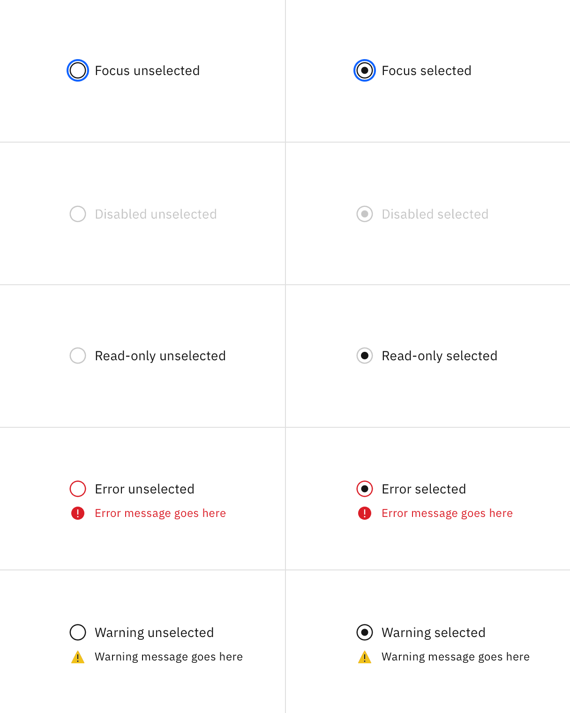
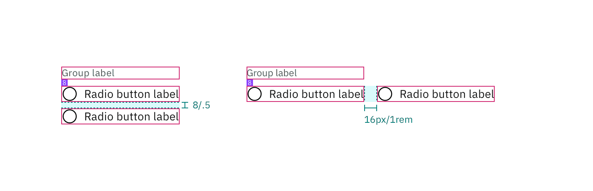

## Color

| Element                   | Property         | Color token       |
| ------------------------- | ---------------- | ----------------- |
| Group label               | text color       | `$text-secondary` |
| Radio button label        | text color       | `$text-primary`   |
| Radio button (unselected) | border           | `$icon-primary`   |
|                           | background-color | Transparent       |
| Radio button (selected)   | border           | `$icon-primary`   |
|                           | dot              | `$icon-primary`   |

<Row>
<Column colLg={8}>

</Column>
</Row>

### Interactive colors

| State     | Element      | Property   | Color token      |
| --------- | ------------ | ---------- | ---------------- |
| Focus     | Radio button | border     | `$focus`         |
| Disabled  | Label        | text color | `$text-disabled` |
|           | Radio button | border     | `$icon-disabled` |
|           |              | inner fill | `$icon-disabled` |
| Read-only | Label        | text color | `$text-primary`  |
|           | Radio button | border     | `$icon-disabled` |
|           |              | inner fill | `$icon-primary`  |

<Row>
<Column colLg={8}>

</Column>
</Row>

## Typography

Radio button labels should be set in sentence case, with only the first word in
a phrase and any proper nouns capitalized.

| Element            | Font-size (px/rem) | Font-weight   | Type token         |
| ------------------ | ------------------ | ------------- | ------------------ |
| Group label        | 12 / 0.75          | Regular / 400 | `$label-01`        |
| Radio button label | 14 / 0.875         | Regular / 400 | `$body-compact-01` |

## Structure

| Element               | Property      | px / rem  | Spacing token |
| --------------------- | ------------- | --------- | ------------- |
| Radio button icon     | height, width | 20 / 1.25 | –             |
|                       | margin-right  | 8 / 0.5   | `$spacing-03` |
| Dot                   | height, width | 8 / 0.5   | –             |
|                       | margin-right  | 8 / 0.5   | `$spacing-03` |
| Group label           | margin-bottom | 8 / 0.5   | `$spacing-03` |
| Horizontal group item | margin-left   | 8 / 0.5   | `$spacing-03` |
| Vertical group item   | margin-bottom | 8 / 0.5   | `$spacing-03` |

<Caption>
  Structure and spacing measurements for radio button | px | rem
</Caption>

<Caption>
  Structure and spacing measurements for radio button | px | rem
</Caption>
