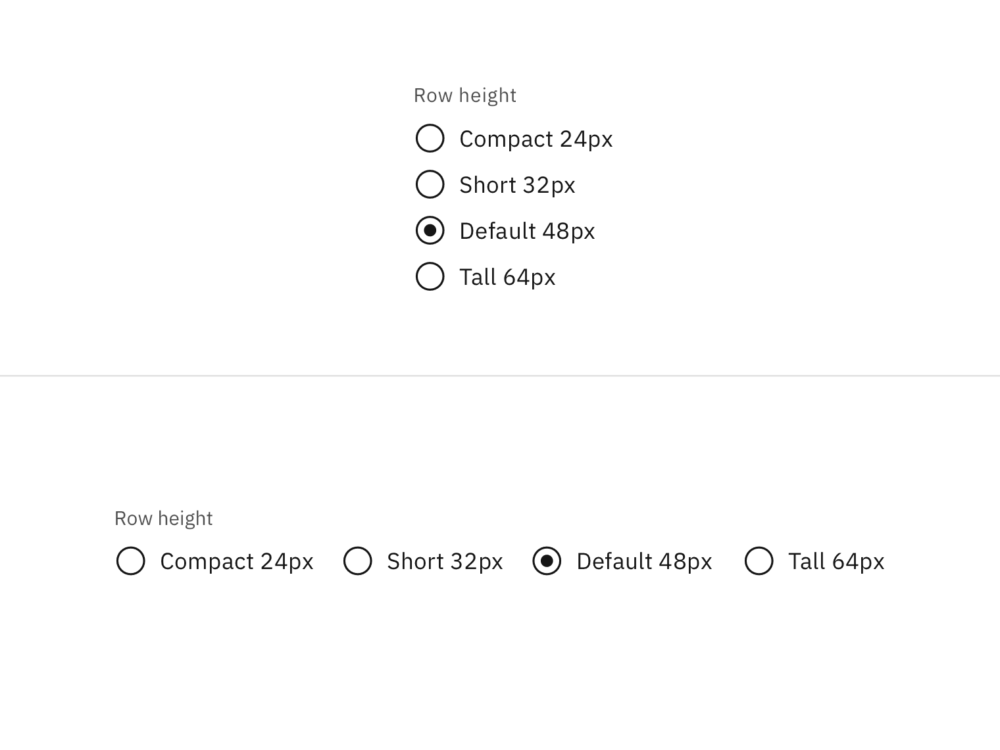
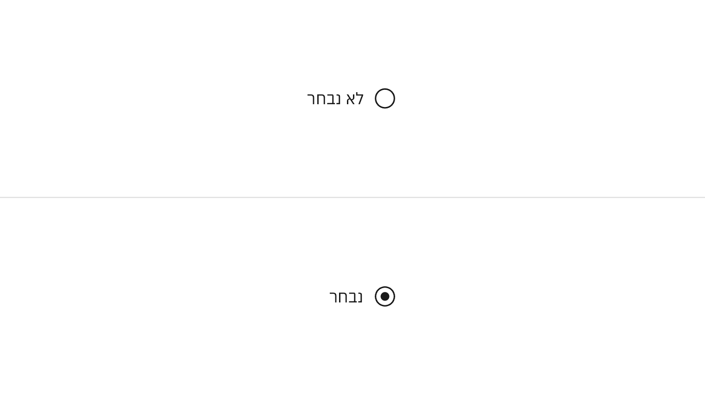
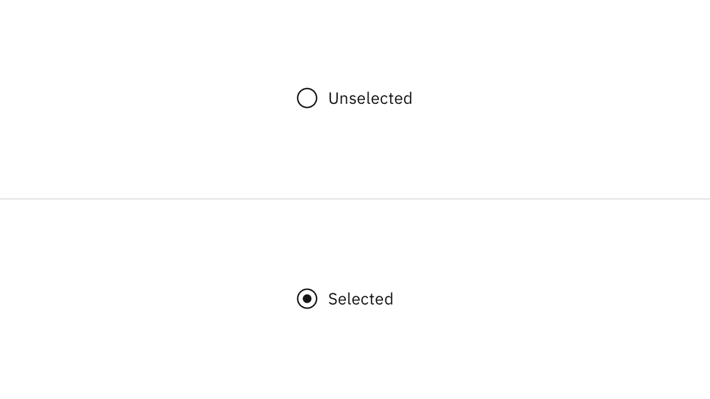

import A11yStatus from 'components/A11yStatus';

<PageDescription>

Use radio buttons when you have a group of mutually exclusive choices and only
one selection from the group is allowed.

</PageDescription>

<InlineNotification>

Radio button
[with AI label](https://react.carbondesignsystem.com/?path=/story/components-radiobutton--with-ai-label)
is now stable. This addition changes the visual appearance of the component and
introduces an AI explainability feature when AI is present in the component. See
the [AI presence](/components/radio-button/usage/#ai-presence) section for more
details.

</InlineNotification>

<AnchorLinks>

<AnchorLink>Live demo</AnchorLink>
<AnchorLink>Overview</AnchorLink>
<AnchorLink>Formatting</AnchorLink>
<AnchorLink>Content</AnchorLink>
<AnchorLink>Behaviors</AnchorLink>
<AnchorLink>AI presence</AnchorLink>
<AnchorLink>Related</AnchorLink>
<AnchorLink>References</AnchorLink>
<AnchorLink>Feedback</AnchorLink>

</AnchorLinks>

## Live demo

<StorybookDemo
  themeSelector
  url="https://react.carbondesignsystem.com"
  variants={[
    {
      label: 'Default',
      variant: 'components-radiobutton--default',
    },
    {
      label: 'with AI Label',
      variant: 'components-radiobutton--with-ai-label',
    },
  ]}
/>

<A11yStatus layout="cards" components="Radio button" />

## Overview

Radio buttons are used for mutually exclusive choices, not for multiple choices.
Only one radio button can be selected at a time. When a user chooses a new item,
the previous choice is automatically deselected.

### When to use

#### Form

Can be used in tiles, data tables, modals, side panels, and in forms on full
pages.

#### Settings

Used to change from one setting to another in a menu, page, or component. It can
often act as a filtering mechanism.

<Row>
<Column colLg={8}>

</Column>
</Row>

### When not to use

If a user can select from multiple options, use checkboxes instead of radio
buttons. Radio buttons allow the user to select only one item in a set whereas
checkboxes allow the user to select multiple items.

<DoDontRow>
  <DoDont type="do" caption="Do use checkboxes when multiple items can be selected.">

  </DoDont>
  <DoDont type="dont" caption="Don't use radio buttons when multiple items can be selected.">

  </DoDont>
</DoDontRow>

## Formatting

### Anatomy

The radio button component is comprised of a set of clickable circles (the
inputs) with text labels positioned to the right. If there is a group of radio
buttons, a group label can be added.

<Row>
<Column colLg={8}>

</Column>
</Row>

1. **Group label (optional):** Describes the group of options or provides
   guidance for making a selection.
2. **Radio button input:** Indicates the state of a radio button. By default, no
   option will be preselected.
3. **Radio button label:** Describes the information you want to select or
   unselect.

### Alignment

Radio button labels are positioned to the right of their inputs in languages
that read left to right. If there is a radio button grouping, they can be laid
out vertically or horizontally depending on the use case and the structure of
the UI. When possible, arrange the radio button and checkbox groups vertically
for easier reading.

<Row>
<Column colLg={8}>

</Column>
</Row>

<Caption>Vertically stacked versus horizontal alignment</Caption>

For languages that read right to left, it's acceptable to place labels to the
left of the inputs.

<Row>
<Column colLg={8}>

</Column>
</Row>

<Caption>
  Example of radio buttons for languages that read right to left instead of left
  to right
</Caption>

### Placement

The radio button component is often used in forms. Forms can be placed on a full
page, in a modal, or in a side panel. A radio button can also be used for
changing settings in a menu or selecting a singular item in a data table.

<Row>
<Column colLg={8}>

</Column>
</Row>

Radio buttons in a form should be placed at least 32px (`layout-03`) below or
before the next component. Spacing of 24px (`layout-02`) or 16px (`layout-01`)
can also be used when space is more restricted or if the form is more complex.

For more information on spacing in forms, see our
[form style guidance](https://www.carbondesignsystem.com/components/form/style).

<Row>
<Column colLg={8}>

</Column>
</Row>

<Caption>Spacing between a radio button and other components in a form</Caption>

## Content

### Main elements

#### Group labels (optional)

A heading can accompany a set of radio buttons to provide further context or
clarity. In some cases, a group of radio buttons may be within a larger group of
components that already have a group label. In this case, an additional group
label for the radio button component itself is not needed.

- A group label can either state the category of the grouping or concisely
  instruct what actions to take below depending on the context.
- Use sentence case for group labels.

#### Radio button labels

- Always use clear and concise labels for radio buttons.
- Labels appear to the right of radio button inputs.

### Overflow content

- We recommend radio button labels being fewer than three words.
- If you are tight on space, consider rewording the label. Do not truncate radio
  button label text with an ellipsis.
- Long labels may wrap to a second line, and this is preferable to truncation.
- Text should wrap beneath the radio button so the control and label are top
  aligned.

<Row>
<Column colLg={8}>

</Column>
</Row>

<DoDontRow>
<DoDont type="do" caption="Do let text wrap beneath the radio button so the control and label are top aligned.">

</DoDont>
<DoDont type="dont" caption="Do not vertically center wrapped text with the radio button.">

</DoDont>
</DoDontRow>

### Further guidance

For further content guidance, see Carbon's
[content guidelines](https://www.carbondesignsystem.com/guidelines/content/overview).

## Behaviors

### States

The radio button input allows for two states: **unselected** and **selected**.
The default view of a radio button is having no radio button preselected. Only
one radio button should be selected at a time. When a user chooses a new item,
the previous choice is automatically deselected. If the user has already
selected an item but wants to deselect it, consider adding alternatives such as
an "other" or "none" option.

<Row>
<Column colLg={8}>

</Column>
</Row>

In addition to unselected and selected states, radio buttons also have states
for focus, disabled, read-only, error, and warning. When deciding whether to use
a disabled or read-only state for radio buttons, see our
[Read-only states pattern](https://carbondesignsystem.com/patterns/read-only-states-pattern/)
guidance.

<Row>
<Column colLg={8}>

</Column>
</Row>

#### Group states

Radio button groups can receive the following states: read-only, disabled,
error, and warning, as well as the addition of helper text.

<Row>
<Column colLg={12}>

</Column>
</Row>

### Interactions

#### Mouse

Users can trigger an item by clicking the radio button input directly or by
clicking the radio button label. Having both regions interactive creates a more
accessible click target.

<Row>
<Column colLg={8}>

</Column>
</Row>

#### Keyboard

By default, no option will be preselected. Users can navigate between radio
button inputs by pressing `Up` or `Down` arrow keys. If a user lands on a radio
button set without a default indicator, they can press `Space` to select the
radio button or they can press an arrow key to select the next radio button. For
additional keyboard interactions, see
the [accessibility tab](https://www.carbondesignsystem.com/components/radio-button/accessibility).

## AI presence

Radio button has a modification that embeds the AI label when AI present in the
control. The AI variant functions the same as the normal version except with the
addition of the AI label which is both a visual indicator and the trigger for
the explainability popover. The AI label can be placed on the radio button group
label or on individual radio button labels.

For more information on designing for AI, see the
[Carbon for AI](/guidelines/carbon-for-ai/) guidelines.

<Row>
<Column colLg={8}>

</Column>
</Row>

## Related

#### Radio buttons versus checkboxes

Radio buttons allow users to select one option from a group of mutually
exclusive choices, while checkboxes allow for a selection of one of more options
from a group. In the use cases where multiple selections are allowed, use the
[checkbox component](https://www.carbondesignsystem.com/components/checkbox/usage)
instead of the radio button.

#### Radio button verses selectable tile

Radio buttons should have concise, easy to compare options. If more information
is required to make a choice, like pricing plans or additional links, consider
using a
[selectable tile](https://www.carbondesignsystem.com/components/tile/usage#selectable).

#### Radio button verses toggle switch

[Toggle switches](https://www.carbondesignsystem.com/components/toggle/usage)
are preferred when the user options are limited to two choices—on and off or
true and false. By comparison, radio buttons, radio buttons can have many other
options.

#### Structured list

If a user needs to choose a singular item from a list that has simple data and
multiple columns, a selectable
[structured list](https://carbondesignsystem.com/components/structured-list/usage)
can be used.

#### Tables

See the
[data table component](https://www.carbondesignsystem.com/components/data-table/usage#radio-selection)
for guidance on how to use radio buttons within a table.

## References

Jakob Nielson,
[Checkboxes vs. Radio Buttons](https://www.nngroup.com/articles/checkboxes-vs-radio-buttons/)
(Nielsen Norman Group, 2004)

Kara Pernice,
[Radio Buttons: Select One by Default or Leave All Unselected?](https://www.nngroup.com/articles/radio-buttons-default-selection/)
(Nielsen Norman Group, 2014)

## Feedback

Help us improve this component by providing feedback, asking questions, and
leaving any other comments on
[GitHub](https://github.com/carbon-design-system/carbon-website/issues/new?assignees=&labels=feedback&template=feedback.md).
