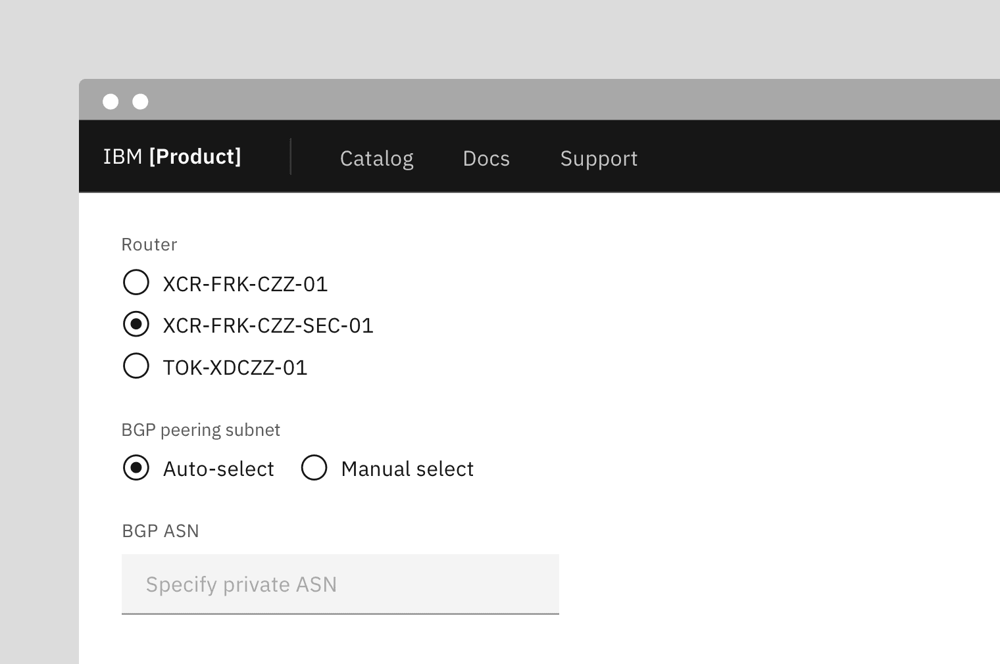
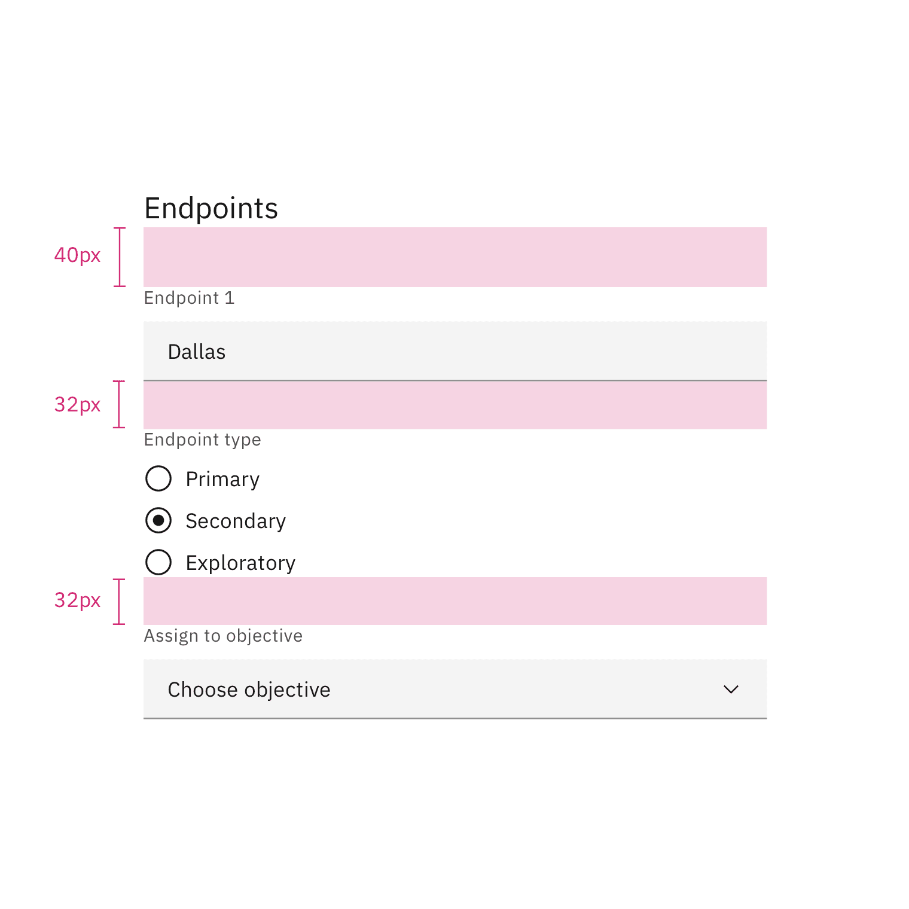
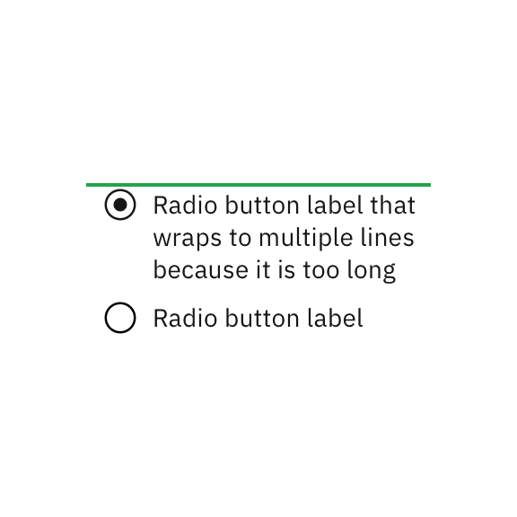
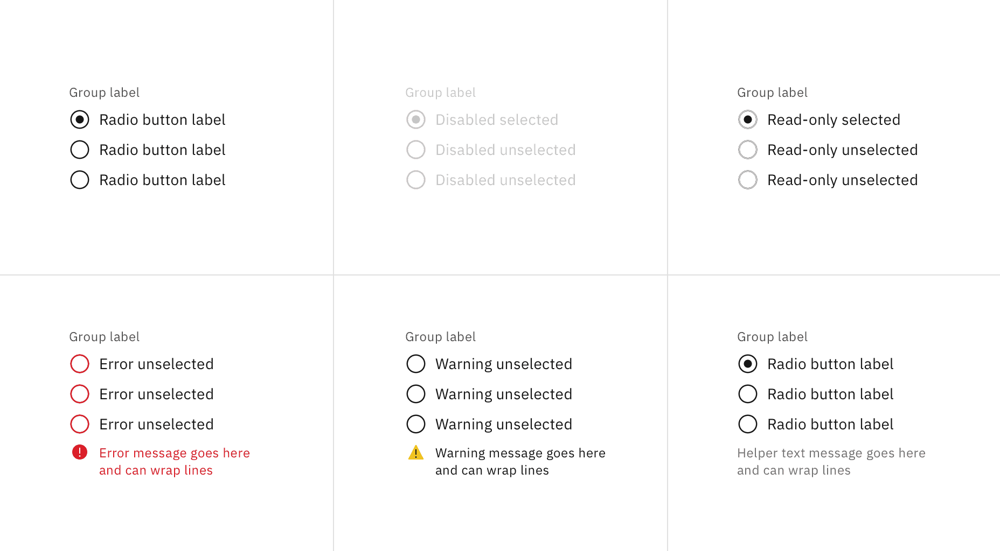
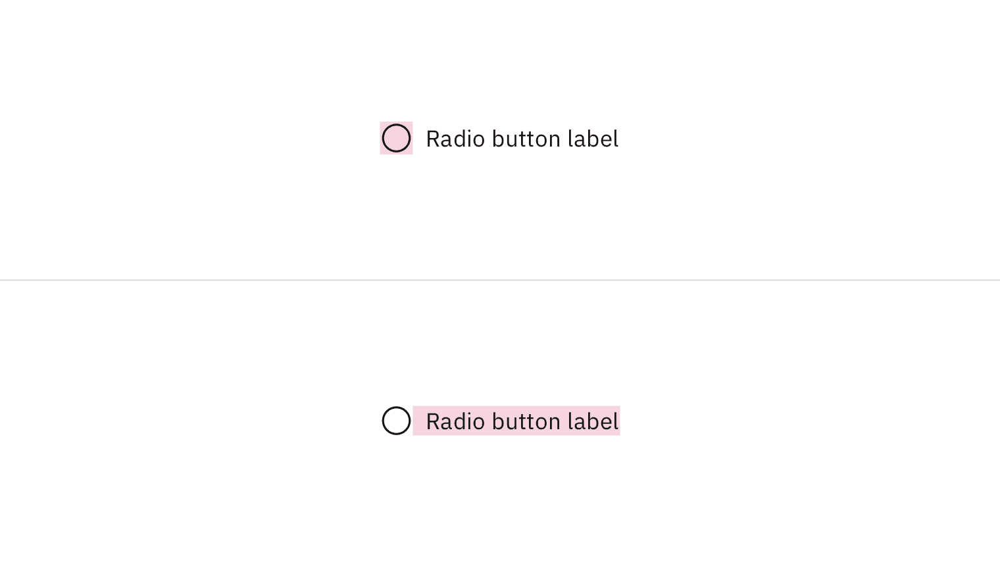

<PageDescription>

Use radio buttons when you have a group of mutually exclusive choices and only
one selection from the group is allowed.

</PageDescription>

<AnchorLinks>

<AnchorLink>Overview</AnchorLink>
<AnchorLink>Live demo</AnchorLink>
<AnchorLink>Formatting</AnchorLink>
<AnchorLink>Content</AnchorLink>
<AnchorLink>Behaviors</AnchorLink>
<AnchorLink>Related</AnchorLink>
<AnchorLink>References</AnchorLink>
<AnchorLink>Feedback</AnchorLink>

</AnchorLinks>

## Overview

Radio buttons are used for mutually exclusive choices, not for multiple choices.
Only one radio button should be selected at a time. When a user chooses a new
item, the previous choice is automatically deselected.

### When to use

#### Form

Can be used in forms on a full page, in modals, or on side panels.

#### Settings

Used to change from one setting to another in a menu, page, or component.

#### Selection in lists

Used to choose a singular item within data tables or lists.

<Row>
<Column colLg={8}>

</Column>
</Row>

### When not to use

If a user can select many option from a list, use checkboxes instead of radio
buttons. Radio buttons allow the user to select only one item in a set whereas
checkboxes allow the user to select multiple options.

<DoDontRow>
  <DoDont caption="Do use checkboxes when multiple items can be selected.">

  </DoDont>
  <DoDont type="dont" caption="Don't use radio buttons when multiple items can be selected.">

  </DoDont>
</DoDontRow>

## Live demo

<ComponentDemo
  components={[
    {
      id: 'radio-button',
      label: 'Radio button',
    },
  ]}>
  <ComponentVariant
    id="radio-button"
    knobs={{
      RadioButtonGroup: ['orientation', 'labelPosition'],
    }}
    links={{
      React:
        'https://react.carbondesignsystem.com/?path=/story/radiobuttongroup--default',
      Angular:
        'https://angular.carbondesignsystem.com/?path=/story/components-radio--basic',
      Vue:
        'http://vue.carbondesignsystem.com/?path=/story/components-cvradiobutton--default',
      Vanilla: 'https://the-carbon-components.netlify.com/?nav=radio-button',
    }}>{`
  <FormGroup
  legendText="Radio button heading"
>
  <RadioButtonGroup
    defaultSelected="default-selected"
    legend="Group Legend"
    name="radio-button-group"
    valueSelected="default-selected"
  >
    <RadioButton
      id="radio-1"
      labelText="Radio button label"
      value="standard"
    />
    <RadioButton
      id="radio-2"
      labelText="Radio button label"
      value="default-selected"
    />
    <RadioButton
      id="radio-3"
      labelText="Radio button label"
      value="disabled"
    />
  </RadioButtonGroup>
</FormGroup>
  `}</ComponentVariant>
</ComponentDemo>

## Formatting

### Anatomy

The radio button component is comprised of a set of clickable circles (the
inputs) with text labels positioned to the right. If there is a group of radio
buttons, a group label can be added.

<Row>
<Column colLg={8}>

</Column>
</Row>

1. **Radio button group label (optional):** Describes the group of options or
   provides guidance for making a selection.
2. **Radio button input:** A radio button indicating the appropriate state. By
   default an option is selected.
3. **Radio button label:** Describes the information you want to select or
   unselect.

### Alignment

Radio button labels are positioned to the right of their inputs in languages
that read left to right. If there is a radio button grouping, they can be laid
out vertically or horizontally depending on the use case and the structure of
the UI. When possible, arrange the radio button and checkbox groups vertically
for easier reading.

<Row>
<Column colLg={8}>

</Column>
</Row>

<Caption>Vertically stacked versus horizontal alignment</Caption>

For languages that read left to right, it's acceptable to place labels to the
left of the inputs.

<Row>
<Column colLg={8}>

</Column>
</Row>

<Caption>
  Example of radio buttons for languages that read right to left instead of left
  to right
</Caption>

### Placement

The radio button component is often used in forms. Forms can be placed on a full
page, in a modal, or in a side panel. A radio button can also be used for
changing settings in a menu or selecting a singular item in a data table.

<Row>
<Column colLg={8}>

</Column>
</Row>

Radio buttons in a form should be placed at least 32px (`layout-03`) below or
before the next component. Spacing of 24px (`layout-02`) or 16px (`layout-01`)
can also be used when space is more restricted or if the form is more complex.

For more information on spacing in forms, see our
[form style guidance](https://www.carbondesignsystem.com/components/form/style).

<Row>
<Column colLg={8}>

</Column>
</Row>

<Caption>Spacing between a radio button and other components in a form</Caption>

## Content

### Main elements

#### Group labels (optional)

If necessary, a heading can accompany a set of radio buttons to provide further
context or clarity.

- A group label can either state the category of the grouping or describe what
  actions to take below.
- Use sentence case for group labels.
- In some cases, a group of radio buttons may be within a larger group of
  components that already have a group label. In this case, an additional group
  label for the radio button component itself is not needed.
- Regardless of whether the label is visible in the interface, a group label is
  always needed in code, whether it’s for one checkbox or a group of them. See
  the
  [radio button code tab](https://www.carbondesignsystem.com/components/radio-button/code)
  for more information.

#### Radio button labels

- Always use clear and concise labels for radio buttons.
- Be explicit about the results that will follow if the radio button is
  selected.
- Labels appear to the right of radio button inputs.

### Overflow content

- We recommend radio button labels being fewer than three words.
- If you are tight on space, consider rewording the label. Do not truncate radio
  button label text with an ellipsis.
- Long labels may wrap to a second line, and this is preferable to truncation.
- Text should wrap beneath the radio button so the control and label are top
  aligned.

<Row>
<Column colLg={8}>

</Column>
</Row>

<DoDontRow>
<DoDont caption="Do let text wrap beneath the radio button so the control and label are top aligned.">

</DoDont>
<DoDont type="dont" caption="Do not vertically center wrapped text with the radio button.">

</DoDont>
</DoDontRow>

### Further guidance

For further content guidance, see Carbon's
[content guidelines](https://www.carbondesignsystem.com/guidelines/content/overview).

## Behaviors

### States

The radio button input allows for two states: unselected and selected. The
default view of a radio button is having at least one radio button preselected.
Only one radio button should be selected at a time. When a user chooses a new
item, the previous choice is automatically deselected.

<Row>
<Column colLg={8}>

</Column>
</Row>

In addition to unselected and selected states, radio buttons also have states
for focus and disabled.

<Row>
<Column colLg={8}>

</Column>
</Row>

### Interactions

#### Mouse

Users can trigger an item by clicking the radio button input directly or by
clicking the radio button label. Having both regions interactive creates a more
accessible click target.

<Row>
<Column colLg={8}>

</Column>
</Row>

#### Keyboard

One radio button should be selected by default. Users can navigate between radio
button inputs by pressing `Up` or `Down` arrow keys. Users can trigger a state
change by pressing `Space` while the checkbox input has focus. For additional
keyboard interactions, see
the [accessibility tab](https://www.carbondesignsystem.com/components/radio-button/accessibility).

#### Screenreader

VoiceOver: Users can trigger a state change by
pressing `Control-Option-Space` or `Space` while the radio button input has
screen reader focus.

JAWS: Users can navigate between radio buttons by pressing the `Up` and `Down`
arrow keys. Users can trigger a state change by pressing `Space` while the radio
button input has screen reader focus.

NVDA: Users can navigate between radio buttons by pressing the `Up` and `Down`
arrow keys. Users can trigger a state change by pressing `Space` while the radio
button input has screen reader focus.

For additional information,
see [screen reader tests](https://www.carbondesignsystem.com/components/radio-button/accessibility#accessibility-testing).

### Default selection

A set of radio buttons should default to having one option selected. Never
display them without a default selection.

## Related

#### Radio buttons versus checkboxes

Radio buttons allow users to select one option from a group of mutually
exclusive choices, while checkboxes allow for a selection of one of more options
from a group. In the use cases where multiple selections are allowed, use the
[checkbox component](https://www.carbondesignsystem.com/components/checkbox/usage)
instead of the radio button.

#### Radio button verses selectable tile

Radio buttons should have concise, easy to compare options. If more information
is required to make a choice, like pricing plans or additional links, consider
using a
[selectable tile](https://www.carbondesignsystem.com/components/tile/usage#selectable).

#### Structured list

If a user needs to choose a singular item from a list that has simple data and
multiple columns, a selectable
[structured list](https://carbondesignsystem.com/components/structured-list/usage)
can be used.

#### Tables

See the
[data table component](https://www.carbondesignsystem.com/components/data-table/usage#radio-selection)
for guidance on how to use radio buttons within a table.

#### Radio button verses toggle switch

[Toggle switches](https://www.carbondesignsystem.com/components/toggle/usage)
are preferred when the user options are true or false. By comparison, radio
buttons are mutually exclusive and can have many other options.

## References

Jakob Nielson,
[Checkboxes vs. Radio Buttons](https://www.nngroup.com/articles/checkboxes-vs-radio-buttons/)
(Nielsen Norman Group, 2004)

Kara Pernice,
[Radio Buttons: Select One by Default or Leave All Unselected?](https://www.nngroup.com/articles/radio-buttons-default-selection/)
(Nielsen Norman Group, 2014)

## Feedback

Help us improve this component by providing feedback, asking questions, and
leaving any other comments on
[GitHub](https://github.com/carbon-design-system/carbon-website/issues/new?assignees=&labels=feedback&template=feedback.md).
