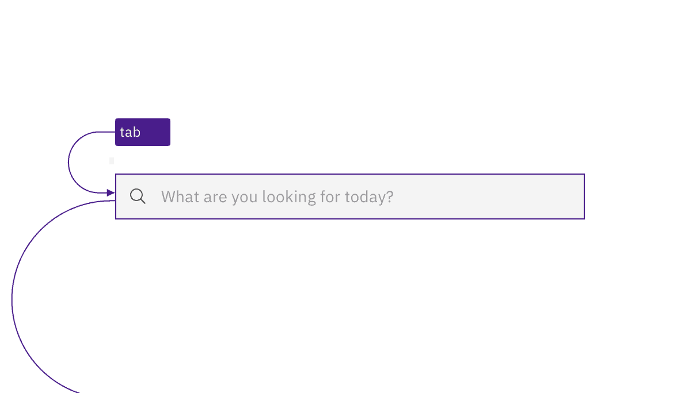
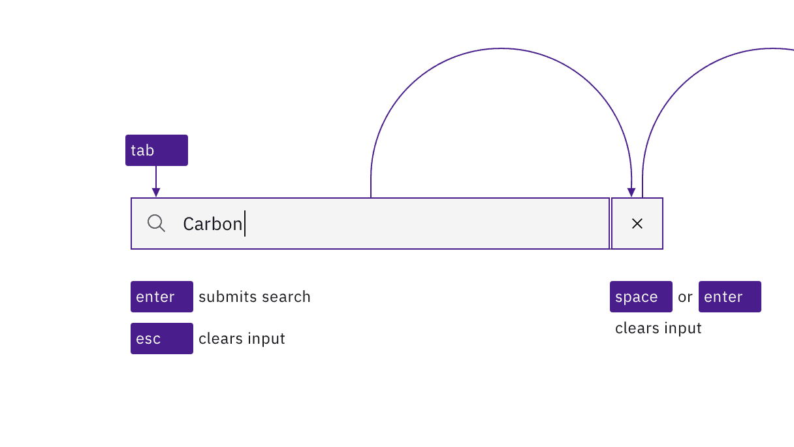
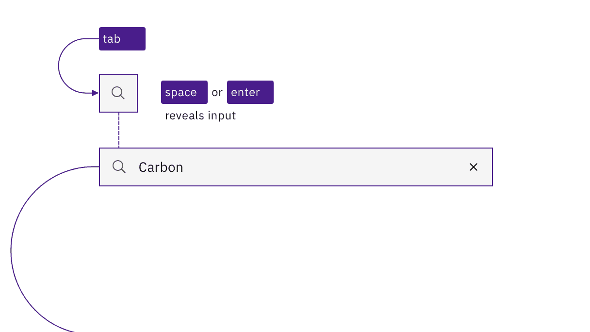
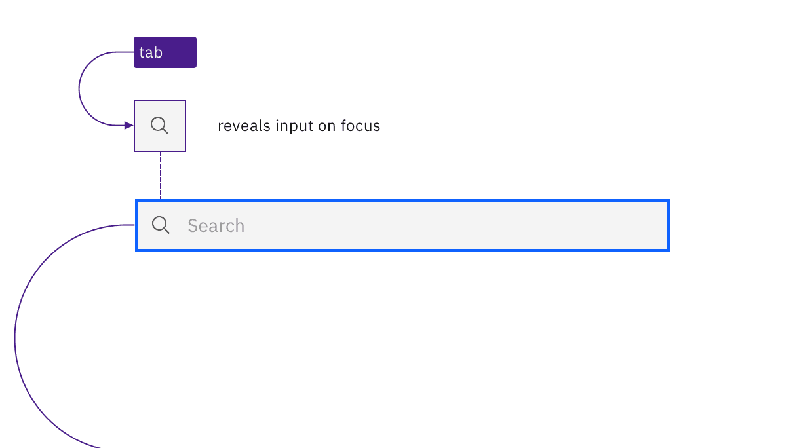
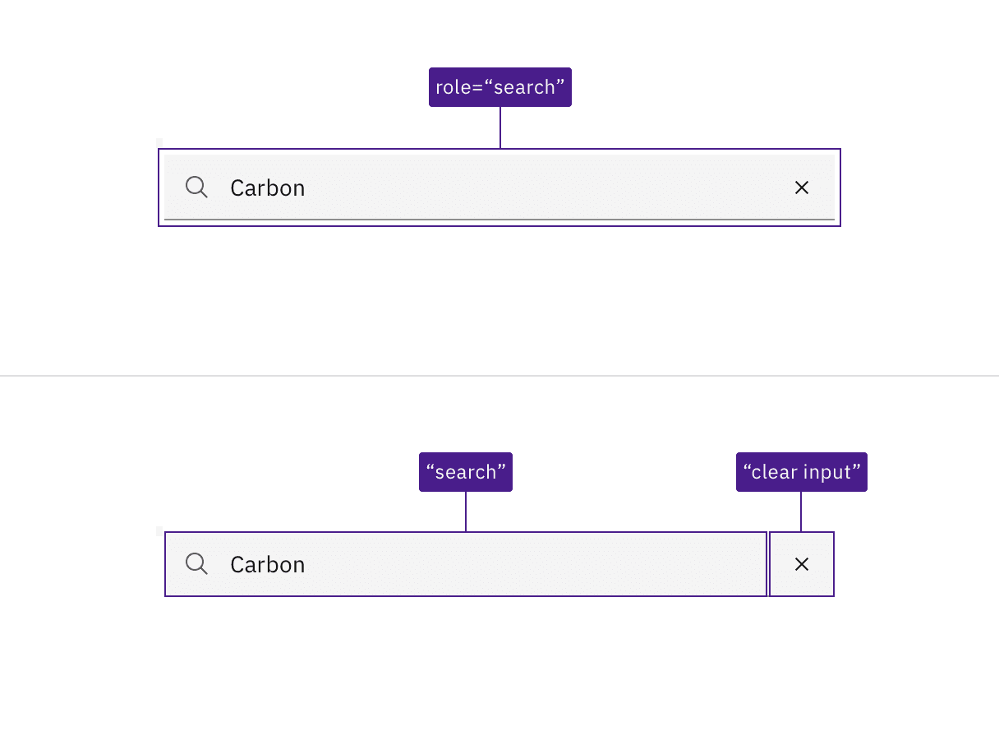

import A11yStatus from 'components/A11yStatus';

import {
  StructuredListWrapper,
  StructuredListHead,
  StructuredListBody,
  StructuredListRow,
  StructuredListInput,
  StructuredListCell,
  OrderedList,
  ListItem,
} from '@carbon/react';

<PageDescription>

Carbon’s search component provides the basic input mechanism for conducting a
search. No accessibility annotations are needed for the input, but design
annotations are needed to make the search messaging and results accessible.

</PageDescription>

<AnchorLinks>

<AnchorLink>What Carbon provides</AnchorLink>
<AnchorLink>Design recommendations</AnchorLink>
<AnchorLink>Development considerations</AnchorLink>

</AnchorLinks>

## What Carbon provides

Carbon bakes keyboard operation into its components, improving the experience of
blind users and others who operate via keyboard. Carbon also incorporates other
accessibility considerations, some of which are described below.

### Keyboard interaction

The search component is in the tab order, and users can type directly into the
search input on focus. Users press `Enter` to submit their text as a search
term, or they can press `Esc` to clear it. Once users start typing, a Cancel
icon ('x') will appear, which becomes the next tab stop and provides another way
to clear the input field via click, `Space` or `Enter` keys.

<Row>
<Column colLg={8}>

<Caption>
  The search input is in the tab order just like any other input.
</Caption>

</Column>
</Row>

<Row>
<Column colLg={8}>

<Caption>
  The user can clear the input by pressing Esc or activating the X button that
  appears inside the input.
</Caption>

</Column>
</Row>

Variations of the search component use a non-persistent text input that is
hidden behind a magnifying glass icon. In one variation, the user activates the
icon-only button to reveal and put focus into the search input. In another
variation, as the icon receives focus it exposes the input and the focus is
immediately placed into the search input. Once in the input, the interaction,
described above, is the same for all variations.

<Row>
<Column colLg={8}>

<Caption>
  A variation where the search input is revealed by activating the magnifying
  glass icon.
</Caption>

</Column>
</Row>
<Row>
<Column colLg={8}>

<Caption>
  A variation where the search input is revealed when the magnifying glass
  receives focus.
</Caption>

</Column>
</Row>

### Role and label

Carbon assigns the entire search interaction a `role` of "search". It also
provides non-visible labels for the search input and icon (“search”), and for
the cancel icon (“clear search input”).

<Row>
<Column colLg={8}>

<Caption>
  The search region, input name, and clear button are all incorporated by
  Carbon.
</Caption>

</Column>
</Row>

## Design recommendations

Carbon provides a
[search pattern](https://carbondesignsystem.com/patterns/search-pattern/) that
outlines three search types: basic, active, and focused. Each of these types
starts with the basic search input mechanism provided by Carbon’s search
component. However, each search type displays suggestions or results in
different ways, which all have accessibility considerations. There are three
broad areas that designers need to consider and annotate for accessibility:

- Search suggestions and typeahead
- Search outcomes and status (e.g., “25 results found”, “no results found”)
- Results navigation

Future updates to this guidance will offer specific documentation on these
accessibility needs.

## Development considerations

Keep these considerations in mind if you are modifying Carbon or creating a
custom component.

- The div containing the search function is given a `role="button"`.
- The hidden label for the input has a default value of “search”.
- The input is `type="text"` with a `role="searchbox"`; using `type="search"` is
  equivalent and also valid.
- See the
  [Mozilla search input documentation](https://developer.mozilla.org/en-US/docs/Web/HTML/Element/input/search)
  for more considerations.

<A11yStatus layout="table" components={['Search', 'Fluid search']} />
