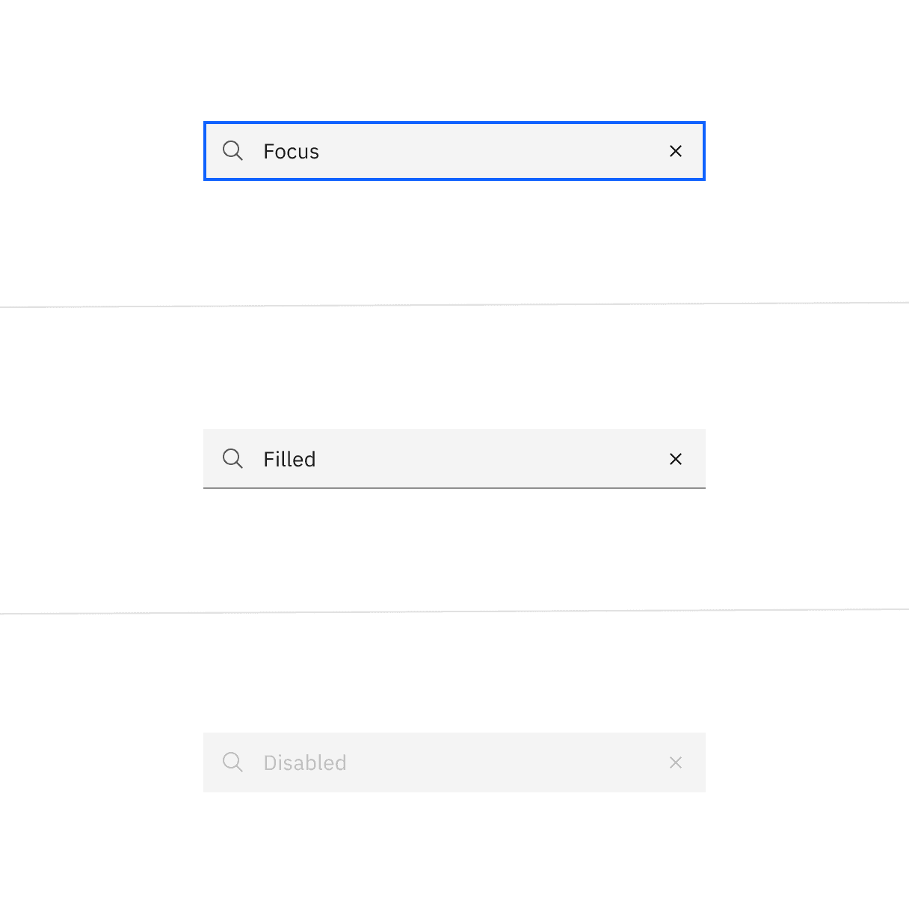
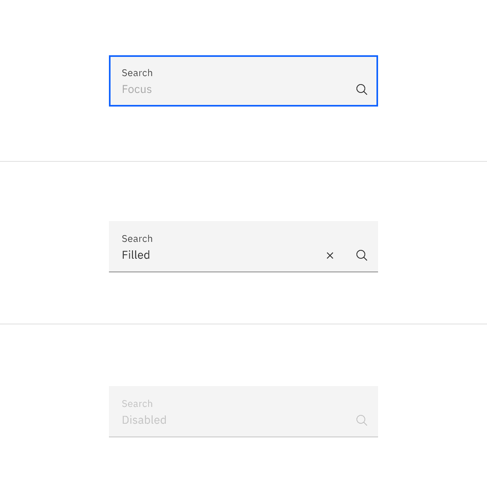
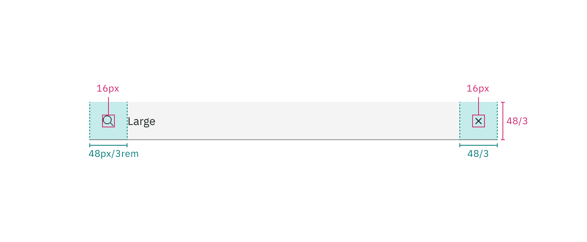
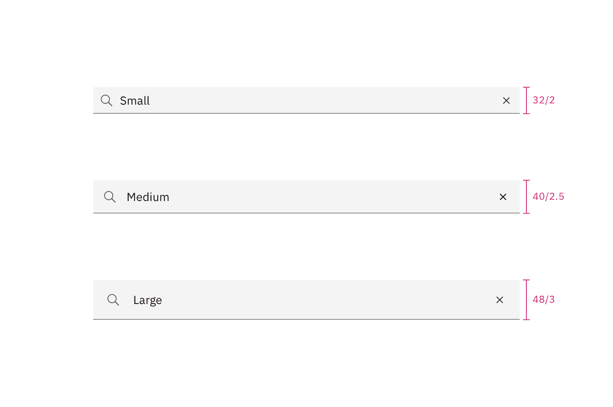

## Color

| Element            | Property         | Color token         |
| ------------------ | ---------------- | ------------------- |
| Field              | background-color | `$field` \*         |
|                    | border-bottom    | `$border-strong` \* |
| Label text (fluid) | text-color       | `$text-secondary`   |
| Placeholder text   | text-color       | `$text-placeholder` |
| Search icon        | fill             | `$icon-secondary`   |

<Caption fullWidth>
  \* Denotes a contextual color token that will change values based on the layer
  it is placed on.
</Caption>

<Caption>Example of search</Caption>

### Interactive colors

| State    | Element            | Property      | Color token         |
| -------- | ------------------ | ------------- | ------------------- |
| Focus    | Field              | border        | `$focus`            |
| Filled   | Field text         | text-color    | `$text-primary`     |
|          | Close icon         | fill          | `$icon-primary`     |
| Disabled | Field text         | text-color    | `$text-dsiabled`    |
|          | Label text (fluid) | text-color    | `$text-disabled`    |
|          | Search icon        | fill          | `$icon-disabled`    |
|          | Field (fluid)      | border-bottom | `$border-subtle` \* |

<Row>
<Column colLg={8}>

<Tabs>

<Tab label="Default">

</Tab>

<Tab label="Fluid">

</Tab>

</Tabs>

</Column>
</Row>

## Typography

Search text should be set in sentence case, with only the first letter of the
first word capitalized.

| Element            | Font-size (px/rem) | Font-weight   | Type token         |
| ------------------ | ------------------ | ------------- | ------------------ |
| Field text         | 14 / 0.875         | Regular / 400 | `$body-compact-01` |
| Label text (fluid) | 12 / 0.75          | Regular / 400 | `$label-01`        |

## Structure

#### Default inputs

The width of the search field should appropriately fit the design and layout of
content. The width may vary based on the grid and layout.

| Element                      | Property                    | px / rem | Spacing token |
| ---------------------------- | --------------------------- | -------- | ------------- |
| Search icon   Close icon | height, width               | 16 / 1   | –             |
| Small field                  | padding-left, padding-right | 32 / 2   | `$spacing-07` |
| Medium field                 | padding-left, padding-right | 40 / 2.5 | `$spacing-08` |
| Large field                  | padding-left, padding-right | 48 / 3   | `$spacing-09` |

<Caption>
  Structure and spacing measurements for default small search | px | rem
</Caption>

<Caption>
  Structure and spacing measurements for default medium search | px | rem
</Caption>

<Caption>
  Structure and spacing measurements for default large search | px | rem
</Caption>

#### Fluid inputs

The width of the search field should appropriately fit the design and layout of
content. The width may vary based on the grid and layout.

| Element     | Property                    | px / rem   | Spacing token |
| ----------- | --------------------------- | ---------- | ------------- |
| Label       | margin-bottom               | 4 / 0.25   | `$spacing-02` |
| Field       | padding-left                | 16 / 1     | `$spacing-05` |
|             | padding-right               | 80 / 5     | `$spacing-11` |
|             | border                      | 1px        | –             |
|             | margin-top, margin-bottom   | 13 / .8125 | –             |
| Close icon  | padding-right, padding-left | 12 / .75   | `$spacing-04` |
| Search icon | padding-right, padding-left | 12 / .75   | `$spacing-04` |

<Caption>
  Structure and spacing measurements for fluid search | px | rem
</Caption>

## Sizes

| Size        | Height px / rem |
| ----------- | --------------- |
| Small (sm)  | 32 / 2          |
| Medium (md) | 40 / 2.5        |
| Large (lg)  | 48 / 3          |

<Caption>Search sizes | px / rem</Caption>
