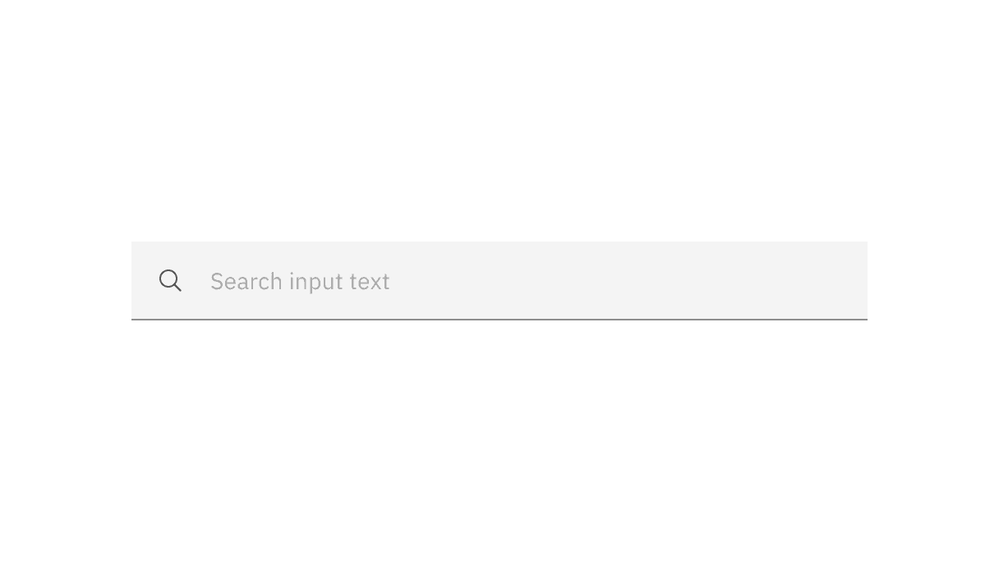

## Color

Inputs come in two different colors. The default input color is `$field-01` and
is used on `$ui-background` and `$ui-02` page backgrounds. The `--light` version
input color is `$field-02` and is used on `$ui-01` page backgrounds.

| Element     | Property         | Color token         |
| ----------- | ---------------- | ------------------- |
| Field       | background-color | `$field` \*         |
|             | border-bottom    | `$border-strong` \* |
| Field text  | text color       | `$text-primary`     |
| Prompt text | text color       | `$text-placeholder` |
| Icon        | fill             | `$icon-secondary`   |

<Caption>
  * Denotes a contextual color token that will change values based on the layer
  it is placed on.
</Caption>

<Caption>Example of Search using $field</Caption>

### Interactive colors

| Element             | Property         | Color token      |
| ------------------- | ---------------- | ---------------- |
| Input:focus         | border           | `$focus`         |
| Field:disabled      | background-color | `$field` \*      |
|                     | border-bottom    | transparent      |
| Field text:disabled | text color       | `$text-disabled` |
| Icon:disabled       | fill             | `$icon-disabled` |

<Caption>Examples of enabled, focus, and disabled search states</Caption>

## Typography

Search text should be set in sentence case, with only the first letter of the
first word capitalized.

| Element    | Font-size (px/rem) | Font-weight   | Type token         |
| ---------- | ------------------ | ------------- | ------------------ |
| Field text | 14 / 0.875         | Regular / 400 | `$body-compact-01` |

## Structure

The width of the search field should appropriately fit the design and layout of
content.

| Element                      | Property                    | px / rem | Spacing token |
| ---------------------------- | --------------------------- | -------- | ------------- |
| Search icon   Close icon | height, width               | 16 / 1   | –             |
| Large field                  | padding-left, padding-right | 48 / 3   | `$spacing-09` |
| Small field                  | padding-left, padding-right | 32 / 2   | `$spacing-07` |

<Caption>
  Structure and spacing measurements for large search | px | rem
</Caption>

<Caption>
  Structure and spacing measurements for small search | px | rem
</Caption>

## Sizes

| Size        | Height px / rem |
| ----------- | --------------- |
| Small (sm)  | 32 / 2          |
| Medium (md) | 40 / 2.5        |
| Large (lg)  | 48 / 3          |

<Caption>Search sizes | px / rem</Caption>
