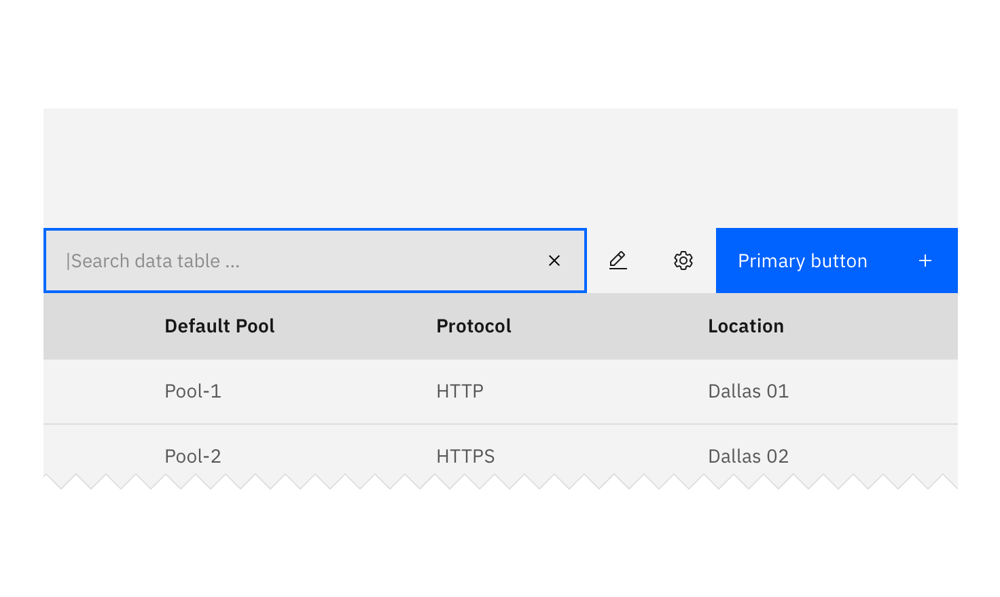

<PageDescription>

Search enables users to specify a word or a phrase to find relevant pieces of
content without the use of navigation.

</PageDescription>

<AnchorLinks>

<AnchorLink>Overview</AnchorLink>
<AnchorLink>Live demo</AnchorLink>
<AnchorLink>Variants</AnchorLink>
<AnchorLink>Formatting</AnchorLink>
<AnchorLink>Feedback</AnchorLink>

</AnchorLinks>

## Overview

Search offers users a way to explore a website or application using keywords.
Search can be used as the primary means of discovering content, or as a filter
to aid the user in finding content.

## Live demo

<ComponentDemo
  components={[
    {
      id: 'search',
      label: 'Search',
    },
  ]}>
  <ComponentVariant
    id="search"
    knobs={{ Search: ['size', 'light'] }}
    links={{
      React:
        'https://react.carbondesignsystem.com/?path=/story/search--default',
      Angular:
        'https://angular.carbondesignsystem.com/?path=/story/components-search--basic',
      Vue:
        'http://vue.carbondesignsystem.com/?path=/story/components-cvsearch--default',
      Vanilla: 'https://the-carbon-components.netlify.com/?nav=search',
    }}>{`
<Search
  id="search-1"
  placeHolderText="Search"
/>
  `}</ComponentVariant>
</ComponentDemo>

## Variants

| Variant      | Purpose                                                                                                                                                                                                    |
| ------------ | ---------------------------------------------------------------------------------------------------------------------------------------------------------------------------------------------------------- |
| Large search | This should be used at a global level when the user is searching content within a page view.                                                                                                               |
| Small search | Choose small when there are space constraints in your design. It can also be component-specific. For example, small search can be used to filter data within a [data table](/components/data-table/usage). |

## Formatting

<Row>
<Column colLg={8}>

</Column>
</Row>

### Search fields

Set the user's context for the search with helpful placeholder text within the
search field (search documents), that pertains to the page or section the search
box is in. Search in the global header should just say search.

Accessibility note: If the search component's label and placeholder text differ,
VoiceOver on macOS will read both.

### Search results

- Clearly show which results are being displayed with labels or headers (i.e.
  Results for X).
- Categorize the search results if they come from different areas (eg. docs,
  services, apps, tutorials, blogs).
- Give the user control over their viewing options and ability to sort results
  (eg. relevancy, popularity, ratings, date).
- Have a clear, “no results”, message and offer suggestions if possible.
- Have smart algorithms that can search for similar terms or can search even
  with misspelled words.
- Include enough of a description in the results for users to make a judgement
  as to whether that particular result is relevant.
- Highlight the search term in the results, where appropriate.

## Feedback

Help us improve this component by providing feedback, asking questions, and
leaving any other comments on
[GitHub](https://github.com/carbon-design-system/carbon-website/issues/new?assignees=&labels=feedback&template=feedback.md).
