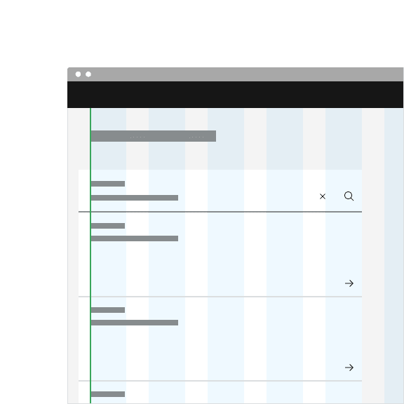
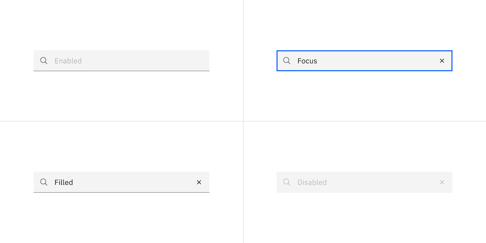
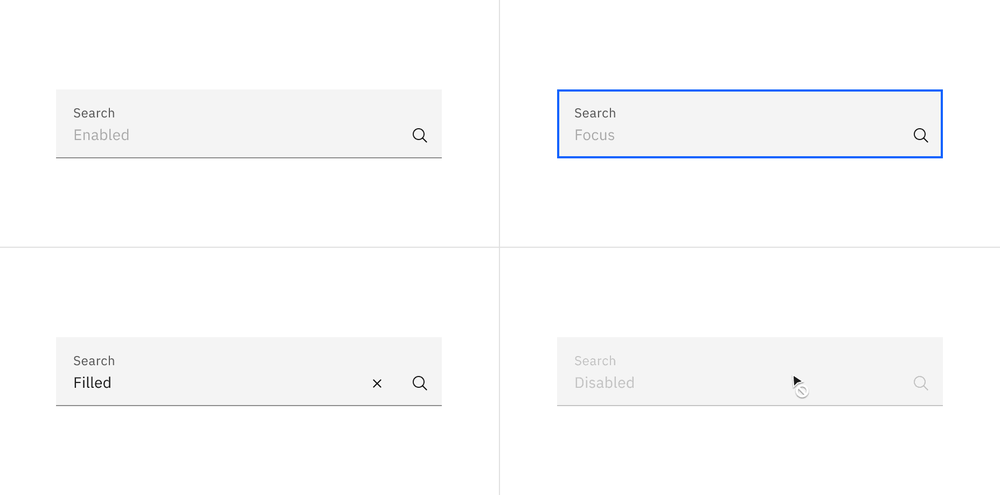
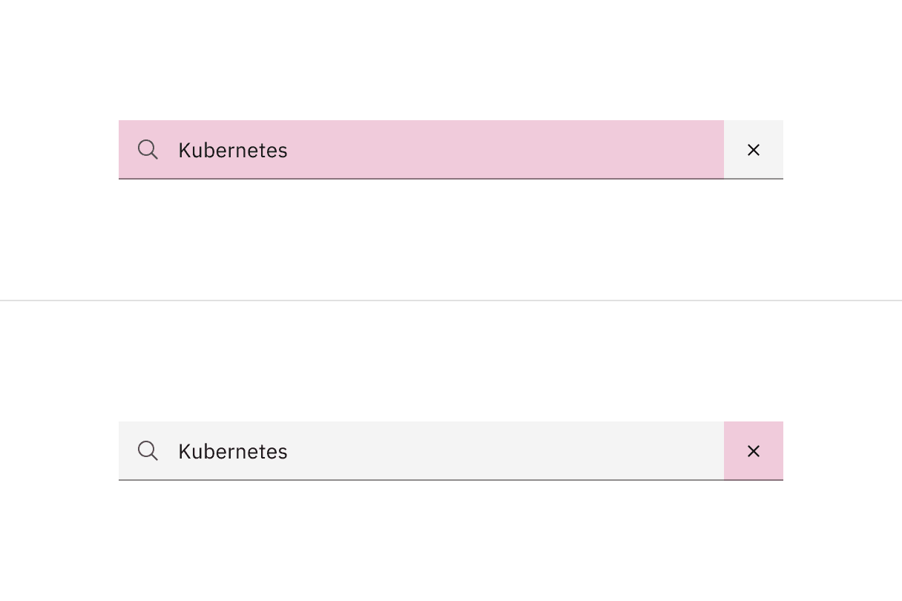
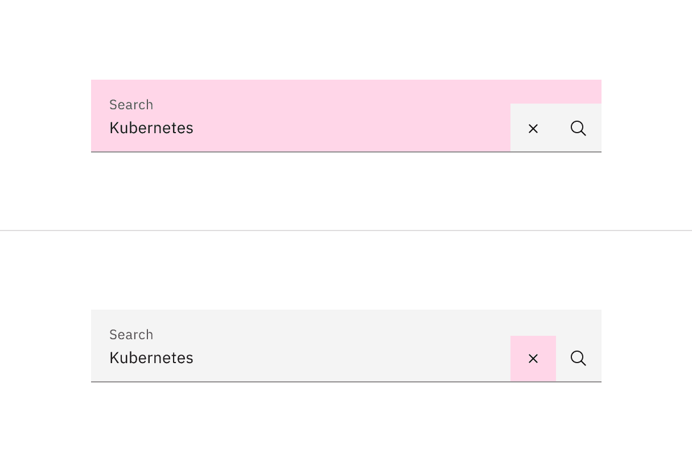

<PageDescription>

Search enables users to specify a word or a phrase to find relevant content
without navigation.

</PageDescription>

<AnchorLinks>

<AnchorLink>Overview</AnchorLink>
<AnchorLink>Live demo</AnchorLink>
<AnchorLink>Formatting</AnchorLink>
<AnchorLink>Content</AnchorLink>
<AnchorLink>Behaviors</AnchorLink>
<AnchorLink>Related</AnchorLink>
<AnchorLink>Feedback</AnchorLink>

</AnchorLinks>

## Overview

Search offers users a way to explore a website or application using keywords.
Search can be used as the primary means of discovering content or as a filter to
aid the user in finding content.

### When to use

- To help users find data more efficiently within a complex or large data set.
- Use at a global level when searching an entire site.
- Use at a page level when searching through content on one page specifically.
- Use at a component level when searching data in a component, like a
  [data table](https://carbondesignsystem.com/components/data-table/usage/#search).

### When not to use

- Do not use when there is small or limited amounts of data.
- Do not use when the information is simple and can be found easily within one
  view.

## Live demo

<ComponentDemo
  components={[
    {
      id: 'search',
      label: 'Search',
    },
  ]}
>
  <ComponentVariant
    id="search"
    knobs={{ Search: ['size', 'light'] }}
    links={{
      React:
        'https://react.carbondesignsystem.com/?path=/story/components-search--default',
      Angular:
        'https://angular.carbondesignsystem.com/?path=/story/components-search--basic',
      Vue: 'http://vue.carbondesignsystem.com/?path=/story/components-cvsearch--default',
      'Web Components':
        'https://web-components.carbondesignsystem.com/?path=/story/components-search--default',
    }}
  >
    {`
<Search
  id="search-1"
  placeHolderText="Search"
/>
  `}
  </ComponentVariant>
</ComponentDemo>

## Formatting

### Anatomy

1. **Field:** The place where a user enters their search query.
2. **Search icon:** Signifies a search field. The magnifying glass icon is a
   universal way to indicate search.
3. **Field text:** Inputted search text by the user. Placeholder text is visible
   before the user types into the field.
4. **Close icon:** Appears after the user has actively typed into the search
   field. Acts as a function to clear the search field.

<Row>
<Column colLg={8}>

<Tabs>

<Tab label="Fixed">

</Tab>

<Tab label="Fluid">

</Tab>

</Tabs>

</Column>
</Row>

### Styling

There are two styles of search, fixed and fluid. They share the same
functionality but look visually different, influencing where to use them.

| Style | Appearance                                                                                                                    | Use case                                                                                                                          |
| ----- | ----------------------------------------------------------------------------------------------------------------------------- | --------------------------------------------------------------------------------------------------------------------------------- |
| Fixed | A traditional style where there is no label indicated.                                                                        | Use when white space is needed between components. For example, a fixed search style is typically used at a global or page level. |
| Fluid | An alternative style where a label is placed inside of the search field and is stacked inline with the user input field text. | Use in expressive moments, fluid forms, and contained spaces.                                                                     |

<Row>
<Column colLg={8}>

</Column>
</Row>

### Sizing

#### Fixed input heights

There are three fixed search height sizes: small, medium, and large. The width
varies in size based on content, layout, and design. Supporting three different
search sizes gives you more flexibility when structuring layouts.

| Size        | Height (px/rem) | Use case                                                                                                                                            |
| ----------- | --------------- | --------------------------------------------------------------------------------------------------------------------------------------------------- |
| Small (sm)  | 32 / 2          | Use when space is constricted within a design.                                                                                                      |
| Medium (md) | 40 / 2.5        | This is the default size and the most commonly used size. When in doubt, use the medium size.                                                       |
| Large (lg)  | 48 / 3          | Use when there is a lot of space to work with. The large size is typically at a global level when the user is searching content within a page view. |

<Row>
<Column colLg={8}>

</Column>
</Row>

#### Fluid input height

There is only one input height at 64px and it is visually larger than the fixed
heights.

<Row>
<Column colLg={8}>

</Column>
</Row>

### Placement

Place the search component within a user interface where users expect to find it
and where it is appropriate for how it is being used in context, whether at a
global level, page-specific level, or within a component.

The fixed search can be arranged on the grid to align the container with other
components containers. Search can also hang to align with other hanging
component containers on the same page, depending on the use case.

<DoDontRow>
  <DoDont caption="Do align the fixed search container vertically with other text on the page.">

  </DoDont>
</DoDontRow>

<DoDontRow>
  <DoDont caption="Do hang the fluid search container with other hanging components.">

  </DoDont>
</DoDontRow>

## Content

### Main elements

#### Placeholder text

Useful and short text hinting at what the user can search for. For example,
“Search for networks or devices.”

#### Field text

- Key words entered by the user to find a search result.
- Keep the field text concise and relate the field text as closely to the result
  you want to find.

### Further guidance

For further content guidance, see Carbon’s
[content guidelines](https://carbondesignsystem.com/guidelines/content/overview/).

## Behaviors

### States

The search component has four states: enabled, focus, filled, and disabled.

<Row>
<Column colLg={12}>

<Tabs>

<Tab label="Fixed">

</Tab>

<Tab label="Fluid">

</Tab>

</Tabs>

</Column>
</Row>

### Interactions

#### Mouse

Click on the search field input to start typing. Once a user starts typing, a
close icon (‘x’) will appear and provides a way to clear the input field by
clicking on the Close icon.

#### Keyboard

Press `Enter` to submit text as a search term, or press `Esc` to clear the
search field. Once a user starts typing, a Close icon (‘x’) will appear and
provides a way to clear the input field by pressing the `Space`or `Enter` keys.

<Row>
<Column colLg={8}>

<Tabs>

<Tab label="Fixed">

</Tab>

<Tab label="Fluid">

</Tab>

</Tabs>

</Column>
</Row>

## Related

<Row>
<Column colSm={2} colMd={2} colLg={4}>

#### Components

- [Data table](https://carbondesignsystem.com/components/data-table/usage/)
- [UI shell header](https://carbondesignsystem.com/components/UI-shell-header/usage/)

</Column>
<Column colSm={2} colMd={2} colLg={4}>

#### Patterns

- [Filtering](https://carbondesignsystem.com/patterns/filtering/)
- [Search](https://carbondesignsystem.com/patterns/search-pattern/)

</Column>
</Row>

## Feedback

Help us improve this component by providing feedback, asking questions, and
leaving any other comments on
[GitHub](https://github.com/carbon-design-system/carbon-website/issues/new?assignees=&labels=feedback&template=feedback.md).
