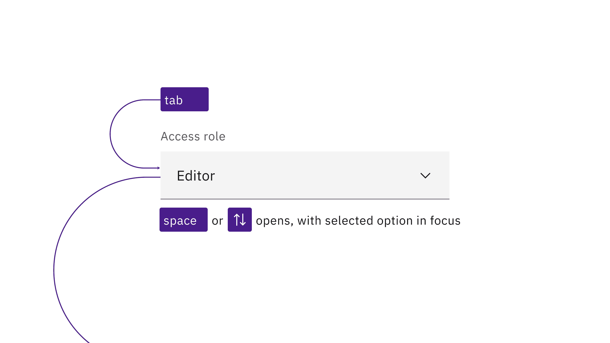
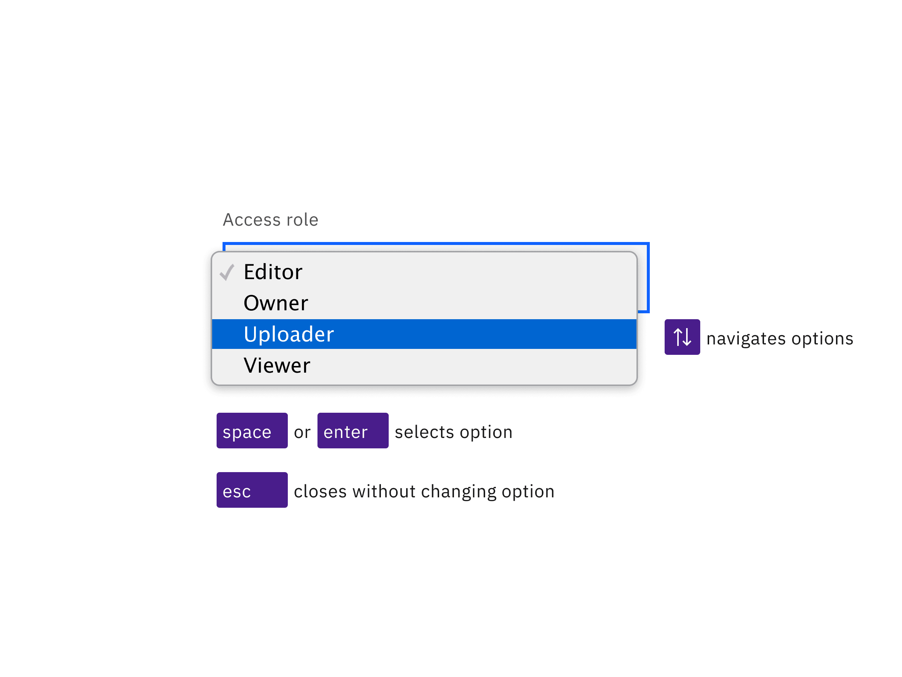

<PageDescription>

No accessibility annotations are needed for selects, but keep these
considerations in mind if you are modifying Carbon or creating a custom
component.

</PageDescription>

<AnchorLinks>

<AnchorLink>What Carbon provides</AnchorLink>
<AnchorLink>Development considerations</AnchorLink>

</AnchorLinks>

## What Carbon provides

Carbon bakes keyboard operation into its components, improving the experience of
blind users and others who operate via keyboard. Carbon also incorporates other
accessibility considerations, some of which are described below.

### Keyboard interaction

A select component is reached by `Tab` and opened with `Space`, or the `Up` or
`Down` arrow keys. The currently selected option will have focus. The arrow keys
are also used for navigating between options. Users can jump about in the list
by pressing individual letter keys, which will reposition to the first option
beginning with that letter. Options are selected with `Space` or `Enter` keys,
which also close the select. Pressing `Esc` closes a select without changing the
selected option.

<Row>
<Column colLg={8}>

<Caption>
  Selects are reached by Tab. Space and arrow keys open the list of options.
</Caption>

</Column>
</Row>

<Row>
<Column colLg={8}>

<Caption>
  The arrow keys navigate the open list of options, with the Space or Enter keys
  selecting the option with focus and closing the list. Esc closes the list
  without changing the option.
</Caption>

</Column>
</Row>

## Development considerations

Keep these considerations in mind if you are modifying Carbon or creating a
custom component.

- Carbon uses the combined attributes `disabled`, `hidden`, and `selected` in
  order to make a default prompt such as “Choose an option” not appear in the
  list of options when the select is open.
- The component is built on the HTML `select` element and has limited styling,
  with most of the visual appearance coming from the browser.
