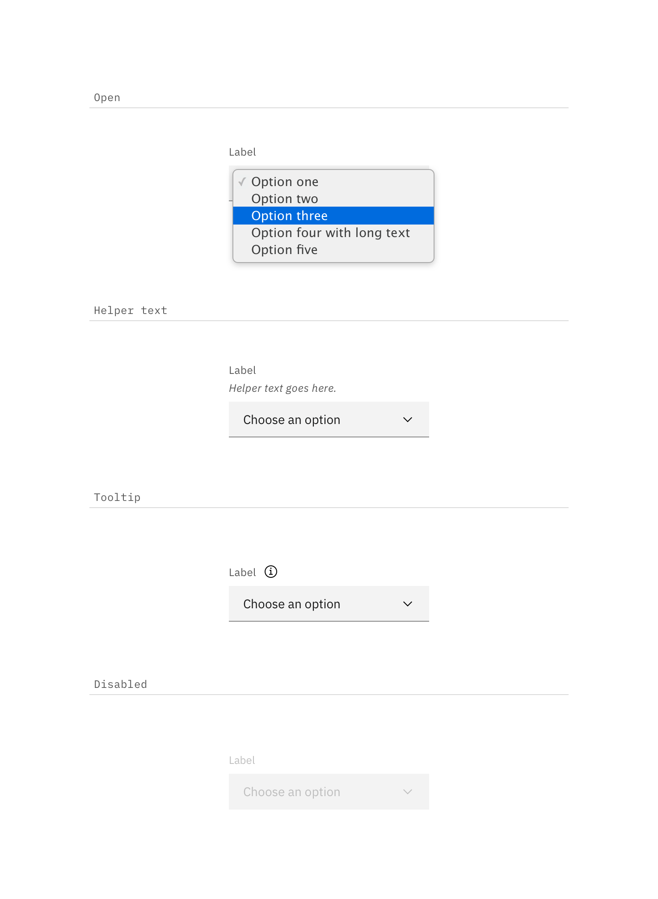
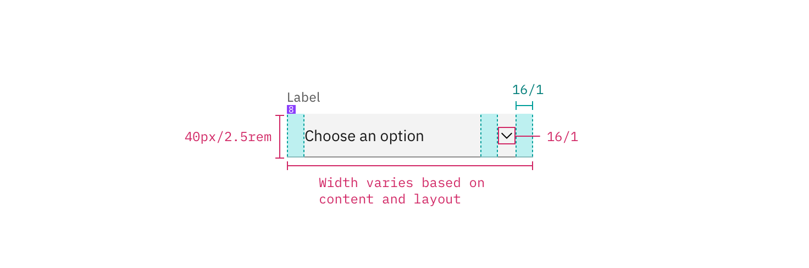
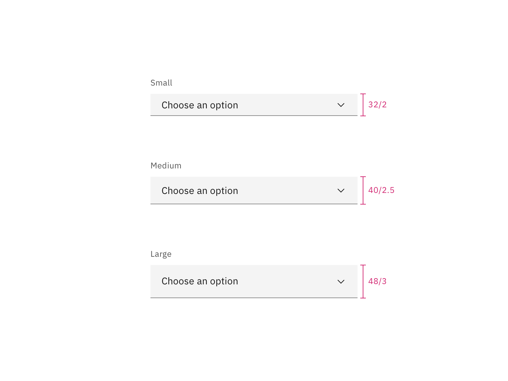
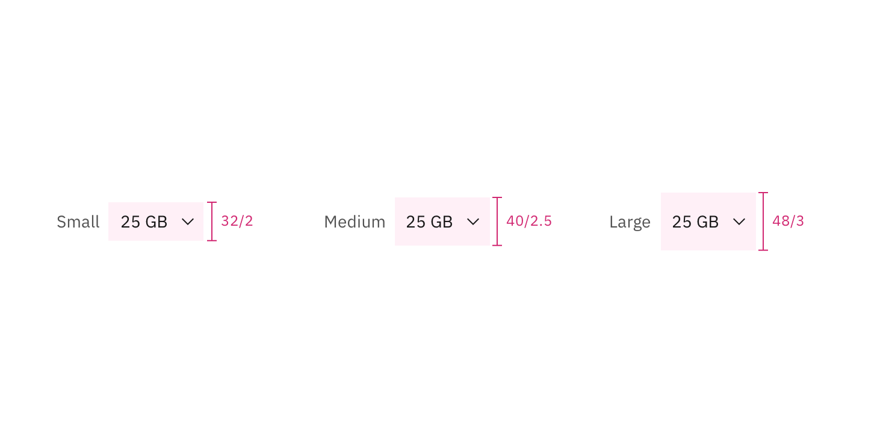

## Color

| Class                 | Property   | Color token     |
| --------------------- | ---------- | --------------- |
| `.bx--select-input`   | background | `$field`        |
| `.bx--select--inline` | background | transparent     |
| `.bx--label`          | text color | `$text-primary` |
| `.bx--select-input`   | text color | `$text-primary` |
| `.bx--select--inline` | text color | `$icon-primary` |
| `.bx--select__arrow`  | fill       | `$icon-primary` |

<Caption>Examples of default and new selection select states</Caption>

### Interaction states

| Class                             | Property   | Color token       |
| --------------------------------- | ---------- | ----------------- |
| `.bx--select-input:focus`         | border     | `$focus`          |
| `.bx--select-input[data-invalid]` | border     | `$support-error`  |
| `.bx--form-requirement`           | text color | `$support-error`  |
| `.bx--select-input:disabled`      | background | `$field-disabled` |
| `.bx--select-input:disabled`      | text color | `$text-disabled`  |

<Caption>Examples of open, disabled, and help select states</Caption>

## Typography

Select text should be set in sentence case, with only the first word in a phrase
and any proper nouns capitalized. Select text should be three words or less.

| Element       | Font-size (px/rem) | Font-weight   | Type token         |
| ------------- | ------------------ | ------------- | ------------------ |
| Label         | 12 / 0. 75         | Regular / 400 | `$label-01`        |
| Field text    | 14 / 0.875         | Regular / 400 | `$body-compact-01` |
| Error message | 12 / 0.75          | Regular / 400 | `$label-01`        |

## Structure

### Select

| Class                     | Property                    | px / rem | Spacing token |
| ------------------------- | --------------------------- | -------- | ------------- |
| `.bx--label`              | margin-bottom               | 8 / 0.5  | `$spacing-03` |
| `.bx--select-input`       | padding-left                | 16 / 1   | `$spacing-05` |
| `.bx--select__arrow`      | padding-left, padding-right | 16 / 1   | `$spacing-05` |
| `.bx--select-input`       | border-bottom               | 1px      | –             |
| `.bx--select-input:focus` | border                      | 2px      | –             |

<Caption>Structure and spacing measurements for select | px / rem</Caption>

### Inline select

| Class                | Property                    | px / rem | Spacing token |
| -------------------- | --------------------------- | -------- | ------------- |
| `.bx--select-input`  | padding-left                | 8 / 0.5  | `$spacing-03` |
| `.bx--select__arrow` | padding-left, padding-right | 8 / 0.5  | `$spacing-03` |

<Caption>
  Structure and spacing measurements for inline select (focused) | px / rem
</Caption>

## Size

| Element | Size        | Height (px / rem) |
| ------- | ----------- | ----------------- |
| Input   | Small (sm)  | 32 / 2            |
|         | Medium (md) | 40 / 2.5          |
|         | Large (lg)  | 48 / 3            |

<Caption>Sizes for default select | px / rem</Caption>

<Caption>Sizes for inline select | px / rem</Caption>
