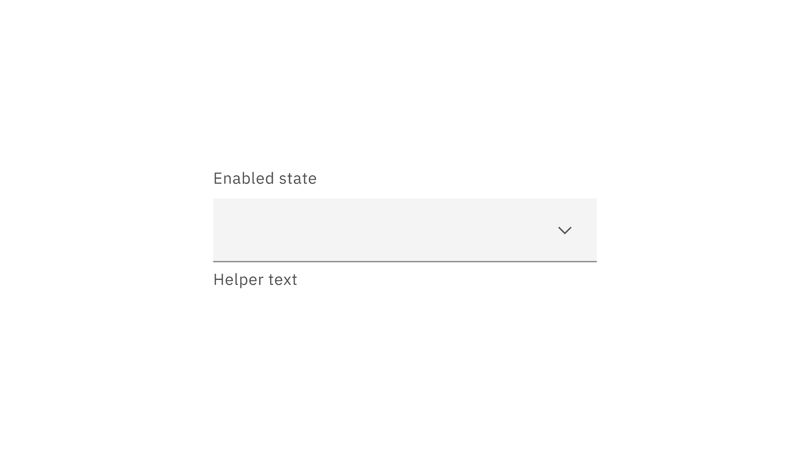
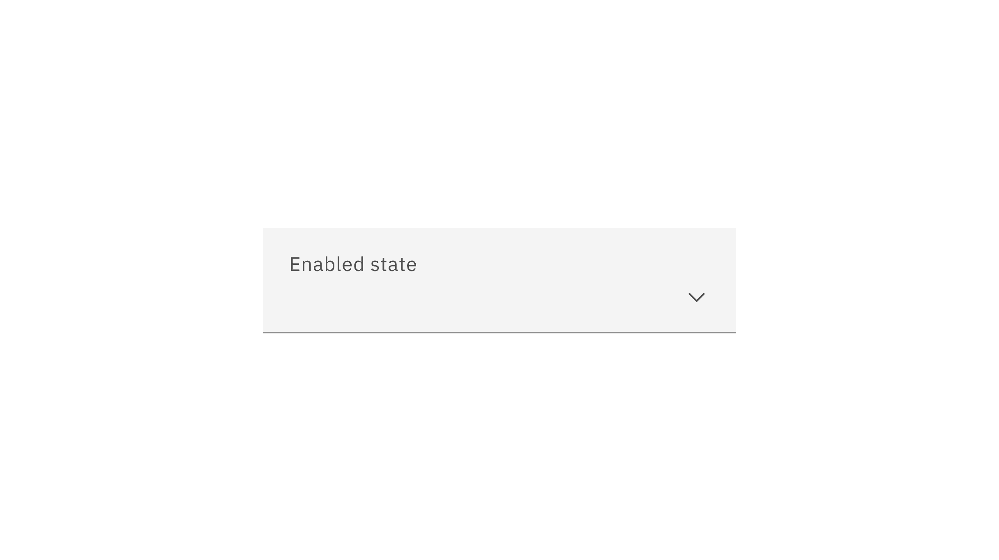
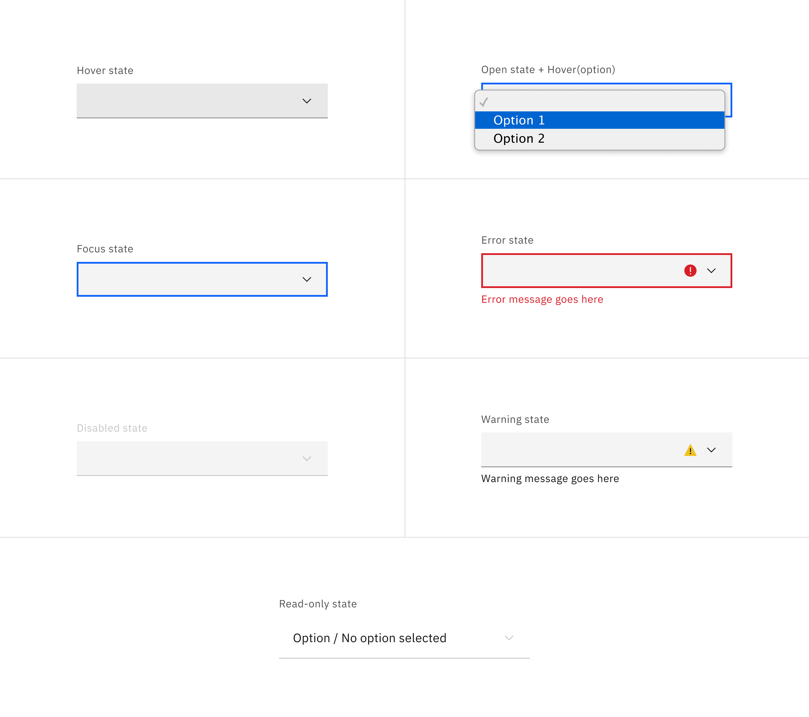
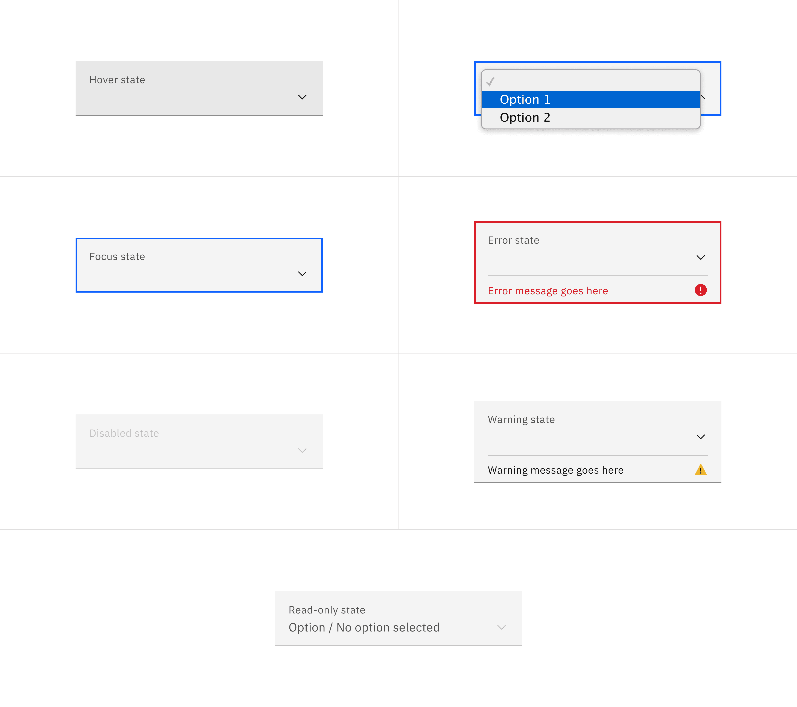
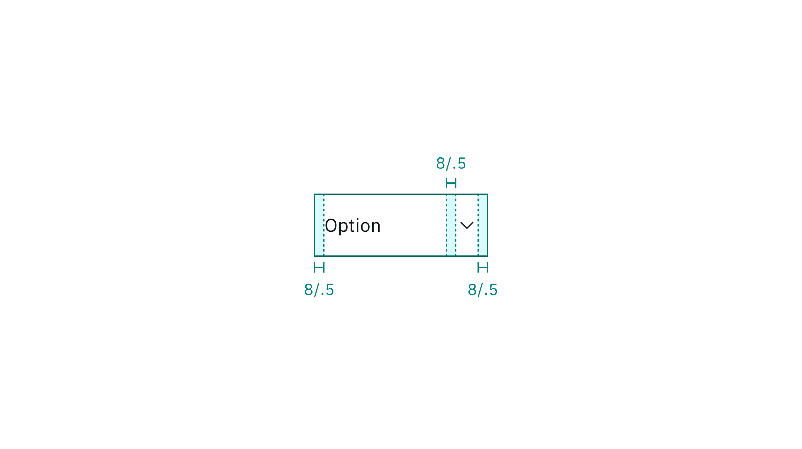
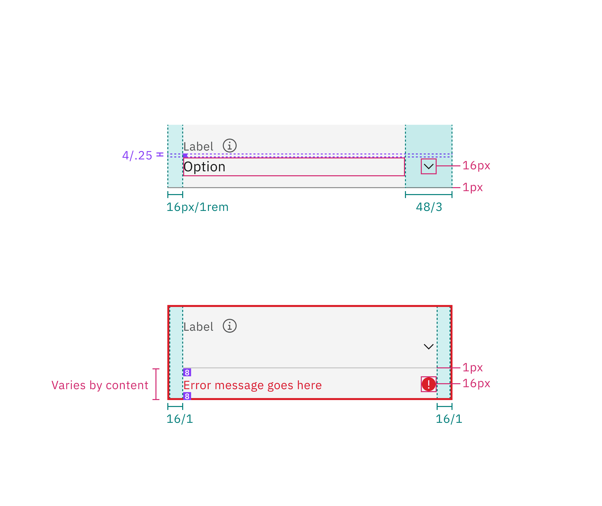
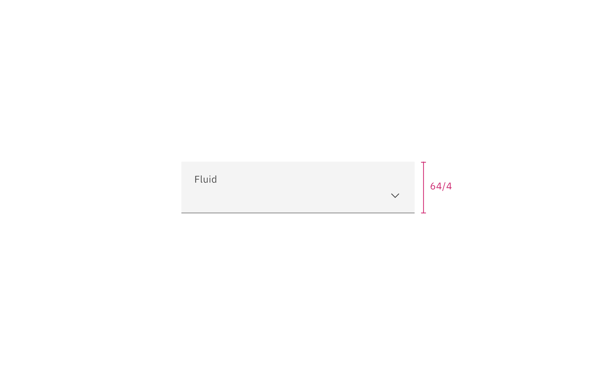

## Color

| Element       | Property      | Color token         |
| ------------- | ------------- | ------------------- |
| Field         | background    | `$field` \*         |
|               | border-bottom | `$border-strong` \* |
| Inline select | background    | transparent         |
| Label         | text color    | `$text-secondary`   |
| Field text    | text color    | `$text-primary`     |
| Helper text   | text color    | `$text-helper`      |
| Icon          | fill          | `$icon-primary`     |

<Caption>
  * Denotes a contextual color token that will change values based on the layer
  it is placed on.
</Caption>

<Row>
<Column colLg={8}>

<Tabs>

<Tab label="Default">

</Tab>

<Tab label="Fluid">

</Tab>

</Tabs>

</Column>
</Row>

### Interactive states

| State     | Element         | Property                   | Color token         |
| --------- | --------------- | -------------------------- | ------------------- |
| Hover     | Field           | background-color           | `$field-hover` \*   |
| Focus     | Field           | border                     | `$focus`            |
| Invalid   | Field           | border                     | `$support-error`    |
|           | Error message   | text-color                 | `$text-error`       |
|           | Error icon      | fill                       | `$support-error`    |
| Warning   | Warning message | text-color                 | `$text-primary`     |
|           | Warning icon    | fill                       | `$support-warning`  |
| Disabled  | Field           | background-color           | `$field` \*         |
|           |                 | border-bottom (default)    | transparent         |
|           |                 | border-bottom (fluid)      | `$border-subtle` \* |
|           | Label           | text-color                 | `$text-disabled`    |
|           | Input text      | text-color                 | `$text-disabled`    |
|           | Chevron icon    | fill                       | `$icon-disabled`    |
| Read-only | Field           | background-color (default) | transparent         |
|           |                 | background-color (fluid)   | `$field` \*         |
|           |                 | border-bottom              | `$border-subtle` \* |
|           | Label           | text-color                 | `$text-secondary`   |
|           | Input text      | text-color (default)       | `$text-primary`     |
|           |                 | text-color (fluid)         | `$text-secondary`   |
|           | Chevron icon    | fill                       | `$icon-disabled`    |

<Caption>
  * Denotes a contextual color token that will change values based on the layer
  it is placed on.
</Caption>

<Row>
<Column colLg={12}>

<Tabs>

<Tab label="Default">

</Tab>

<Tab label="Fluid">

</Tab>

</Tabs>

</Column>
</Row>

## Typography

Select text should be set in sentence case, with only the first word in a phrase
and any proper nouns capitalized. Select text should be three words or less.

| Element         | Font-size (px/rem) | Font-weight   | Type token         |
| --------------- | ------------------ | ------------- | ------------------ |
| Label           | 12 / 0.75          | Regular / 400 | `$label-01`        |
| Field text      | 14 / 0.875         | Regular / 400 | `$body-compact-01` |
| Helper text     | 12 / 0.75          | Regular / 400 | `$helper-text`     |
| Warning message | 12 / 0.75          | Regular / 400 | `$label-01`        |
| Error message   | 12 / 0.75          | Regular / 400 | `$label-01`        |

## Structure

### Default select

| Element      | Property                    | px / rem | Spacing token |
| ------------ | --------------------------- | -------- | ------------- |
| Label        | margin-bottom               | 8 / 0.5  | `$spacing-03` |
| Input text   | padding-left                | 16 / 1   | `$spacing-05` |
| Helper text  | margin-top                  | 4 / 0.25 | `$spacing-02` |
| Field        | padding-left                | 16 / 1   | `$spacing-05` |
|              | padding-right               | 48 / 3   | `$spacing-09` |
|              | border-bottom               | 1px      | –             |
| Chevron icon | padding-left, padding-right | 16 / 1   | `$spacing-05` |
| State icon   | padding-left, padding-right | 16 / 1   | `$spacing-05` |

<Caption>
  Structure and spacing measurements for default select | px / rem
</Caption>

### Default inline select

| Element      | Property      | px / rem | Spacing token |
| ------------ | ------------- | -------- | ------------- |
| Input text   | padding-left  | 16 / 1   | `$spacing-05` |
|              | padding-right | 8 / 0.5  | `$spacing-03` |
| Chevron icon | padding-right | 16 / 1   | `$spacing-05` |
|              | padding-left  | 8 / 0.5  | `$spacing-03` |

<Caption>
  Structure and spacing measurements for default inline select | px / rem
</Caption>

### Fluid select

| Element      | Property                    | px / rem | Spacing token |
| ------------ | --------------------------- | -------- | ------------- |
| Label        | margin-bottom               | 4 / .25  | `$spacing-02` |
| Input text   | padding-left                | 16 / 1   | `$spacing-05` |
| Helper text  | margin-top                  | 4 / .25  | `$spacing-02` |
| Field        | padding-left                | 16 / 1   | `$spacing-05` |
|              | padding-right               | 48 / 3   | `$spacing-09` |
|              | border-bottom               | 1px      | –             |
| Chevron icon | padding-left, padding-right | 16 / 1   | `$spacing-05` |
| State icon   | padding-left, padding-right | 16 / 1   | `$spacing-05` |

<Caption>
  Structure and spacing measurements for fluid select | px / rem
</Caption>

## Sizes

### Default select

| Element | Size        | Height (px / rem) |
| ------- | ----------- | ----------------- |
| Field   | Small (sm)  | 32 / 2            |
|         | Medium (md) | 40 / 2.5          |
|         | Large (lg)  | 48 / 3            |

<Caption>Sizes for default select | px / rem</Caption>

<Caption>Sizes for default inline select | px / rem</Caption>

### Fluid select

| Element | Size    | Height (px / rem) |
| ------- | ------- | ----------------- |
| Field   | Default | 64 / 4            |

<Caption>Size for fluid select | px / rem</Caption>
