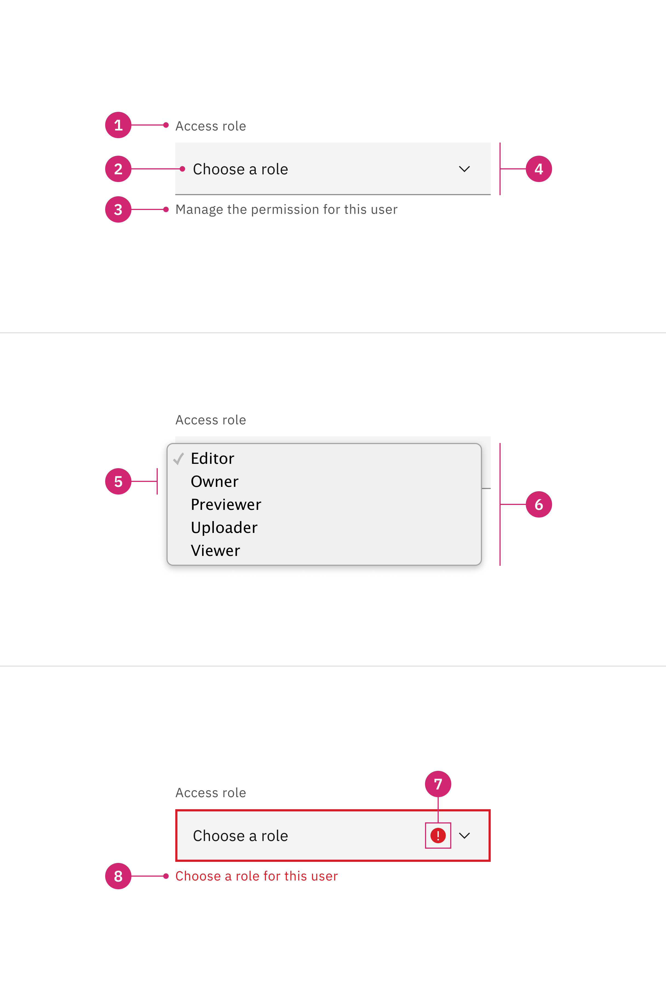
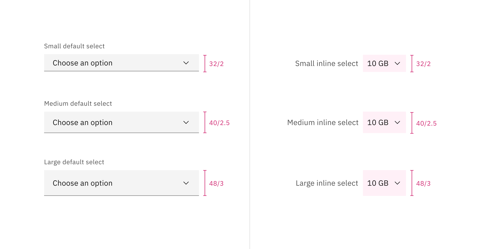
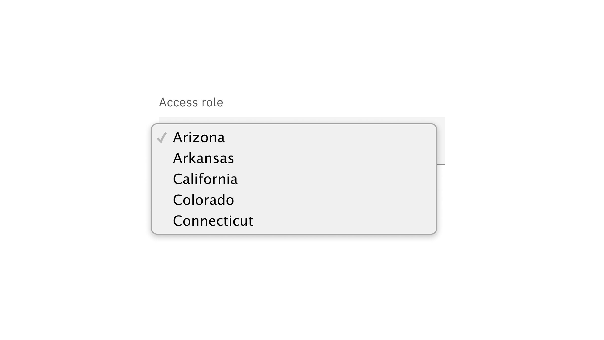
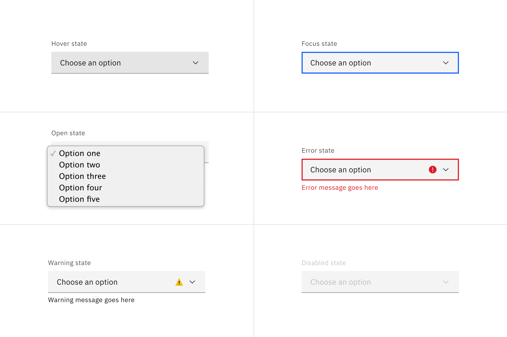
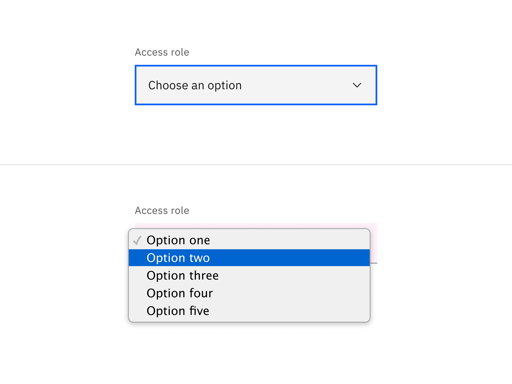
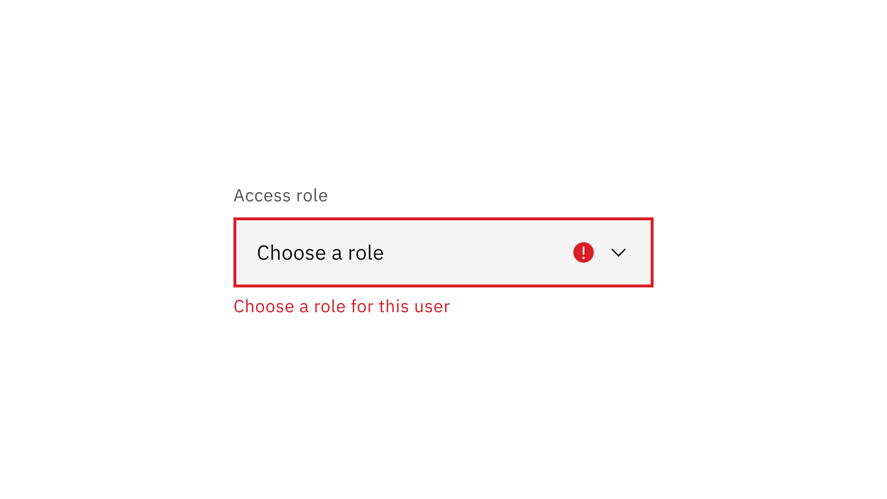

<PageDescription>

Select allows users to choose one option from a list of values.

</PageDescription>

<AnchorLinks>

<AnchorLink>Overview</AnchorLink>
<AnchorLink>Live demo</AnchorLink>
<AnchorLink>Variants</AnchorLink>
<AnchorLink>Formatting</AnchorLink>
<AnchorLink>Content</AnchorLink>
<AnchorLink>Behaviors</AnchorLink>
<AnchorLink>Feedback</AnchorLink>

</AnchorLinks>

## Overview

The select component collects user-provided information from a
list of options. Selects are usually used in forms where a user submits data
and chooses one option from a list.

<Row>
<Column colLg={8}>

</Column>
</Row>

#### When to use

- Use the select component inside a form where users are selecting from a list
  of options and submitting data.

- When the experience is mostly form-based.

#### When not to use

It is best practice not to use a select if there are fewer than three options
for selection. In this case, use a
[radio button](https://carbondesignsystem.com/components/radio-button/usage/)
group instead.

#### Select versus Dropdown

While the select and
[dropdown](https://carbondesignsystem.com/components/dropdown/usage/) components
look similar, they have different functions.

- A select presents a list of options from which the users can select only one
  item from that list. It works best in forms when users select an option from
  the select list and submit data.

- A dropdown presents a list of options that users can select one or several
  options from that list. Dropdown options are used for taking an action,
  filtering, or sorting existing content.

Another important difference between the two components is the underlying code.
The select component’s appearance will be determined by the browser being used,
while the dropdown component can be styled as needed.

<Row>
<Column colLg={12}>

<Caption>
  The example shows that the dropdown presents a list of options for actions
  while the select presents a list of options for data submission.
</Caption>

</Column>
</Row>

## Live demo

<ComponentDemo
  components={[
    {
      id: 'select',
      label: 'Select',
    },
  ]}
>
  <ComponentVariant
    id="select"
    knobs={{
      Select: ['disabled', 'inline', 'invalid', 'light'],
      SelectItem: ['disabled', 'hidden'],
      SelectItemGroup: ['disabled'],
    }}
    links={{
      React:
        'https://react.carbondesignsystem.com/?path=/story/components-select--default',
      Angular:
        'https://angular.carbondesignsystem.com/?path=/story/components-select--basic',
      Vue: 'http://vue.carbondesignsystem.com/?path=/story/components-cvselect--default',
      'Web Components':
        'https://web-components.carbondesignsystem.com/?path=/story/components-select--default',
    }}
  >
    {`
<Select
  defaultValue="placeholder-item"
  helperText="Optional helper text"
  id="select-1"
  invalidText="A valid value is required"
  labelText="Select"
>
  <SelectItem
    text="Choose an option"
    value="placeholder-item"
  />
  <SelectItemGroup
    label="Category 1"
  >
    <SelectItem
      text="Option 1"
      value="option-1"
    />
    <SelectItem
      text="Option 2"
      value="option-2"
    />
  </SelectItemGroup>
  <SelectItemGroup
    label="Category 2"
  >
    <SelectItem
      text="Option 3"
      value="option-3"
    />
    <SelectItem
      text="Option 4"
      value="option-4"
    />
  </SelectItemGroup>
</Select>
  `}
  </ComponentVariant>
</ComponentDemo>

## Variants

| Variant         | Purpose                                                    |
| --------------- | ---------------------------------------------------------- |
| _Default_       | Typically used in forms with a variety of other components |
| _Inline select_ | Used when there are multiple select fields within a form   |

#### Default select

Default selects are used in forms with other components.

<Row>
<Column colLg={8}>

</Column>
</Row>

#### Inline select

Inline select is useful when you have multiple select fields within a form.
Inline selects have less visual weight on a page because they are borderless.

<Row>
<Column colLg={8}>

</Column>
</Row>

## Formating

### Anatomy

<Row>
<Column colLg={8}>

</Column>
</Row>

1. **Labels:** Text that informs the user what to expect in the list of dropdown
   options.
2. **Default option:** Usually a frequent option that users would choose from a
   select list.
3. **Helper text** (optional, except for error and warning): Assistive text to
   help the user choose the right selection.
4. **Field:** Persists when the dropdown is open or closed.
5. **Option:** A choice for the user, shown with other choices in a menu.
6. **Menu:** A list of options to choose from, displayed as an open state.
7. **Status icon:** Indicates the state of the select, either error or warning.
8. **Error or Warning text**: It replaces the helper text when an error or
   warning state appears.

### Sizing

Select has three sizes for both variants: **small**, **medium**, and **large**.
The width varies in size based on content, layout, and design.

| Size        | Height (px/rem) | Use case                                                                                                                                        |
| ----------- | --------------- | ----------------------------------------------------------------------------------------------------------------------------------------------- |
| Small (sm)  | 32 / 2          | Use when space is constricted or when placing a select in a form that is long and complex.                                                      |
| Medium (md) | 40 / 2.5        | This is the default size and the most commonly used size. When in doubt, use the medium size.                                                   |
| Large (lg)  | 48 / 3          | Use when there is a lot of space to work with. The large size is typically used in simple forms or when a select is placed by itself on a page. |

<Row>
<Column colLg={12}>

</Column>
</Row>

## Content

### Main elements

#### Label

- Labels inform users what to expect in the list of select options.
- Keep the label short and concise by limiting it to a single line of text.

#### Helper text

- Helper text is pertinent information that assists the user in choosing the
  right selection from the select menu.
- Helper text is optional but replaced with warning or error text when these
  states appear.

#### Order

The order of the select list should be based on the frequency of use. If
applicable, the list should be in alphabetical order or in increasing order
relative to the content.

<Row>
<Column colLg={8}>

</Column>
</Row>

#### Overflow content

Avoid having multiple lines of text in a select menu. The menu items should be
no longer than three words.

## Behaviors

### States

The select has multiple interactive states for both default and inline variants:
**enabled**, **hover**, **focus**, **open**, **error**, **warning**, and
**disabled**.

| State       | When to use                                                                                                                                                                                                                                                  |
| ----------- | ------------------------------------------------------------------------------------------------------------------------------------------------------------------------------------------------------------------------------------------------------------ |
| _Enabled_   | When the select is live but a user is not directly interacting with it. This is commonly referred to as the default or normal state of the component. An enabled select field should contain a default value.                                                |
| _Hover_     | When a user's mouse cursor is hovering over the field.                                                                                                                                                                                                       |
| _Focus_     | When a user tabs to or clicks on the select field, the field becomes focused, indicating the user has successfully navigated to the component.                                                                                                               |
| _Error_     | When the required select value has not been selected. It can also be triggered due to a system error. This state requires a user response before data can be submitted or saved.                                                                             |
| _Warning_   | When you need to call the user's attention to an exception condition. The condition might not be an error but can cause problems if not resolved.                                                                                                            |
| _Disabled_  | When the user is not allowed to interact with the select due to either permissions, dependencies, or prerequisites. The disabled state completely removes the interactive function from a component. The styling is not subject to WCAG contrast compliance. |
| _Skeleton_  | Used on an initial page load to indicate that the number input has not yet fully loaded.                                                                                                                                                                     |
| _Read-only_ | _Coming soon!_                                                                                                                                                                                                                                               |

<Row>
<Column colLg={12}>

</Column>
</Row>

### Interactions

#### Mouse

Users trigger a dropdown menu to open by clicking the chevron icon or clicking
anywhere within the field. Users can close the menu by clicking the chevron icon
or clicking outside of the menu. To select an option the user can click anywhere
inside an option container.

<Row>
<Column colLg={8}>

</Column>
</Row>

#### Keyboard

- The dropdown field is the element that receives focus. All keyboard
  interactions happen from this element.
- Users can open the dropdown menu by pressing `Space`, `Enter`, `Down arrow` or
  the `Up arrow`.
- Users can move the highlighted option to the next option by pressing the
  `Down arrow`.
- Users can move the highlighted option to the previous option by pressing the
  `Up arrow`.
- Users can close the dropdown menu by pressing `Escape`, `Space`, or `Enter`.

<Row>
<Column colLg={8}>

</Column>
</Row>

### Validation

#### Invalid

Real-time validation helps to streamline the process of filling out a form. The
error state is triggered if the data is invalid or a required field is left
empty. The error state has three visual indicators to signify invalid content: a
red border, an error icon indicator, and an error message.

<Row>
<Column colLg={8}>

</Column>
</Row>

#### Default selection

By default, the selected option is usually the first item in alphabetical order.
The default selection could also be a call-to-action that asks users to select
an option from the menu.

## Related

- If there are fewer than three options to choose from, use a
  [radio button](https://carbondesignsystem.com/components/radio-button/usage/)
  group instead.
- If multi-select is necessary, use
  [dropdown](https://carbondesignsystem.com/components/dropdown/usage/) instead.
  Dropdown options are used to take an action, navigating outside of the current
  context, filtering or sorting existing content.

## Feedback

Help us improve this component by providing feedback, asking questions, and
leaving any other comments on
[GitHub](https://github.com/carbon-design-system/carbon-website/issues/new?assignees=&labels=feedback&template=feedback.md).
