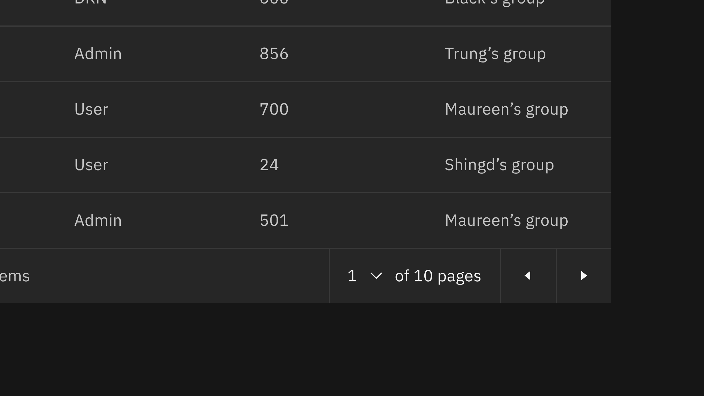

<PageDescription>

The select component allows users to choose one option from a list. It is used
in forms for users to submit data.

</PageDescription>

<AnchorLinks>

<AnchorLink>Overview</AnchorLink>
<AnchorLink>Live demo</AnchorLink>
<AnchorLink>Variants</AnchorLink>
<AnchorLink>Best practices</AnchorLink>
<AnchorLink>Accessibility</AnchorLink>
<AnchorLink>Feedback</AnchorLink>

</AnchorLinks>

## Overview

Select is a type of input that is used in forms, where a user is submitting data
and chooses one option from a list.

### Select versus Dropdown

While the select and dropdown components look similar, they have different
functions.

- Use the select component inside a form where users are selecting from a list
  of options and submitting data.
- Use the dropdown component to filter or sort content on a page.

Another important difference between the two components is the underlying code.
The select component's appearance will be determined by the browser being used,
while the dropdown component can be styled as needed.

## Live demo

<ComponentDemo
  components={[
    {
      id: 'select',
      label: 'Select',
    },
  ]}>
  <ComponentVariant
    id="select"
    knobs={{
      Select: ['disabled', 'inline', 'invalid', 'light'],
      SelectItem: ['disabled', 'hidden'],
      SelectItemGroup: ['disabled'],
    }}
    links={{
      React:
        'https://react.carbondesignsystem.com/?path=/story/select--default',
      Angular:
        'https://angular.carbondesignsystem.com/?path=/story/components-select--basic',
      Vue:
        'http://vue.carbondesignsystem.com/?path=/story/components-cvselect--default',
      Vanilla: 'https://the-carbon-components.netlify.com/?nav=select',
    }}>{`
<Select
  defaultValue="placeholder-item"
  helperText="Optional helper text"
  id="select-1"
  invalidText="A valid value is required"
  labelText="Select"
>
  <SelectItem
    text="Choose an option"
    value="placeholder-item"
  />
  <SelectItemGroup
    label="Category 1"
  >
    <SelectItem
      text="Option 1"
      value="option-1"
    />
    <SelectItem
      text="Option 2"
      value="option-2"
    />
  </SelectItemGroup>
  <SelectItemGroup
    label="Category 2"
  >
    <SelectItem
      text="Option 3"
      value="option-3"
    />
    <SelectItem
      text="Option 4"
      value="option-4"
    />
  </SelectItemGroup>
</Select>
  `}</ComponentVariant>
</ComponentDemo>

## Variants

| Variant         | Purpose                                                                                                                               |
| --------------- | ------------------------------------------------------------------------------------------------------------------------------------- |
| _Default_       | Typically used in forms with a variety of other components.                                                                           |
| _Small select_  | When vertical space is a concern, or select is being paired with a larger component like [data tables](/components/data-table/usage). |
| _Inline select_ | When multiple selects are grouped together.                                                                                           |

#### Small select

Small selects are commonly used in [data tables](/components/data-table/usage).
When using a small select for a number selection, the increments in the select
should be 10, 25, 50 and 100. The maximum amount of items a user can see per
page is 100.

<Row>
<Column colLg={8}>

</Column>
</Row>

#### Inline select

Inline select is useful when you have multiple select fields within a form.
Inline selects have less visual weight on a page because they are borderless.

<Row>
<Column colLg={8}>

</Column>
</Row>

## Best practices

### Labels

Labels are essential to the usability of forms. Do not place a label inside a
_select_ element. Use sentence case and no more than three words.

### Validation

Real-time validation helps to streamline the process and keep data clean when
the user is filling out forms. For full guidelines, refer to the
[forms](/components/form/usage) usage page.

<Row>
<Column colLg={8}>

</Column>
</Row>

### Order

The order of the select list should be based on the frequency of use. If
applicable, the list should be in increasing order relative to the content. In
cases of forms, alternative orders such as alphabetical may be more fitting. A
horizontal rule can be used to group similar items together.

## Accessibility

### Styling select dropdowns

To maximize accessibility, it is strongly recommended not to style select
dropdowns. One of the
[WCAG 2.0 standards](https://www.w3.org/TR/WCAG20-TECHS/G202.html) for
accessibility is “ensuring keyboard control for all functionality”. CSS
alternatives to select elements do not meet this requirement.

While you can make a select element easily usable by a mouse, making it usable
with keyboard navigation is complex. The default select element should follow
this process:

| State    | Mouse                                    | Keyboard                                            |
| -------- | ---------------------------------------- | --------------------------------------------------- |
| _:hover_ | move your cursor over the select element | use the tab key to focus the select element         |
| _:focus_ | click on the select element              | press enter                                         |
| _:_      | move your cursor over the desired option | use the top and bottom arrow keys to pick an option |
| :select  | click on the desired option              | press enter                                         |

## Feedback

Help us improve this component by providing feedback, asking questions, and
leaving any other comments on
[GitHub](https://github.com/carbon-design-system/carbon-website/issues/new?assignees=&labels=feedback&template=feedback.md).
