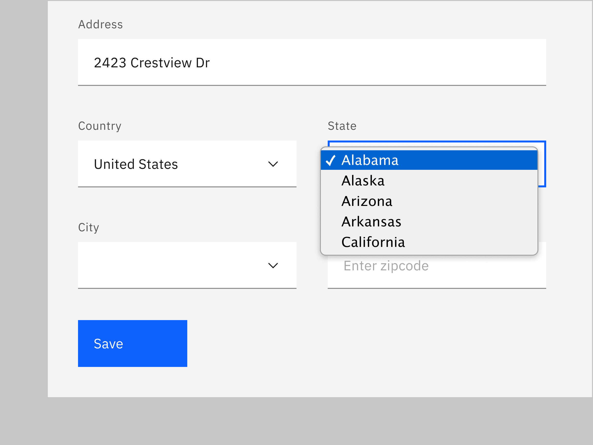
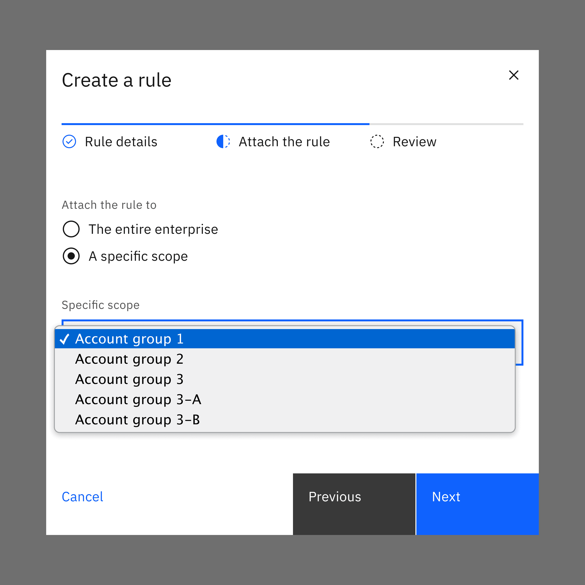

<AnchorLinks>

<AnchorLink>General guidance</AnchorLink>
<AnchorLink>Formatting</AnchorLink>
<AnchorLink>Content</AnchorLink>
<AnchorLink>Behavior</AnchorLink>
<AnchorLink>Accessibility</AnchorLink>
<AnchorLink>Variations</AnchorLink>
<AnchorLink>Style</AnchorLink>
<AnchorLink>Code</AnchorLink>
<AnchorLink>Feedback</AnchorLink>

</AnchorLinks>

## General guidance

Select is a type of input that is used in forms, where a user is submitting data and chooses one option from a list.

While the select and dropdown components look similar, they have different functions.

- Use the select component inside a form where users are selecting from a list of options and submitting data.
- Use the dropdown component to filter or sort content on a page.

Another important difference between the two components is the underlying code. The select component's appearance will be determined by the browser being used, while the dropdown component can be styled as needed.

<ComponentCode
  name="Select"
  component="select"
  variation="select"
  hasReactVersion="select--default"
  hasLightVersion
  hasReactVersion="select--default"
  hasVueVersion="select--default"
  hasAngularVersion="?path=/story/select--basic"
  codepen="oOxzmZ"
/>

## Formatting

## Content 

**Labels are essential to the usability of forms.** Do not place a label inside a _select_ element. Use sentence case and no more than three words.

**The order of the select list should be based on the frequency of use.** If applicable, the list should be in increasing order relative to the content. In cases of forms, alternative orders such as alphabetical may be more fitting. A horizontal rule can be used to group similar items together.

## Behavior

**Real-time validation helps to streamline the process and keep data clean when the user is filling out forms.** For full guidelines, refer to the [forms](/components/form) usage page.

<Row>
<Column colLg={8}>

</Column>
</Row>

## Accessibility

### Styling select dropdowns

To maximize accessibility, it is strongly recommended not to style select dropdowns.
One of the [WCAG 2.0 standards](https://www.w3.org/TR/WCAG20-TECHS/G202.html) for accessibility is “ensuring keyboard control for all functionality.” CSS alternatives to select elements do not meet this requirement.

While you can make a select element easily usable by a mouse, making it usable with keyboard navigation is complex. The default select element should follow this process:

| State    | Mouse                                    | Keyboard                                            |
| -------- | ---------------------------------------- | --------------------------------------------------- |
| _:hover_ | move your cursor over the select element | use the tab key to focus the select element         |
| _:focus_ | click on the select element              | press enter                                         |
| _:_      | move your cursor over the desired option | use the top and bottom arrow keys to pick an option |
| :select  | click on the desired option              | press enter                                         |

## Variations 

| Select type     | Purpose                                                                                                                         |
| --------------- | ------------------------------------------------------------------------------------------------------------------------------- |
| _Default_       | Typically used in forms with a variety of other components.                                                                     |
| _Small select_  | When vertical space is a concern, or select is being paired with a larger component like [data tables](/components/data-table). |
| _Inline select_ | When multiple selects are grouped together.                                                                                     |

### Small select

_Small selects_ are commonly used in [data tables](/components/data-table). When using a small select for a number selection, the increments in the select should be 10, 25, 50 and 100. The maximum amount of items a user can see per page is 100.

<Row>
<Column colLg={8}>

</Column>
</Row>

### Inline select

Inline select is useful when you have multiple select fields within a form. Inline selects have less visual weight on a page because they are borderless.

<Row>
<Column colLg={8}>

</Column>
</Row>

## Style

### Color

Inputs come in two different colors. The default input color is `$field-01` and is used on `$ui-background` and `$ui-02` page backgrounds. The `--light` version input color is `$field-02` and is used on `$ui-01` page backgrounds.

| Class                 | Property   | Color toke  |
| --------------------- | ---------- | ----------- |
| `.bx--select-input`   | background | `$field-01` |
| `.bx--select--light`  | background | `$field-02` |
| `.bx--select--inline` | background | transparent |
| `.bx--label`          | text color | `$text-01`  |
| `.bx--select-input`   | text color | `$text-01`  |
| `.bx--select--inline` | text color | `$icon-01`  |
| `.bx--select__arrow`  | fill       | `$icon-01`  |

<Caption>Examples of default and new selection select states</Caption>

### Interaction states

| Class                             | Property   | Color token    |
| --------------------------------- | ---------- | -------------- |
| `.bx--select-input:focus`         | border     | `$focus`       |
| `.bx--select-input[data-invalid]` | border     | `$support-01`  |
| `.bx--form-requirement`           | text color | `$support-01`  |
| `.bx--select-input:disabled`      | background | `$disabled-01` |
| `.bx--select-input:disabled`      | text color | `$disabled-02` |

**Open:** Style determined by browser

**Help text:** Help text appears below the label when the input is active. Help text remains visible while the input is focused and disappears after focus away.

**Error:** Error messages appear below the input field and are always present while invalid.

**Disabled:** Disabled state has a `.not-allowed` cursor hover.

<Caption>Examples of open, disabled, and help select states</Caption>

### Typography

Select text should be set in sentence case, with only the first word in a phrase and any proper nouns capitalized. Select text should be three words or less.

| Class                   | Font-size (px/rem) | Font-weight   | Type token       |
| ----------------------- | ------------------ | ------------- | ---------------- |
| `.bx--label`            | 12 / 0. 75         | Regular / 400 | `$label-01`      |
| `.bx--select-input`     | 14 / 0.875         | Regular / 400 | `$body-short-01` |
| `.bx--select--inline`   | 14 / 0.875         | Regular / 400 | `$body-short-01` |
| `.bx--form-requirement` | 12 / 0.75          | Regular / 400 | `$label-01`      |

### Structure

#### Select

| Class                     | Property                    | px / rem | Spacing token |
| ------------------------- | --------------------------- | -------- | ------------- |
| `.bx--select-input`       | height                      | 40 / 2.5 | –             |
| `.bx--label`              | margin-bottom               | 8 / 0.5  | `$spacing-03` |
| `.bx--select-input`       | padding-left                | 16 / 1   | `$spacing-05` |
| `.bx--select__arrow`      | padding-left, padding-right | 16 / 1   | `$spacing-05` |
| `.bx--select-input`       | border-bottom               | 1px      | –             |
| `.bx--select-input:focus` | border                      | 2px      | –             |

<Caption>Structure and spacing measurements for select | px / rem</Caption>

#### Small Select

| Class                | Property                    | px / rem | Spacing token |
| -------------------- | --------------------------- | -------- | ------------- |
| `.bx--select-input`  | height                      | 32 / 2   | –             |
| `.bx--select-input`  | padding-left                | 8 / 0.5  | `$spacing-03` |
| `.bx--select__arrow` | padding-left, padding-right | 8 / 0.5  | `$spacing-03` |

<Caption>
  Structure and spacing measurements for small select | px / rem & examples of
  open and disabled small select states
</Caption>

#### Inline select

| Class                | Property                    | px / rem | Spacing token |
| -------------------- | --------------------------- | -------- | ------------- |
| `.bx--select-input`  | height                      | 32 / 2   | –             |
| `.bx--select-input`  | padding-left                | 8 / 0.5  | `$spacing-03` |
| `.bx--select__arrow` | padding-left, padding-right | 8 / 0.5  | `$spacing-03` |

<Caption>
  Structure and spacing measurements for inline select (focused) | px / rem
</Caption>

## Code

<ComponentDocs component="select"></ComponentDocs>

## Feedback
