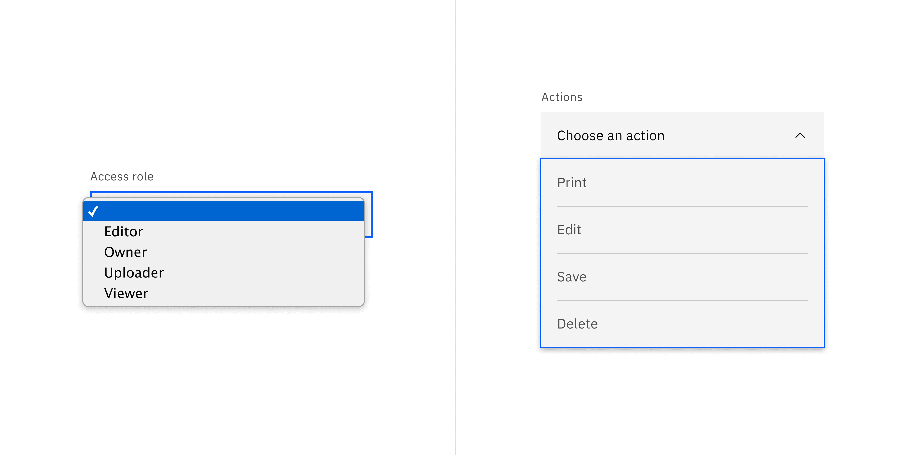
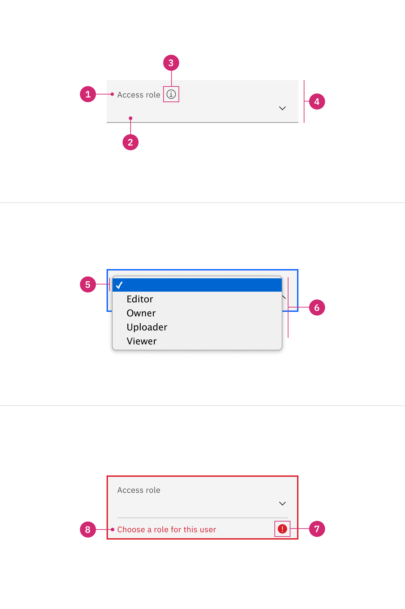
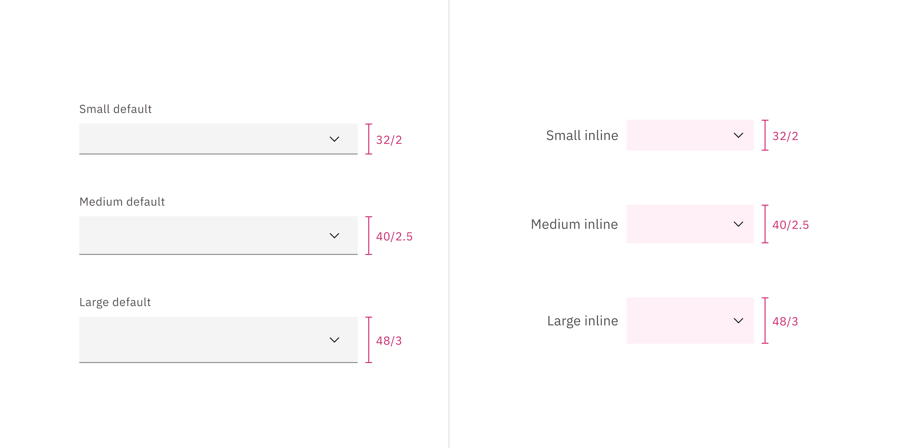
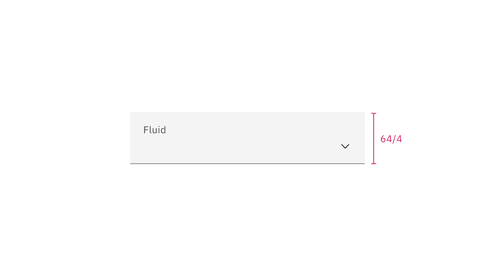
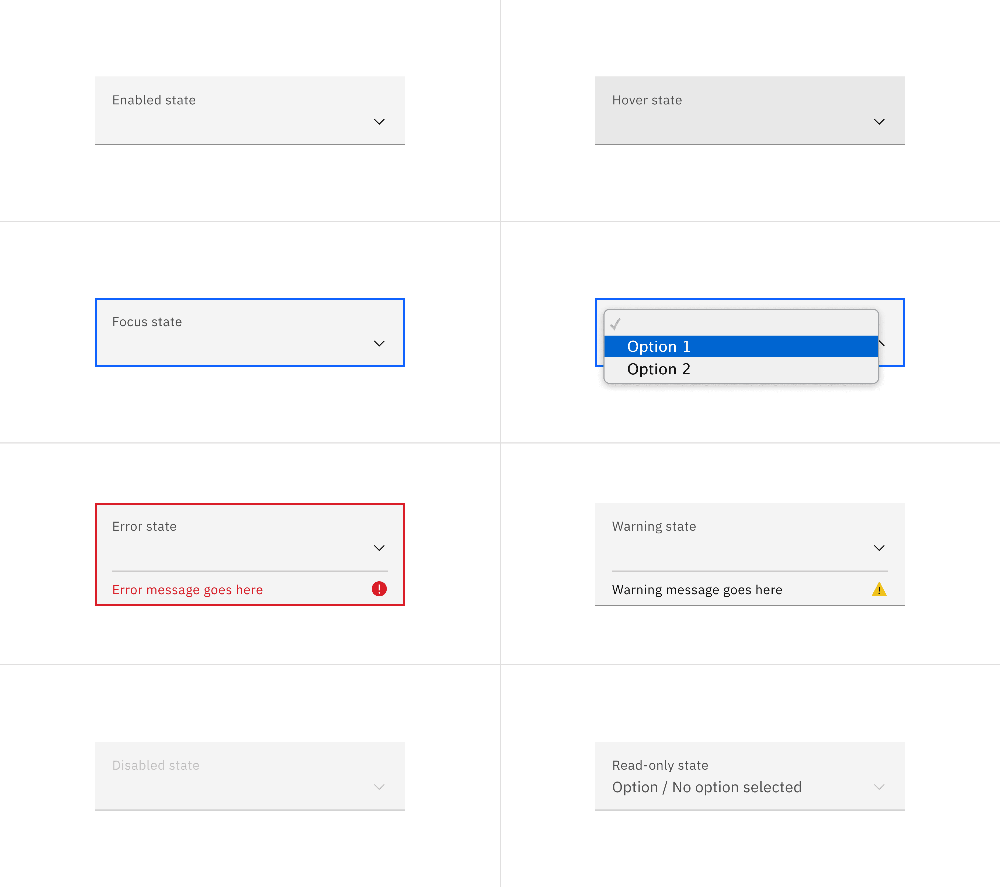
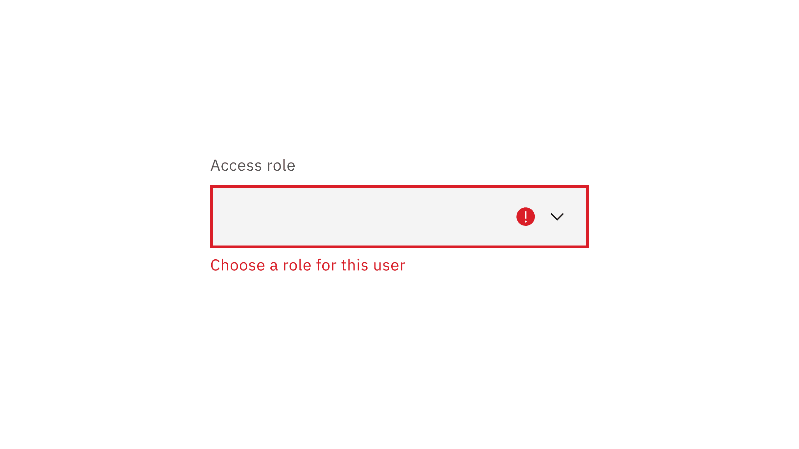
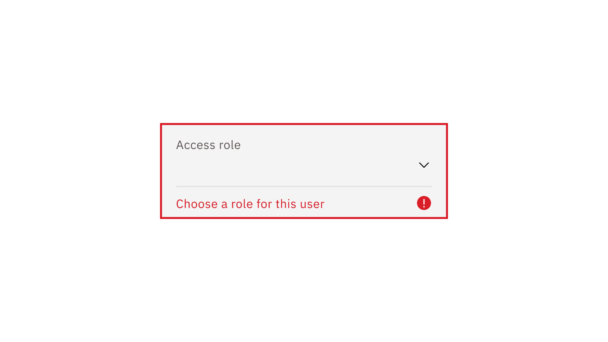

<PageDescription>

Select allows users to choose one option from a list of values.

</PageDescription>

<AnchorLinks>

<AnchorLink>Overview</AnchorLink>
<AnchorLink>Live demo</AnchorLink>
<AnchorLink>Variants</AnchorLink>
<AnchorLink>Formatting</AnchorLink>
<AnchorLink>Content</AnchorLink>
<AnchorLink>Behaviors</AnchorLink>
<AnchorLink>Feedback</AnchorLink>

</AnchorLinks>

## Overview

The select component collects user-provided information from a list of options.
Selects are usually used in forms where a user submits data and chooses one
option from a list.

<Row>
<Column colLg={8}>

</Column>
</Row>

#### When to use

- Use the select component inside a form where users are selecting from a list
  of options and submitting data.

- When the experience is mostly form-based.

#### When not to use

It is best practice not to use a select if there are fewer than three options
for selection. In this case, use a
[radio button](https://carbondesignsystem.com/components/radio-button/usage/)
group instead.

#### Select versus Dropdown

While the select and
[dropdown](https://carbondesignsystem.com/components/dropdown/usage/) components
look similar, they have different functions.

- A select presents a list of options from which the users can select only one
  item from that list. It works best in forms when users choose an option from
  the select list and submit data.

- A dropdown presents a list of options that users can select one or several
  options from that list. Dropdown options are used for taking an action,
  filtering, or sorting existing content.

Another important difference between the two components is the underlying code.
The select list appearance will be determined by the browser being used, while
the dropdown list can be styled as needed.

<Row>
<Column colLg={12}>

<Caption>
  Example of a select list of options for data submission on the left versus a
  dropdown list of actional options on the right.
</Caption>

</Column>
</Row>

## Live demo

<ComponentDemo
  components={[
    {
      id: 'select',
      label: 'Select',
    },
  ]}
>
  <ComponentVariant
    id="select"
    knobs={{
      Select: ['disabled', 'inline', 'invalid', 'light'],
      SelectItem: ['disabled', 'hidden'],
      SelectItemGroup: ['disabled'],
    }}
    links={{
      React:
        'https://react.carbondesignsystem.com/?path=/story/components-select--default',
      Angular:
        'https://angular.carbondesignsystem.com/?path=/story/components-select--basic',
      Vue: 'http://vue.carbondesignsystem.com/?path=/story/components-cvselect--default',
      'Web Components':
        'https://web-components.carbondesignsystem.com/?path=/story/components-select--default',
    }}
  >
    {`
<Select
  defaultValue="placeholder-item"
  helperText="Optional helper text"
  id="select-1"
  invalidText="A valid value is required"
  labelText="Select"
>
  <SelectItem
    text="Choose an option"
    value="placeholder-item"
  />
  <SelectItemGroup
    label="Category 1"
  >
    <SelectItem
      text="Option 1"
      value="option-1"
    />
    <SelectItem
      text="Option 2"
      value="option-2"
    />
  </SelectItemGroup>
  <SelectItemGroup
    label="Category 2"
  >
    <SelectItem
      text="Option 3"
      value="option-3"
    />
    <SelectItem
      text="Option 4"
      value="option-4"
    />
  </SelectItemGroup>
</Select>
  `}
  </ComponentVariant>
</ComponentDemo>

## Variants

| Variant         | Purpose                                                     |
| --------------- | ----------------------------------------------------------- |
| _Default_       | Typically used in forms with a variety of other components. |
| _Inline select_ | Used when there are multiple select fields within a form.   |

#### Default select

Default selects are used in forms with other components.

<Row>
<Column colLg={8}>

</Column>
</Row>

#### Inline select

Inline select is useful when you have multiple select fields within a form.
Inline selects have less visual weight on a page because they are borderless.

<Row>
<Column colLg={8}>

</Column>
</Row>

## Formatting

### Anatomy

<Row>
<Column colLg={8}>

<Tabs>

<Tab label="Default">

</Tab>

<Tab label="Fluid">

</Tab>

</Tabs>

</Column>
</Row>

1. **Labels:** Text that informs the user what to expect in the list of dropdown
   options.
2. **Default option:** An empty option selected by default. The user can decide
   whether to choose a different option from the list. Depending on the use
   case, this defaulted behavior can be modified to be a prefilled selection to
   the first option in the list, which is typically shown in alphabetical order,
   or the prefilled selection could be a frequent or commonly used option that
   is on the list.
3. **Helper text** (optional, except for error and warning): Assistive text to
   help the user choose the right selection. Helper text is shown in a tooltip
   for fluid styles.
4. **Field:** Persists when the dropdown is open or closed.
5. **Option:** A choice for the user, shown with other choices in a list.
6. **List:** A list of options to choose from, displayed as an open state.
7. **Status icon:** Indicates the state of the select, either error or warning.
8. **Error or Warning text**: Replaces the helper text when an error or warning
   state appears.

### Styling

There are two styles of select inputs, default and fluid. They share the same
functionality but look visually different, influencing where to use them.

| Style   | Appearance                                                                                                               | Use case                                                                                                                                         |
| ------- | ------------------------------------------------------------------------------------------------------------------------ | ------------------------------------------------------------------------------------------------------------------------------------------------ |
| Default | A traditional style where the label is positioned outside and above the input field.                                     | Use when white space is needed between input components or in productive moments where space is at a premium, and smaller components are needed. |
| Fluid   | An alternative style where the label is placed inside of the input field and is stacked inline with the user input text. | Use in expressive moments, fluid forms, contained spaces, or attached to complex components, like a toolbar.                                     |

<Row>
<Column colLg={8}>

</Column>
</Row>

### Sizing

#### Default input heights

There are three default select height size for both variants: small, medium, and
large. Supporting three different select sizes gives you more flexibility when
structuring layouts. However, use a consistent size for all form components on
the same page. For example, if you are using a medium size select also use the
same size text inputs, buttons, and so on. When in doubt, use the default medium
size height.

| Default size | Height (px/rem) | Use case                                                                                                                                        |
| ------------ | --------------- | ----------------------------------------------------------------------------------------------------------------------------------------------- |
| Small (sm)   | 32 / 2          | Use when space is constricted or when placing a select in a form that is long and complex.                                                      |
| Medium (md)  | 40 / 2.5        | This is the default size and the most commonly used size. When in doubt, use the medium size.                                                   |
| Large (lg)   | 48 / 3          | Use when there is a lot of space to work with. The large size is typically used in simple forms or when a select is placed by itself on a page. |

<Row>
<Column colLg={12}>

</Column>
</Row>

#### Fluid inputs heights

In the fluid select, there is only one input height. The list height is
controlled by the browser.

<Row>
<Column colLg={8}>

</Column>
</Row>

#### Width

There is no minimum or maximum width for a select. The width can be customized
appropriately for its context.

## Content

### Main elements

#### Label

Concise labels for text and data inputs help users understand what information
is being requested of them.

- Labels inform users what to expect in the list of select options.
- Labels are not helper text; be succinct. Use one to three words only.

#### Helper text

- Helper text is pertinent information that assists the user in choosing the
  right selection from the select list.
- Helper text is optional but replaced with warning or error text when these
  states appear.

#### List order

If applicable, the list should be in alphabetical order or in increasing order
relative to the content. Otherwise, the order of the select list should be based
on the frequency of use.

<Row>
<Column colLg={8}>

</Column>
</Row>

## Behaviors

### States

The select has multiple interactive states for both default and inline variants:
**enabled**, **hover**, **selected**, **focus**, **open**, **error**,
**warning**, **disabled**, skeleton, and **read-only**.

| State       | When to use                                                                                                                                                                                                                                                                                   |
| ----------- | --------------------------------------------------------------------------------------------------------------------------------------------------------------------------------------------------------------------------------------------------------------------------------------------- |
| _Enabled_   | When the select is live and a user is not directly interacting with it. This is commonly referred to as the default or normal state of the component. An enabled select field should contain a default value.                                                                                 |
| _Hover_     | When a user's mouse cursor is hovering over the field.                                                                                                                                                                                                                                        |
| _Selected_  | When a user opens the list and selects an option within the list.                                                                                                                                                                                                                             |
| _Focus_     | When a user tabs to or clicks on the select field, the field becomes focused, indicating the user has successfully navigated to the component.                                                                                                                                                |
| _Open_      | When a user opens the list.                                                                                                                                                                                                                                                                   |
| _Error_     | When a select component marked as "required" has not had an option selected. It can also be triggered due to a system error. This state requires a user response before data can be submitted or saved.                                                                                       |
| _Warning_   | When you need to call the user's attention to an exception condition. The condition might not be an error but can cause problems if not resolved.                                                                                                                                             |
| _Disabled_  | When the user cannot interact with a component and all interactive functions have been removed. Unlike read-only states, disabled states are not focusable, are not read by screen readers, and do not need to pass visual contrast, making them inaccessible if they need to be interpreted. |
| _Skeleton_  | Used on an initial page load to indicate that the select has not yet fully loaded.                                                                                                                                                                                                            |
| _Read-only_ | When the user can review but not modify the component. This state removes all interactive functions like the disabled state but can still be focusable, accessible by screen readers, and passes visual contrast for readability.                                                             |

<Row>
<Column colLg={12}>

<Tabs>

<Tab label="Default">

</Tab>

<Tab label="Fluid">

</Tab>

</Tabs>

</Column>
</Row>

### Interactions

#### Mouse

Users can open and close the list by clicking the chevron icon or clicking
anywhere within the field. To select an option, the user can click anywhere
inside an option list.

<Row>
<Column colLg={8}>

<Tabs>

<Tab label="Default">

</Tab>

<Tab label="Fluid">

</Tab>

</Tabs>

</Column>
</Row>

#### Keyboard

- The dropdown field is the element that receives focus. All keyboard
  interactions happen from this element.
- Users can open the list by pressing `Space`, `Enter`, the `Down arrow`, or the
  `Up arrow`.
- Users can move the highlighted option to the next option by pressing the
  `Down arrow`.
- Users can move the highlighted option to the previous option by pressing the
  `Up arrow`.
- Users can close the list by pressing `Escape`, `Space`, or `Enter`.

<Row>
<Column colLg={8}>

<Tabs>

<Tab label="Default">

</Tab>

<Tab label="Fluid">

</Tab>

</Tabs>

</Column>
</Row>

### Validation

#### Invalid

Real-time validation helps to streamline the process of filling out a form. The
error state is triggered if the data is invalid or a required field is left
empty. The error state has three visual indicators to signify invalid content: a
red border, an error icon indicator, and an error message.

<Row>
<Column colLg={8}>

<Tabs>

<Tab label="Default">

</Tab>

<Tab label="Fluid">

</Tab>

</Tabs>

</Column>
</Row>

## Related

- If there are fewer than three options to choose from, use a
  [radio button](https://carbondesignsystem.com/components/radio-button/usage/)
  group instead.
- If multi-select is necessary, use
  [dropdown](https://carbondesignsystem.com/components/dropdown/usage/) instead.
  Dropdown options are used to take an action, navigating outside of the current
  context, filtering or sorting existing content.

## Feedback

Help us improve this component by providing feedback, asking questions, and
leaving any other comments on
[GitHub](https://github.com/carbon-design-system/carbon-website/issues/new?assignees=&labels=feedback&template=feedback.md).
