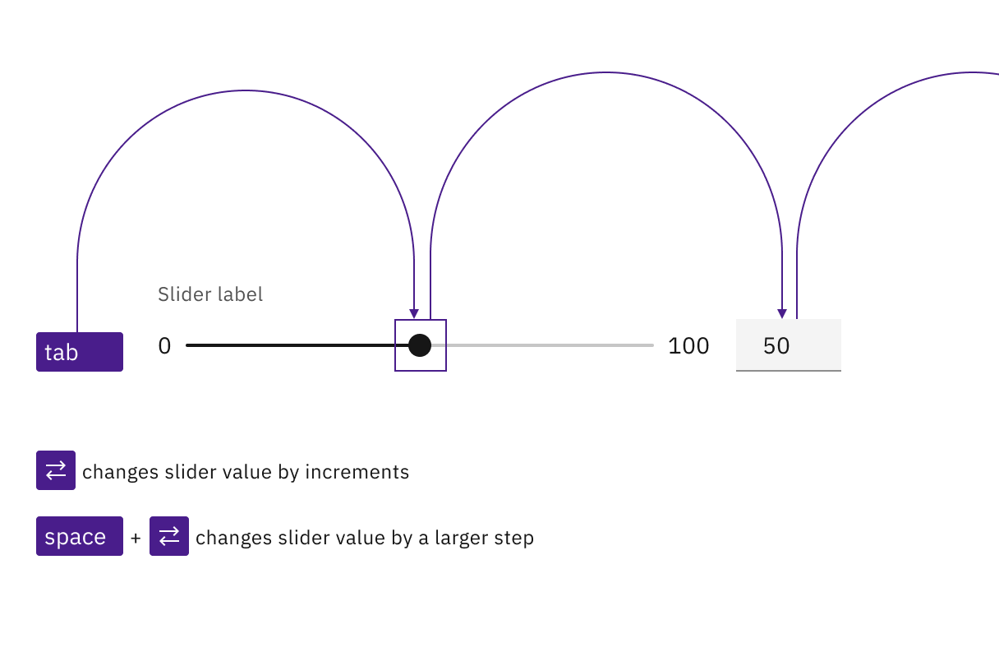
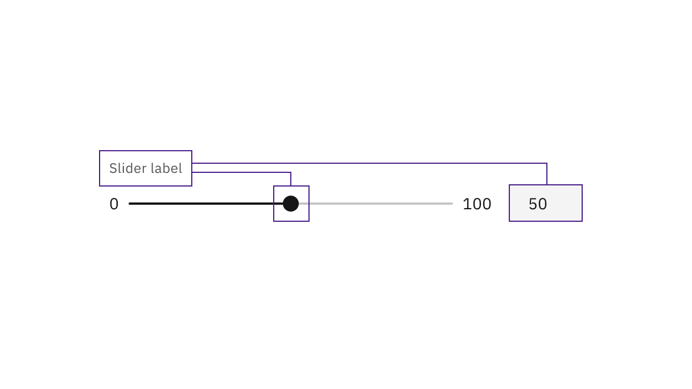

import localVideo from './videos/slider.mp4';
import localPoster from './images/slider-accessibility-3.png';

<PageDescription>

No accessibility annotations are needed for sliders, but keep these
considerations in mind if you are modifying Carbon or creating a custom
component.

</PageDescription>

<AnchorLinks>
  <AnchorLink>What Carbon provides</AnchorLink>
  <AnchorLink>Development considerations</AnchorLink>
</AnchorLinks>

## What Carbon provides

Carbon bakes keyboard operation into its components, improving the experience of
blind users and others who operate via the keyboard. Carbon incorporates many
other accessibility considerations, some of which are described below.

### Keyboard interactions

Tab order goes from slider to text input. Arrow keys are used to change the
slider value. `Shift`+arrow changes the slider value by a larger increment (such
as by 10 instead of 1). Users can also directly enter a value in the input.

<Row>
<Column colLg={8}>

<Caption>
  Both the slider and input are in the tab order and keyboard operable.
</Caption>

</Column>
</Row>

### Labeling and updates

<Row>
<Column colLg={8}>

<Caption>
  The slider label is programmatically associated with both the slider and
  input.
</Caption>

</Column>
</Row>

<Row>
<Column colLg={8}>

<Video src={localVideo} poster={localPoster} aria-label="pointer clicks on slider range and input updates to 80. input value changes to 75 and slider repositions to match"/>

<Caption>
  The input value and slider position are in sync. An update to either causes
  the other to update.
</Caption>

</Column>
</Row>

## Development considerations

Keep these considerations in mind if you are modifying Carbon or creating a
custom component:

- The `step` value determines the change increment when moving the slider,
  either by pointer or keyboard. A value of `"1"` is recommended.
- The `stepMultiplier` determines the value change when the keyboard is used to
  alter the slider by pressing `Shift`+ Arrow key. A tenth of the total range is
  recommended as a value, such as `"10"` in a 0-100 slider.
- See the
  [ARIA authoring practices](https://www.w3.org/TR/wai-aria-practices-1.2/#slider)
  for more considerations.
