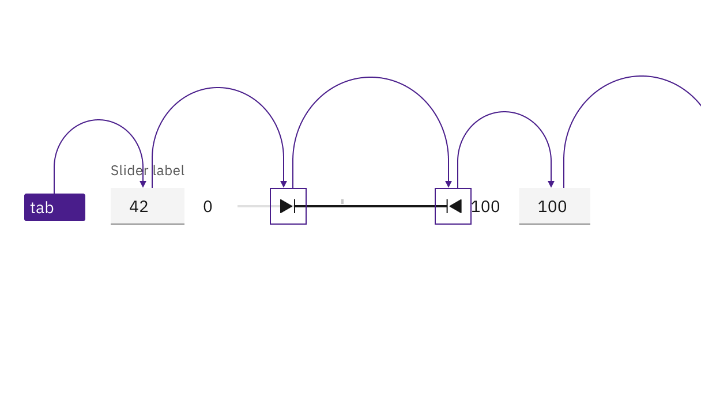
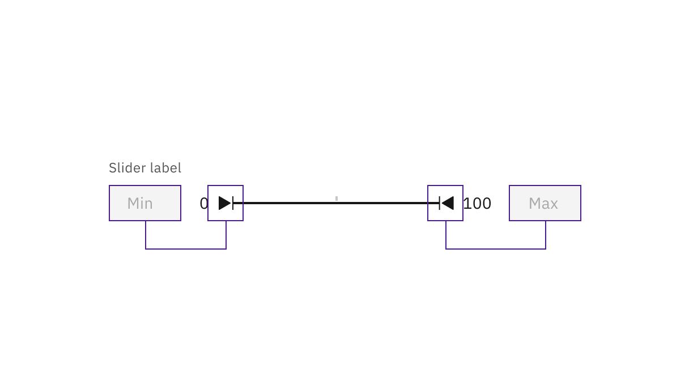

import A11yStatus from 'components/A11yStatus';

import localVideoOne from './videos/default-slider-demo.mp4';
import localPosterOne from './images/slider-accessibility-default-mp4-image.png';
import localVideoTwo from './videos/range-slider-demo.mp4';
import localPosterTwo from './images/slider-accessibility-range-mp4-image.png';

<PageDescription>

No accessibility annotations are needed for sliders, but keep these
considerations in mind if you are modifying Carbon or creating a custom
component.

</PageDescription>

<AnchorLinks>
  <AnchorLink>What Carbon provides</AnchorLink>
  <AnchorLink>Development considerations</AnchorLink>
</AnchorLinks>

<A11yStatus components="Slider" />

## What Carbon provides

Carbon bakes keyboard operation into its components, improving the experience of
blind users and others who operate via the keyboard. Carbon incorporates many
other accessibility considerations, some of which are described below.

### Keyboard interactions (default slider)

Tab order goes from slider to number input. Arrow keys are used to change the
slider value. `Shift` + `Arrow` changes the slider value by a larger increment
(such as by 10 instead of 1). Users can also directly enter a value in the
input.

<Row>
<Column colLg={8}>

<Caption>
  Both the slider and input are in the tab order and keyboard operable.
</Caption>

</Column>
</Row>

### Labeling and updates (default slider)

<Row>
<Column colLg={8}>

<Caption>
  The input value and slider position are in sync. An update to either causes
  the other to update.
</Caption>

</Column>
</Row>

<Row>
<Column colLg={8}>

<Video
  src={localVideoOne}
  poster={localPosterOne}
  aria-label="pointer clicks on slider range and input updates to 80. input value changes to 75 and slider repositions to match"
/>

<Caption>
  The multiple ways of updating a value within the default slider component.
</Caption>

</Column>
</Row>

### Keyboard interactions (range slider)

For the range slider, tab order goes from the first number input, to the two
handles in turn, and then to the second number input. The handle keyboard
operation is the same as with the default slider. Users can also directly enter
numbers into the minimum and maximum value inputs.

<Row>
<Column colLg={8}>

<Caption>
  Both the slider and inputs are in the tab order and keyboard operable.
</Caption>

</Column>
</Row>

### Labeling and updates (range slider)

The slider label is a description what kind of values will be selected from the
range slider. The minimum and maximum values are labeled with placeholder text
of min and max due to space constraints.

<Row>
<Column colLg={8}>

<Caption>
  The input value and slider position are in sync. An update to either causes
  the other to update.
</Caption>

</Column>
</Row>

<Row>
<Column colLg={8}>

<Video
  src={localVideoTwo}
  poster={localPosterTwo}
  aria-label="pointer clicks on slider range and input updates to 80. input value changes to 75 and slider repositions to match"
/>

<Caption>
  The multiple ways of updating a value within the default slider component.
</Caption>

</Column>
</Row>

## Development considerations

Keep these considerations in mind if you are modifying Carbon or creating a
custom component:

- The `step` value determines the change increment when moving the slider,
  either by pointer or keyboard. A value of `"1"` is recommended.
- The `stepMultiplier` determines the value change when the keyboard is used to
  alter the slider by pressing `Shift`+ Arrow key. A tenth of the total range is
  recommended as a value, such as `"10"` in a 0-100 slider.
- See the
  [ARIA authoring practices](https://www.w3.org/TR/wai-aria-practices-1.2/#slider)
  for more considerations.

### Error handling

If an inputted value is outside the allowed range, the slider will auto-correct
to the nearest allowed digit. When the inputted value results in an error, the
error will display alongside the corresponding text input.

In the range slider, if the inputted value is not logically correct (for
example, if a minimum value is greater than the maximum value), a warning
message will be generated that informs the user that a value was autocorrected
to the nearest allowed digit.
